# 📱 DOKUMENTASI SISTEM — BOOYAHHUB
### Platform Scrim & Tournament E-Sports (Free Fire)

> **Versi Dokumen:** 2.0  
> **Tanggal:** Juni 2026  
> **Teknologi:** Flutter · Dart · Supabase · Midtrans · Firebase FCM  

---

## 📋 Daftar Isi

1. [Gambaran Umum Sistem](#1-gambaran-umum-sistem)
2. [Aktor & Peran](#2-aktor--peran)
3. [Use Case Diagram](#3-use-case-diagram)
4. [Activity Diagram per Use Case](#4-activity-diagram-per-use-case)
   - [UC-01 Registrasi Akun](#uc-01-registrasi-akun)
   - [UC-02 Login](#uc-02-login)
   - [UC-03 Browse & Cari Scrim](#uc-03-browse--cari-scrim)
   - [UC-04 Lihat Detail Scrim](#uc-04-lihat-detail-scrim)
   - [UC-05 Daftar Scrim](#uc-05-daftar-scrim)
   - [UC-06 Pembayaran via Midtrans](#uc-06-pembayaran-via-midtrans)
   - [UC-07 Lihat Status Pendaftaran](#uc-07-lihat-status-pendaftaran)
   - [UC-08 Terima Room ID & Password](#uc-08-terima-room-id--password)
   - [UC-09 Lihat Hasil Pertandingan](#uc-09-lihat-hasil-pertandingan)
   - [UC-10 Klaim Hadiah](#uc-10-klaim-hadiah)
   - [UC-11 Lihat Leaderboard](#uc-11-lihat-leaderboard)
   - [UC-12 Kelola Profil & Rekening Bank](#uc-12-kelola-profil--rekening-bank)
   - [UC-13 Buat Scrim Baru (Admin)](#uc-13-buat-scrim-baru-admin)
   - [UC-14 Edit & Hapus Scrim (Admin)](#uc-14-edit--hapus-scrim-admin)
   - [UC-15 Kelola Pendaftaran Peserta (Admin)](#uc-15-kelola-pendaftaran-peserta-admin)
   - [UC-16 Kirim Room ID ke Peserta (Admin)](#uc-16-kirim-room-id-ke-peserta-admin)
   - [UC-17 Input Hasil Pertandingan (Admin)](#uc-17-input-hasil-pertandingan-admin)
   - [UC-18 Verifikasi Klaim Hadiah (Admin)](#uc-18-verifikasi-klaim-hadiah-admin)
   - [UC-19 Berlangganan Premium (Admin)](#uc-19-berlangganan-premium-admin)
   - [UC-20 Dashboard Keuangan (Platform)](#uc-20-dashboard-keuangan-platform)
   - [UC-21 Kelola & Suspend Pengguna (Platform)](#uc-21-kelola--suspend-pengguna-platform)
   - [UC-22 Approve/Reject Premium Request (Platform)](#uc-22-approvereject-premium-request-platform)
5. [Sequence Diagram per Use Case](#5-sequence-diagram-per-use-case)
   - [SD-01 Registrasi Akun](#sd-01-registrasi-akun)
   - [SD-02 Login](#sd-02-login)
   - [SD-03 Browse & Cari Scrim](#sd-03-browse--cari-scrim)
   - [SD-04 Daftar Scrim](#sd-04-daftar-scrim)
   - [SD-05 Pembayaran via Midtrans](#sd-05-pembayaran-via-midtrans)
   - [SD-06 Terima Room ID & Password](#sd-06-terima-room-id--password)
   - [SD-07 Lihat Hasil & Klaim Hadiah](#sd-07-lihat-hasil--klaim-hadiah)
   - [SD-08 Lihat Leaderboard](#sd-08-lihat-leaderboard)
   - [SD-09 Kelola Profil & Rekening Bank](#sd-09-kelola-profil--rekening-bank)
   - [SD-10 Buat & Kelola Scrim (Admin)](#sd-10-buat--kelola-scrim-admin)
   - [SD-11 Kirim Room ID ke Peserta (Admin)](#sd-11-kirim-room-id-ke-peserta-admin)
   - [SD-12 Input Hasil Pertandingan (Admin)](#sd-12-input-hasil-pertandingan-admin)
   - [SD-13 Verifikasi Klaim Hadiah (Admin)](#sd-13-verifikasi-klaim-hadiah-admin)
   - [SD-14 Berlangganan Premium (Admin)](#sd-14-berlangganan-premium-admin)
   - [SD-15 Dashboard Keuangan (Platform)](#sd-15-dashboard-keuangan-platform)
   - [SD-16 Kelola & Suspend Pengguna (Platform)](#sd-16-kelola--suspend-pengguna-platform)
   - [SD-17 Approve/Reject Premium Request (Platform)](#sd-17-approvereject-premium-request-platform)
6. [Class Diagram](#6-class-diagram)
7. [Entity Relationship Diagram (ERD)](#7-entity-relationship-diagram-erd)
8. [Arsitektur Sistem](#8-arsitektur-sistem)
9. [Struktur Direktori Proyek](#9-struktur-direktori-proyek)

---

## 1. Gambaran Umum Sistem

**BooyahHub** adalah platform mobile berbasis Flutter yang dirancang khusus untuk komunitas e-sports Free Fire di Indonesia. Platform ini memfasilitasi penyelenggaraan **scrim** (pertandingan latihan) dan **turnamen** dengan sistem pembayaran online terintegrasi melalui Midtrans.

### Fitur Utama

| Fitur | Deskripsi |
|-------|-----------|
| 🎮 Browse & Daftar Scrim | Peserta dapat mencari dan mendaftar scrim yang tersedia |
| 💳 Pembayaran Online | Integrasi Midtrans (GoPay, OVO, DANA, Transfer Bank, Kartu Kredit) |
| 🏆 Leaderboard | Papan peringkat real-time berdasarkan poin pertandingan |
| 📊 Manajemen Scrim | Admin dapat membuat, mengelola, dan memasukkan hasil pertandingan |
| 🏅 Klaim Hadiah | Pemenang dapat mengklaim prize pool melalui transfer bank |
| 💰 Dashboard Keuangan |  memantau seluruh arus kas platform |
| 🔔 Notifikasi Push | Notifikasi real-time via Firebase Cloud Messaging |
| ⭐ Sistem Premium | Admin dapat berlangganan premium untuk fitur unggulan |

---

## 2. Aktor & Peran

| Aktor | Role di DB | Deskripsi |
|-------|-----------|-----------|
| **Peserta** | `participant` | Pengguna umum yang mendaftar dan mengikuti scrim/turnamen |
| **Admin** | `admin` | Penyelenggara scrim yang memiliki akun terverifikasi; dapat berlangganan premium |
| **** | `platform` | Pemilik platform dengan akses penuh ke semua data dan konfigurasi |

---

## 3. Use Case Diagram


```mermaid
graph TB
    subgraph PESERTA["👤 PESERTA"]
        UC1([UC-01: Registrasi Akun])
        UC2([UC-02: Login])
        UC3([UC-03: Browse & Cari Scrim])
        UC4([UC-04: Lihat Detail Scrim])
        UC5([UC-05: Daftar Scrim])
        UC6([UC-06: Bayar via Midtrans])
        UC7([UC-07: Lihat Status Pendaftaran])
        UC8([UC-08: Terima Room ID & Password])
        UC9([UC-09: Lihat Hasil Pertandingan])
        UC10([UC-10: Klaim Hadiah])
        UC11([UC-11: Lihat Leaderboard])
        UC12([UC-12: Kelola Profil & Rekening Bank])
        UC13([UC-13: Lihat Riwayat Scrim])
    end

    subgraph ADMIN["🎮 ADMIN"]
        UC14([UC-14: Buat Scrim Baru])
        UC15([UC-15: Edit & Hapus Scrim])
        UC16([UC-16: Kelola Pendaftaran Peserta])
        UC17([UC-17: Kirim Room ID ke Peserta])
        UC18([UC-18: Input Hasil Pertandingan])
        UC19([UC-19: Distribusi Prize Pool])
        UC20([UC-20: Verifikasi Klaim Hadiah])
        UC21([UC-21: Kirim Notifikasi Broadcast])
        UC22([UC-22: Berlangganan Premium])
        UC23([UC-23: Lihat Laporan Scrim])
    end

    subgraph PLATFORM["👑 PLATFORM"]
        UC24([UC-24: Dashboard Keuangan])
        UC25([UC-25: Monitor Semua Scrim])
        UC26([UC-26: Kelola Pengguna])
        UC27([UC-27: Suspend/Unsuspend Pengguna])
        UC28([UC-28: Approve/Reject Premium Request])
        UC29([UC-29: Kelola Pengaturan Platform])
        UC30([UC-30: Lihat Audit Log])
    end

    subgraph EXT["⚙️ SISTEM EKSTERNAL"]
        UC31([UC-31: Generate Midtrans Token])
        UC32([UC-32: Webhook Payment Notification])
        UC33([UC-33: Kirim Push Notification FCM])
    end

    A(👤 Peserta) --> UC1 & UC2 & UC3 & UC4 & UC5 & UC7 & UC8 & UC9 & UC10 & UC11 & UC12 & UC13
    B(🎮 Admin) --> UC14 & UC15 & UC16 & UC17 & UC18 & UC19 & UC20 & UC21 & UC22 & UC23
    C(👑 Platform) --> UC24 & UC25 & UC26 & UC27 & UC28 & UC29 & UC30

    UC5 -.->|include| UC6
    UC6 -.->|include| UC31
    UC31 -.->|include| UC32
    UC32 -.->|include| UC33
    UC10 -.->|include| UC20
    UC22 -.->|include| UC28
    UC18 -.->|include| UC19
```

---

## 4. Activity Diagram per Use Case

---

### UC-01 Registrasi Akun

**Aktor:** Peserta baru  
**Tujuan:** Membuat akun baru di platform BooyahHub  
**Prasyarat:** Pengguna belum memiliki akun  

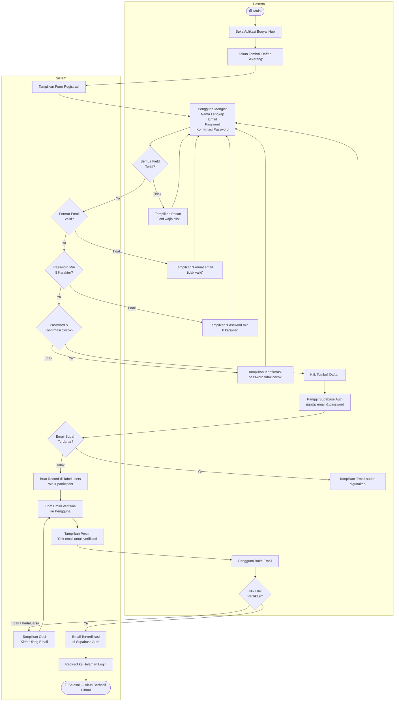
```mermaid
```mermaid
flowchart TD
    subgraph Peserta
        direction TB
        A([🟢 Mulai]) --> B[Buka Aplikasi BooyahHub]
        B --> C[Tekan Tombol 'Daftar Sekarang']
        E[Pengguna Mengisi:<br/>Nama Lengkap<br/>Email<br/>Password<br/>Konfirmasi Password] --> F
        G --> E
        I --> E
        K --> E
        M --> E
        N[Klik Tombol 'Daftar'] --> O
        Q --> E
        U[Pengguna Buka Email] --> V
    end

    subgraph Sistem
        direction TB
        C --> D[Tampilkan Form Registrasi]
        D --> E
        F{Semua Field<br/>Terisi?} -->|Tidak| G[Tampilkan Pesan<br/>'Field wajib diisi']
        F -->|Ya| H{Format Email<br/>Valid?}
        H -->|Tidak| I[Tampilkan 'Format email tidak valid']
        H -->|Ya| J{Password Min<br/>8 Karakter?}
        J -->|Tidak| K[Tampilkan 'Password min. 8 karakter']
        J -->|Ya| L{Password &<br/>Konfirmasi Cocok?}
        L -->|Tidak| M[Tampilkan 'Konfirmasi password tidak cocok']
        L -->|Ya| N
        O[Panggil Supabase Auth<br/>signUp email & password] --> P{Email Sudah<br/>Terdaftar?}
        P -->|Ya| Q[Tampilkan 'Email sudah digunakan']
        P -->|Tidak| R[Buat Record di Tabel users<br/>role = participant]
        R --> S[Kirim Email Verifikasi<br/>ke Pengguna]
        S --> T[Tampilkan Pesan<br/>'Cek email untuk verifikasi']
        T --> U
        V{Klik Link<br/>Verifikasi?} -->|Tidak / Kadaluarsa| W[Tampilkan Opsi<br/>'Kirim Ulang Email']
        W --> S
        V -->|Ya| X[Email Terverifikasi<br/>di Supabase Auth]
        X --> Y[Redirect ke Halaman Login]
        Y --> Z([🔴 Selesai — Akun Berhasil Dibuat])
    end
```

---

### UC-02 Login

**Aktor:** Peserta, Admin,   
**Tujuan:** Masuk ke platform menggunakan akun yang sudah terdaftar  
**Prasyarat:** Pengguna sudah memiliki akun dan email terverifikasi  

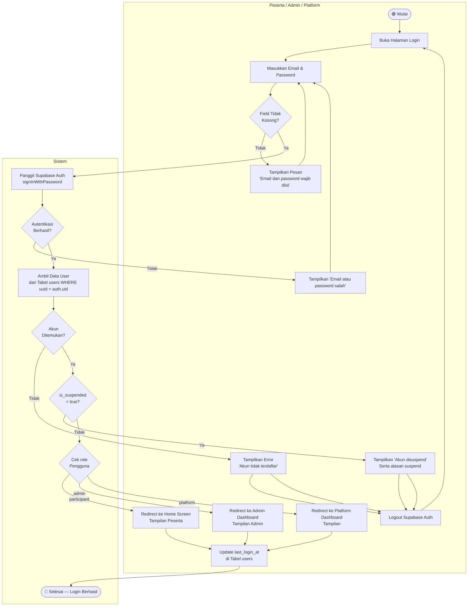
```mermaid
flowchart TD
    subgraph Pengguna ["Peserta / Admin / Platform"]
        direction TB
        A([🟢 Mulai]) --> B[Buka Halaman Login]
        B --> C[Masukkan Email & Password]
        C --> D
        E --> C
        H --> C
        K --> L
        N --> L
        P --> S
        Q --> S
        R --> S
    end

    subgraph Sistem
        direction TB
        D{Field Tidak<br/>Kosong?} -->|Tidak| E[Tampilkan Pesan<br/>'Email dan password wajib diisi']
        D -->|Ya| F[Panggil Supabase Auth<br/>signInWithPassword]
        F --> G{Autentikasi<br/>Berhasil?}
        G -->|Tidak| H[Tampilkan 'Email atau password salah']
        G -->|Ya| I[Ambil Data User<br/>dari Tabel users WHERE uuid = auth.uid]
        I --> J{Akun<br/>Ditemukan?}
        J -->|Tidak| K[Tampilkan Error<br/>'Akun tidak terdaftar']
        K --> L[Logout Supabase Auth]
        L --> B
        J -->|Ya| M{is_suspended<br/>= true?}
        M -->|Ya| N[Tampilkan 'Akun disuspend'<br/>Serta alasan suspend]
        N --> L
        M -->|Tidak| O{Cek role<br/>Pengguna}
        O -->|participant| P[Redirect ke Home Screen<br/>Tampilan Peserta]
        O -->|admin| Q[Redirect ke Admin Dashboard<br/>Tampilan Admin]
        O -->|platform| R[Redirect ke Platform Dashboard<br/>Tampilan ]
        S[Update last_login_at<br/>di Tabel users] --> T([🔴 Selesai — Login Berhasil])
    end
```

---

### UC-03 Browse & Cari Scrim

**Aktor:** Peserta  
**Tujuan:** Menemukan scrim yang sesuai untuk diikuti  
**Prasyarat:** Pengguna sudah login  

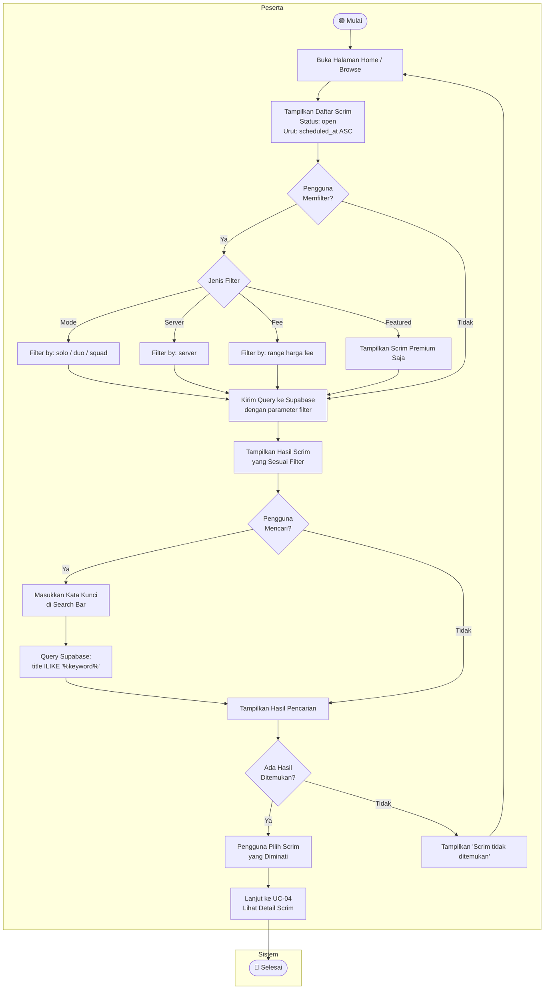
```mermaid
flowchart TD
    subgraph Peserta
        direction TB
        A([🟢 Mulai]) --> B[Buka Halaman Home / Browse]
        C --> D{Pengguna<br/>Memfilter?}
        D -->|Ya| E{Jenis Filter}
        E -->|Mode| F[Filter by: solo / duo / squad]
        E -->|Server| G[Filter by: server]
        E -->|Fee| H[Filter by: range harga fee]
        E -->|Featured| I[Tampilkan Scrim Premium Saja]
        F & G & H & I --> J
        D -->|Tidak| J
        K --> L{Pengguna<br/>Mencari?}
        L -->|Ya| M[Masukkan Kata Kunci<br/>di Search Bar]
        M --> N
        L -->|Tidak| O
        O --> P{Ada Hasil<br/>Ditemukan?}
        Q --> B
        P -->|Ya| R[Pengguna Pilih Scrim<br/>yang Diminati]
        R --> S[Lanjut ke UC-04<br/>Lihat Detail Scrim]
    end

    subgraph Sistem
        direction TB
        B --> C[Tampilkan Daftar Scrim<br/>Status: open<br/>Urut: scheduled_at ASC]
        J[Kirim Query ke Supabase<br/>dengan parameter filter] --> K[Tampilkan Hasil Scrim<br/>yang Sesuai Filter]
        N[Query Supabase:<br/>title ILIKE '%keyword%'] --> O[Tampilkan Hasil Pencarian]
        P -->|Tidak| Q[Tampilkan 'Scrim tidak ditemukan']
        S --> T([🔴 Selesai])
    end
```

---

### UC-04 Lihat Detail Scrim

**Aktor:** Peserta  
**Tujuan:** Melihat informasi lengkap scrim sebelum memutuskan untuk daftar  
**Prasyarat:** Pengguna sudah memilih scrim dari daftar  

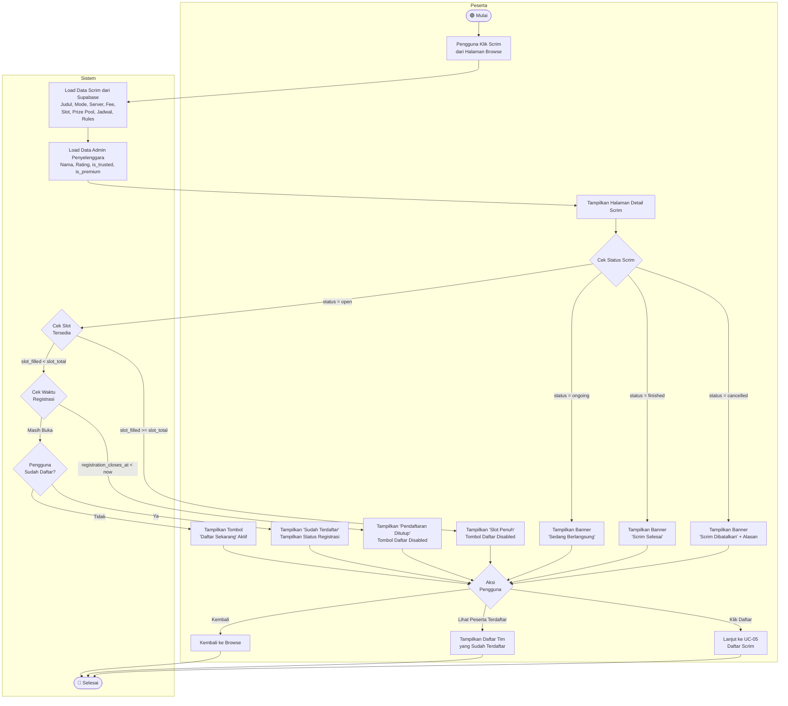
```mermaid
flowchart TD
    subgraph Peserta
        direction TB
        A([🟢 Mulai]) --> B[Pengguna Klik Scrim<br/>dari Halaman Browse]
        E --> F
        G & H & I & K & M & O & P --> Q{Aksi<br/>Pengguna}
        Q -->|Klik Daftar| R[Lanjut ke UC-05<br/>Daftar Scrim]
        Q -->|Lihat Peserta Terdaftar| S
        Q -->|Kembali| T[Kembali ke Browse]
    end

    subgraph Sistem
        direction TB
        B --> C[Load Data Scrim dari Supabase<br/>Judul, Mode, Server, Fee,<br/>Slot, Prize Pool, Jadwal, Rules]
        C --> D[Load Data Admin Penyelenggara<br/>Nama, Rating, is_trusted, is_premium]
        D --> E[Tampilkan Halaman Detail Scrim]
        F{Cek Status Scrim} -->|status = cancelled| G[Tampilkan Banner<br/>'Scrim Dibatalkan' + Alasan]
        F -->|status = finished| H[Tampilkan Banner<br/>'Scrim Selesai']
        F -->|status = ongoing| I[Tampilkan Banner<br/>'Sedang Berlangsung']
        F -->|status = open| J{Cek Slot<br/>Tersedia}
        J -->|slot_filled >= slot_total| K[Tampilkan 'Slot Penuh'<br/>Tombol Daftar Disabled]
        J -->|slot_filled < slot_total| L{Cek Waktu<br/>Registrasi}
        L -->|registration_closes_at < now| M[Tampilkan 'Pendaftaran Ditutup'<br/>Tombol Daftar Disabled]
        L -->|Masih Buka| N{Pengguna<br/>Sudah Daftar?}
        N -->|Ya| O[Tampilkan 'Sudah Terdaftar'<br/>Tampilkan Status Registrasi]
        N -->|Tidak| P[Tampilkan Tombol<br/>'Daftar Sekarang' Aktif]
        S[Tampilkan Daftar Tim<br/>yang Sudah Terdaftar] --> U
        R & T --> U([🔴 Selesai])
    end
```

---

### UC-05 Daftar Scrim

**Aktor:** Peserta  
**Tujuan:** Mendaftarkan tim untuk mengikuti scrim  
**Prasyarat:** Pengguna login, scrim masih buka, slot tersedia  

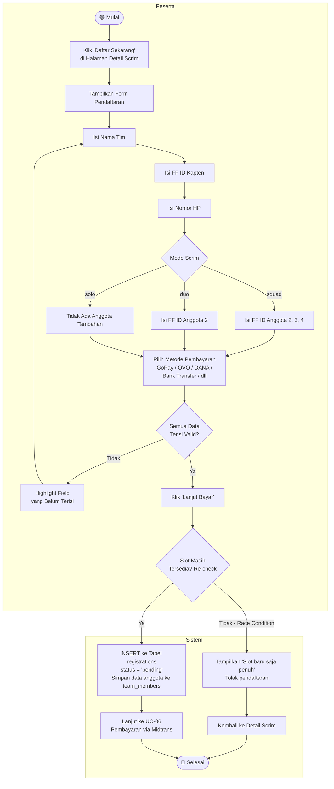
```mermaid
flowchart TD
    subgraph Peserta
        direction TB
        A([🟢 Mulai]) --> B[Klik 'Daftar Sekarang'<br/>di Halaman Detail Scrim]
        C --> D[Isi Nama Tim]
        D --> E[Isi FF ID Kapten]
        E --> F[Isi Nomor HP]
        F --> G{Mode Scrim}
        G -->|squad| H[Isi FF ID Anggota 2, 3, 4]
        G -->|duo| I[Isi FF ID Anggota 2]
        G -->|solo| J[Tidak Ada Anggota Tambahan]
        H & I & J --> K[Pilih Metode Pembayaran<br/>GoPay / OVO / DANA /<br/>Bank Transfer / dll]
        K --> L
        M --> D
        N[Klik 'Lanjut Bayar'] --> O
    end

    subgraph Sistem
        direction TB
        B --> C[Tampilkan Form Pendaftaran]
        L{Semua Data<br/>Terisi Valid?} -->|Tidak| M[Highlight Field<br/>yang Belum Terisi]
        L -->|Ya| N
        O{Slot Masih<br/>Tersedia? Re-check} -->|Tidak - Race Condition| P[Tampilkan 'Slot baru saja penuh'<br/>Tolak pendaftaran]
        P --> Q[Kembali ke Detail Scrim]
        O -->|Ya| R[INSERT ke Tabel registrations<br/>status = 'pending'<br/>Simpan data anggota ke team_members]
        R --> S[Lanjut ke UC-06<br/>Pembayaran via Midtrans]
        Q & S --> T([🔴 Selesai])
    end
```

---

### UC-06 Pembayaran via Midtrans

**Aktor:** Peserta  
**Tujuan:** Menyelesaikan pembayaran biaya pendaftaran scrim  
**Prasyarat:** Data registrasi tersimpan dengan status `pending`  

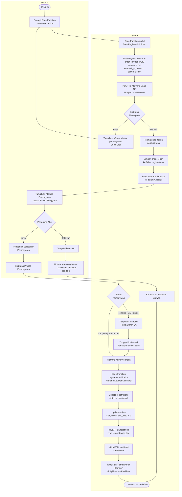
```mermaid
flowchart TD
    subgraph Peserta
        direction TB
        A([🟢 Mulai]) --> B
        K --> L{Pengguna Aksi}
        L -->|Bayar| M[Pengguna Selesaikan<br/>Pembayaran]
        L -->|Batalkan| N[Tutup Midtrans UI]
        M --> Q
        N --> O
    end

    subgraph Sistem
        direction TB
        B[Panggil Edge Function<br/>create-transaction] --> C[Edge Function Ambil<br/>Data Registrasi & Scrim]
        C --> D[Buat Payload Midtrans:<br/>order_id = reg-UUID<br/>amount = fee<br/>enabled_payments = sesuai pilihan]
        D --> E[POST ke Midtrans Snap API<br/>/snap/v1/transactions]
        E --> F{Midtrans<br/>Merespons}
        F -->|Error| G[Tampilkan 'Gagal inisiasi pembayaran'<br/>Coba Lagi]
        G --> B
        F -->|Berhasil| H[Terima snap_token<br/>dari Midtrans]
        H --> I[Simpan snap_token<br/>ke Tabel registrations]
        I --> J[Buka Midtrans Snap UI<br/>di dalam Aplikasi]
        J --> K[Tampilkan Metode Pembayaran<br/>sesuai Pilihan Pengguna]
        O[Update status registrasi<br/>→ 'cancelled' / biarkan pending] --> P[Kembali ke Halaman Browse]
        Q[Midtrans Proses Pembayaran] --> R{Status<br/>Pembayaran}
        R -->|Pending - VA/Transfer| S[Tampilkan Instruksi<br/>Pembayaran VA]
        S --> T[Tunggu Konfirmasi<br/>Pembayaran dari Bank]
        T --> U[Midtrans Kirim Webhook]
        R -->|Langsung Settlement| U
        U --> V[Edge Function<br/>payment-notification<br/>Menerima & Memverifikasi]
        V --> W[Update registrations<br/>status = 'confirmed']
        W --> X[Update scrims<br/>slot_filled = slot_filled + 1]
        X --> Y[INSERT transactions<br/>type = registration_fee]
        Y --> Z[Kirim FCM Notifikasi<br/>ke Peserta]
        Z --> AA[Tampilkan 'Pembayaran Berhasil'<br/>di Aplikasi via Realtime]
        P & AA --> AB([🔴 Selesai — Terdaftar!])
    end
```

---

### UC-07 Lihat Status Pendaftaran

**Aktor:** Peserta  
**Tujuan:** Memantau status registrasi yang telah dilakukan  
**Prasyarat:** Peserta sudah pernah mendaftar minimal satu scrim  

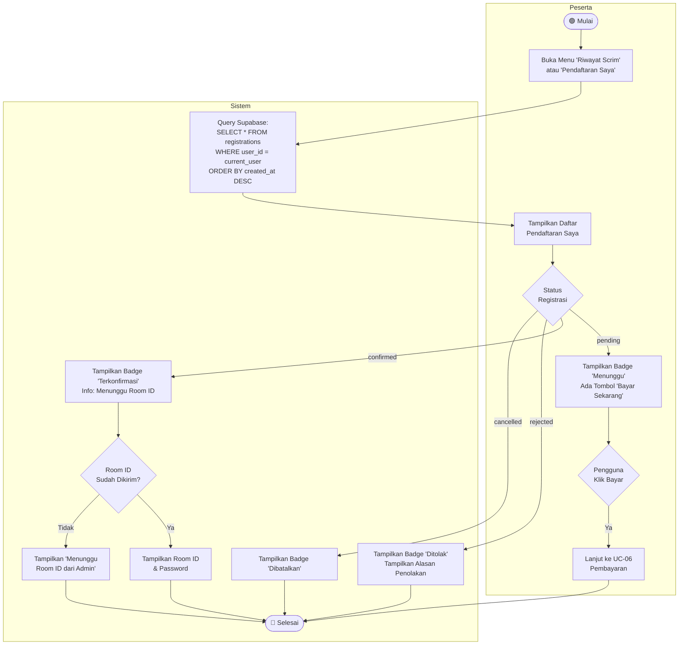
```mermaid
flowchart TD
    subgraph Peserta
        direction TB
        A([🟢 Mulai]) --> B[Buka Menu 'Riwayat Scrim'<br/>atau 'Pendaftaran Saya']
        D --> E
        F --> J{Pengguna<br/>Klik Bayar}
        J -->|Ya| K[Lanjut ke UC-06<br/>Pembayaran]
    end

    subgraph Sistem
        direction TB
        B --> C[Query Supabase:<br/>SELECT * FROM registrations<br/>WHERE user_id = current_user<br/>ORDER BY created_at DESC]
        C --> D[Tampilkan Daftar<br/>Pendaftaran Saya]
        E{Status<br/>Registrasi} -->|pending| F[Tampilkan Badge 'Menunggu'<br/>Ada Tombol 'Bayar Sekarang']
        E -->|confirmed| G[Tampilkan Badge 'Terkonfirmasi'<br/>Info: Menunggu Room ID]
        E -->|rejected| H[Tampilkan Badge 'Ditolak'<br/>Tampilkan Alasan Penolakan]
        E -->|cancelled| I[Tampilkan Badge 'Dibatalkan']
        G --> L{Room ID<br/>Sudah Dikirim?}
        L -->|Ya| M[Tampilkan Room ID<br/>& Password]
        L -->|Tidak| N[Tampilkan 'Menunggu<br/>Room ID dari Admin']
        H & I & K & M & N --> O([🔴 Selesai])
    end
```

---

### UC-08 Terima Room ID & Password

**Aktor:** Peserta  
**Tujuan:** Mendapatkan informasi Room ID dan Password untuk masuk ke game  
**Prasyarat:** Registrasi berstatus `confirmed`, Admin sudah mengirim Room ID  

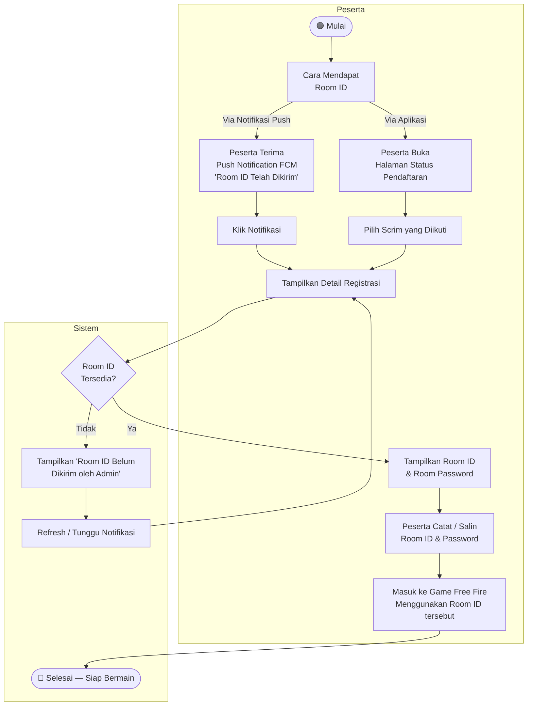
```mermaid
flowchart TD
    subgraph Peserta
        direction TB
        A([🟢 Mulai]) --> B[Cara Mendapat<br/>Room ID]
        B -->|Via Notifikasi Push| C[Peserta Terima<br/>Push Notification FCM<br/>'Room ID Telah Dikirim']
        B -->|Via Aplikasi| D[Peserta Buka<br/>Halaman Status Pendaftaran]
        C --> E[Klik Notifikasi]
        D --> F[Pilih Scrim yang Diikuti]
        E & F --> G
        K --> L[Peserta Catat / Salin<br/>Room ID & Password]
        L --> M[Masuk ke Game Free Fire<br/>Menggunakan Room ID tersebut]
    end

    subgraph Sistem
        direction TB
        G[Tampilkan Detail Registrasi] --> H{Room ID<br/>Tersedia?}
        H -->|Tidak| I[Tampilkan 'Room ID Belum<br/>Dikirim oleh Admin']
        I --> J[Refresh / Tunggu Notifikasi]
        J --> G
        H -->|Ya| K[Tampilkan Room ID<br/>& Room Password]
        M --> N([🔴 Selesai — Siap Bermain])
    end
```

---

### UC-09 Lihat Hasil Pertandingan

**Aktor:** Peserta  
**Tujuan:** Melihat hasil akhir scrim termasuk ranking dan poin  
**Prasyarat:** Scrim telah selesai dan Admin sudah menginput hasil  

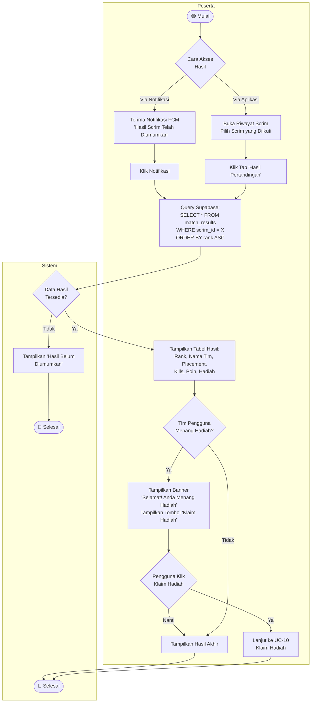
```mermaid
flowchart TD
    subgraph Peserta
        direction TB
        A([🟢 Mulai]) --> B{Cara Akses<br/>Hasil}
        B -->|Via Notifikasi| C[Terima Notifikasi FCM<br/>'Hasil Scrim Telah Diumumkan']
        B -->|Via Aplikasi| D[Buka Riwayat Scrim<br/>Pilih Scrim yang Diikuti]
        C --> E[Klik Notifikasi]
        D --> F[Klik Tab 'Hasil Pertandingan']
        E & F --> G
        K --> L
        N --> O{Pengguna Klik<br/>Klaim Hadiah}
        O -->|Ya| P[Lanjut ke UC-10<br/>Klaim Hadiah]
        O -->|Nanti| M
    end

    subgraph Sistem
        direction TB
        G[Query Supabase:<br/>SELECT * FROM match_results<br/>WHERE scrim_id = X<br/>ORDER BY rank ASC] --> H{Data Hasil<br/>Tersedia?}
        H -->|Tidak| I[Tampilkan 'Hasil Belum<br/>Diumumkan']
        H -->|Ya| K[Tampilkan Tabel Hasil:<br/>Rank, Nama Tim, Placement,<br/>Kills, Poin, Hadiah]
        L{Tim Pengguna<br/>Menang Hadiah?} -->|Tidak| M[Tampilkan Hasil Akhir]
        L -->|Ya| N[Tampilkan Banner<br/>'Selamat! Anda Menang Hadiah'<br/>Tampilkan Tombol 'Klaim Hadiah']
        I --> J([🔴 Selesai])
        M & P --> Q([🔴 Selesai])
    end
```

---

### UC-10 Klaim Hadiah

**Aktor:** Peserta (Pemenang)  
**Tujuan:** Mengajukan klaim prize pool yang telah diraih  
**Prasyarat:** Tim menempati posisi pemenang, prize_amount > 0, belum pernah klaim  

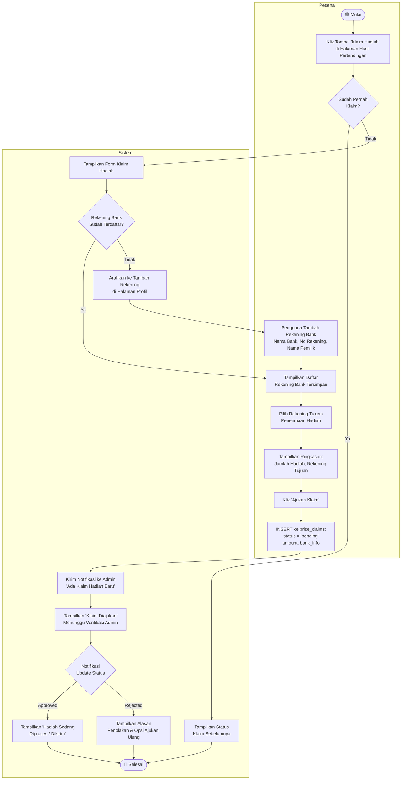
```mermaid
flowchart TD
    subgraph Peserta
        direction TB
        A([🟢 Mulai]) --> B[Klik Tombol 'Klaim Hadiah'<br/>di Halaman Hasil Pertandingan]
        B --> C
        I[Pengguna Tambah Rekening Bank<br/>Nama Bank, No Rekening, Nama Pemilik] --> G
        J[Pilih Rekening Tujuan<br/>Penerimaan Hadiah] --> K
        L[Klik 'Ajukan Klaim'] --> M
    end

    subgraph Sistem
        direction TB
        C{Sudah Pernah<br/>Klaim?} -->|Ya| D[Tampilkan Status<br/>Klaim Sebelumnya]
        D --> Z([🔴 Selesai])
        C -->|Tidak| E[Tampilkan Form Klaim Hadiah]
        E --> F{Rekening Bank<br/>Sudah Terdaftar?}
        F -->|Ya| G[Tampilkan Daftar<br/>Rekening Bank Tersimpan]
        F -->|Tidak| H[Arahkan ke Tambah Rekening<br/>di Halaman Profil]
        H --> I
        G --> J
        K[Tampilkan Ringkasan:<br/>Jumlah Hadiah, Rekening Tujuan] --> L
        M[INSERT ke prize_claims:<br/>status = 'pending'<br/>amount, bank_info] --> N[Kirim Notifikasi ke Admin<br/>'Ada Klaim Hadiah Baru']
        N --> O[Tampilkan 'Klaim Diajukan'<br/>Menunggu Verifikasi Admin]
        O --> P{Notifikasi<br/>Update Status}
        P -->|Approved| Q[Tampilkan 'Hadiah Sedang<br/>Diproses / Dikirim']
        P -->|Rejected| R[Tampilkan Alasan<br/>Penolakan & Opsi Ajukan Ulang]
        Q & R --> Z
    end
```

---

### UC-11 Lihat Leaderboard

**Aktor:** Peserta  
**Tujuan:** Melihat ranking pemain terbaik di platform  
**Prasyarat:** Pengguna sudah login  

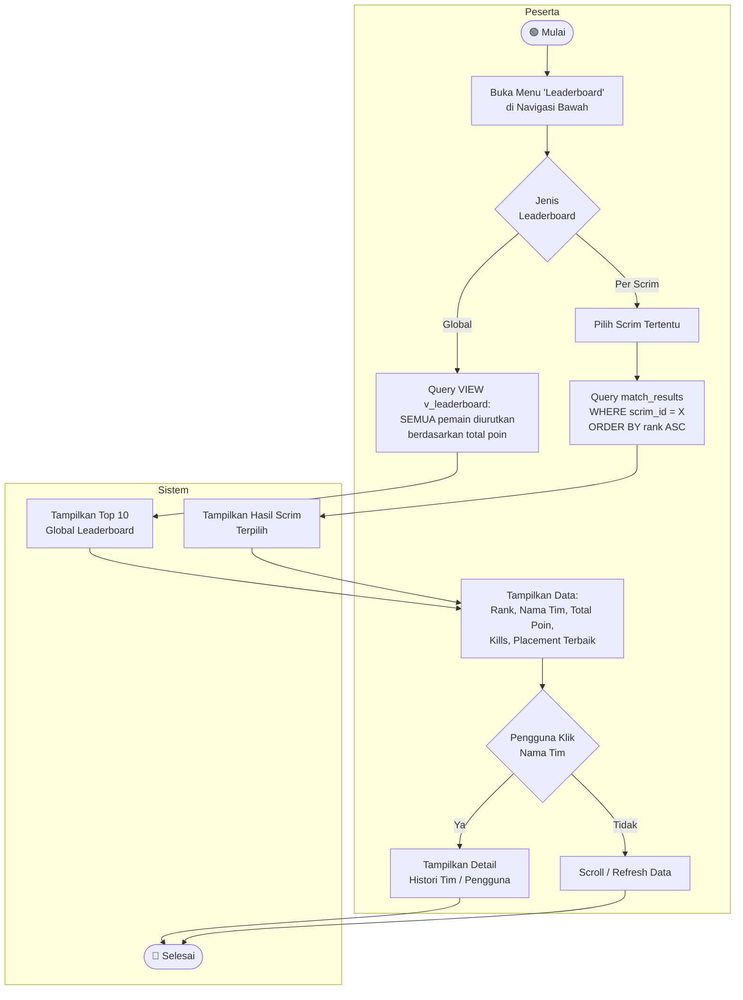
```mermaid
flowchart TD
    subgraph Peserta
        direction TB
        A([🟢 Mulai]) --> B[Buka Menu 'Leaderboard'<br/>di Navigasi Bawah]
        B --> C{Jenis<br/>Leaderboard}
        C -->|Global| D
        C -->|Per Scrim| E[Pilih Scrim Tertentu]
        E --> F
        I --> J{Pengguna Klik<br/>Nama Tim}
        J -->|Ya| K
        J -->|Tidak| L
    end

    subgraph Sistem
        direction TB
        D[Query VIEW v_leaderboard:<br/>SEMUA pemain diurutkan<br/>berdasarkan total poin] --> G[Tampilkan Top 10<br/>Global Leaderboard]
        F[Query match_results<br/>WHERE scrim_id = X<br/>ORDER BY rank ASC] --> H[Tampilkan Hasil Scrim<br/>Terpilih]
        G & H --> I[Tampilkan Data:<br/>Rank, Nama Tim, Total Poin,<br/>Kills, Placement Terbaik]
        K[Tampilkan Detail<br/>Histori Tim / Pengguna] --> M([🔴 Selesai])
        L[Scroll / Refresh Data] --> M
    end
```

---

### UC-12 Kelola Profil & Rekening Bank

**Aktor:** Peserta  
**Tujuan:** Memperbarui informasi profil dan mengelola rekening bank untuk klaim hadiah  
**Prasyarat:** Pengguna sudah login  

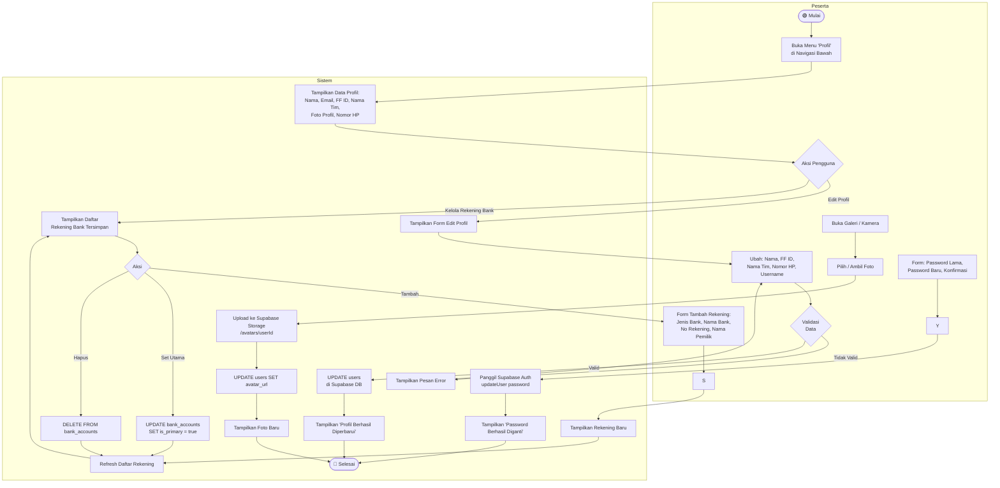
```mermaid
flowchart TD
    subgraph Peserta
        direction TB
        A([🟢 Mulai]) --> B[Buka Menu 'Profil'<br/>di Navigasi Bawah]
        D{Aksi Pengguna}
        F[Ubah: Nama, FF ID,<br/>Nama Tim, Nomor HP, Username] --> G
        K[Buka Galeri / Kamera] --> L[Pilih / Ambil Foto]
        R[Form Tambah Rekening:<br/>Jenis Bank, Nama Bank,<br/>No Rekening, Nama Pemilik] --> S
        X[Form: Password Lama,<br/>Password Baru, Konfirmasi] --> Y
    end

    subgraph Sistem
        direction TB
        B --> C[Tampilkan Data Profil:<br/>Nama, Email, FF ID, Nama Tim,<br/>Foto Profil, Nomor HP]
        C --> D
        D -->|Edit Profil| E[Tampilkan Form Edit Profil]
        E --> F
        G{Validasi<br/>Data} -->|Tidak Valid| H[Tampilkan Pesan Error]
        H --> F
        G -->|Valid| I[UPDATE users<br/>di Supabase DB]
        I --> J[Tampilkan 'Profil Berhasil Diperbarui']
        L --> M[Upload ke Supabase Storage<br/>/avatars/userId]
        M --> N[UPDATE users SET avatar_url]
        N --> O[Tampilkan Foto Baru]
        D -->|Kelola Rekening Bank| P[Tampilkan Daftar<br/>Rekening Bank Tersimpan]
        P --> Q{Aksi}
        Q -->|Tambah| R
        S --> T[Tampilkan Rekening Baru]
        Q -->|Set Utama| U[UPDATE bank_accounts<br/>SET is_primary = true]
        Q -->|Hapus| V[DELETE FROM bank_accounts]
        T & U & V --> W[Refresh Daftar Rekening]
        W --> P
        Y --> Z[Panggil Supabase Auth<br/>updateUser password]
        Z --> AA[Tampilkan 'Password Berhasil Diganti']
        J & O & AA --> AB([🔴 Selesai])
    end
```

---

### UC-13 Buat Scrim Baru (Admin)

**Aktor:** Admin  
**Tujuan:** Membuat event scrim baru yang bisa diikuti peserta  
**Prasyarat:** Pengguna login sebagai Admin  

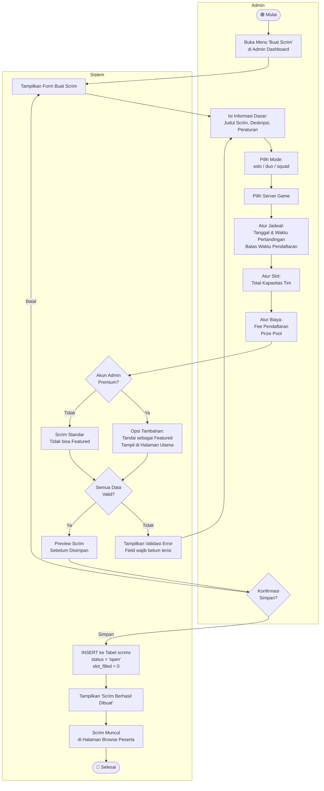
```mermaid
flowchart TD
    subgraph Admin
        direction TB
        A([🟢 Mulai]) --> B[Buka Menu 'Buat Scrim'<br/>di Admin Dashboard]
        D[Isi Informasi Dasar:<br/>Judul Scrim, Deskripsi, Peraturan] --> E[Pilih Mode:<br/>solo / duo / squad]
        E --> F[Pilih Server Game]
        F --> G[Atur Jadwal:<br/>Tanggal & Waktu Pertandingan<br/>Batas Waktu Pendaftaran]
        G --> H[Atur Slot:<br/>Total Kapasitas Tim]
        H --> I[Atur Biaya:<br/>Fee Pendaftaran<br/>Prize Pool]
        P{Konfirmasi<br/>Simpan?}
    end

    subgraph Sistem
        direction TB
        B --> C[Tampilkan Form Buat Scrim]
        C --> D
        I --> J{Akun Admin<br/>Premium?}
        J -->|Ya| K[Opsi Tambahan:<br/>Tandai sebagai Featured<br/>Tampil di Halaman Utama]
        J -->|Tidak| L[Scrim Standar<br/>Tidak bisa Featured]
        K & L --> M{Semua Data<br/>Valid?}
        M -->|Tidak| N[Tampilkan Validasi Error<br/>Field wajib belum terisi]
        N --> D
        M -->|Ya| O[Preview Scrim<br/>Sebelum Disimpan]
        O --> P
        P -->|Batal| C
        P -->|Simpan| Q[INSERT ke Tabel scrims<br/>status = 'open'<br/>slot_filled = 0]
        Q --> R[Tampilkan 'Scrim Berhasil Dibuat']
        R --> S[Scrim Muncul<br/>di Halaman Browse Peserta]
        S --> T([🔴 Selesai])
    end
```

---

### UC-14 Edit & Hapus Scrim (Admin)

**Aktor:** Admin  
**Tujuan:** Memodifikasi atau menghapus scrim yang telah dibuat  
**Prasyarat:** Admin adalah pembuat scrim, scrim belum dimulai/selesai  

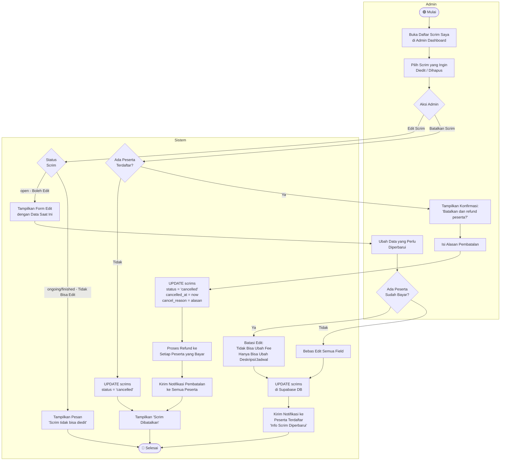
```mermaid
flowchart TD
    subgraph Admin
        direction TB
        A([🟢 Mulai]) --> B[Buka Daftar Scrim Saya<br/>di Admin Dashboard]
        B --> C[Pilih Scrim yang Ingin<br/>Diedit / Dihapus]
        C --> D{Aksi Admin}
        G[Ubah Data yang Perlu<br/>Diperbarui] --> H
        P[Tampilkan Konfirmasi:<br/>'Batalkan dan refund peserta?'] --> Q[Isi Alasan Pembatalan]
    end

    subgraph Sistem
        direction TB
        D -->|Edit Scrim| E{Status<br/>Scrim}
        E -->|open - Boleh Edit| F[Tampilkan Form Edit<br/>dengan Data Saat Ini]
        F --> G
        H{Ada Peserta<br/>Sudah Bayar?} -->|Ya| I[Batasi Edit:<br/>Tidak Bisa Ubah Fee<br/>Hanya Bisa Ubah Deskripsi/Jadwal]
        H -->|Tidak| J[Bebas Edit Semua Field]
        I & J --> K[UPDATE scrims<br/>di Supabase DB]
        K --> L[Kirim Notifikasi ke<br/>Peserta Terdaftar<br/>'Info Scrim Diperbarui']
        E -->|ongoing/finished - Tidak Bisa Edit| M[Tampilkan Pesan<br/>'Scrim tidak bisa diedit']
        D -->|Batalkan Scrim| N{Ada Peserta<br/>Terdaftar?}
        N -->|Tidak| O[UPDATE scrims<br/>status = 'cancelled']
        N -->|Ya| P
        Q --> R[UPDATE scrims<br/>status = 'cancelled'<br/>cancelled_at = now<br/>cancel_reason = alasan]
        R --> S[Proses Refund ke<br/>Setiap Peserta yang Bayar]
        S --> T[Kirim Notifikasi Pembatalan<br/>ke Semua Peserta]
        O & T --> U[Tampilkan 'Scrim Dibatalkan']
        L & M & U --> V([🔴 Selesai])
    end
```

---

### UC-15 Kelola Pendaftaran Peserta (Admin)

**Aktor:** Admin  
**Tujuan:** Meninjau dan mengelola daftar peserta yang mendaftar scrim  
**Prasyarat:** Scrim sudah ada peserta yang mendaftar  

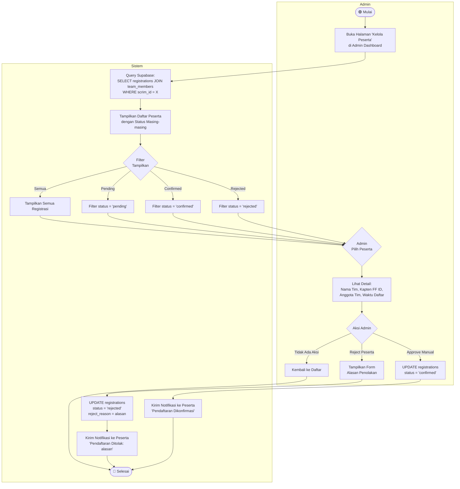
```mermaid
flowchart TD
    subgraph Admin
        direction TB
        A([🟢 Mulai]) --> B[Buka Halaman 'Kelola Peserta'<br/>di Admin Dashboard]
        J{Admin<br/>Pilih Peserta} --> K
        L{Aksi Admin} -->|Approve Manual| M
        L -->|Reject Peserta| N[Tampilkan Form<br/>Alasan Penolakan]
        L -->|Tidak Ada Aksi| R
    end

    subgraph Sistem
        direction TB
        B --> C[Query Supabase:<br/>SELECT registrations JOIN team_members<br/>WHERE scrim_id = X]
        C --> D[Tampilkan Daftar Peserta<br/>dengan Status Masing-masing]
        D --> E{Filter<br/>Tampilkan}
        E -->|Semua| F[Tampilkan Semua Registrasi]
        E -->|Pending| G[Filter status = 'pending']
        E -->|Confirmed| H[Filter status = 'confirmed']
        E -->|Rejected| I[Filter status = 'rejected']
        F & G & H & I --> J
        K[Lihat Detail:<br/>Nama Tim, Kapten FF ID,<br/>Anggota Tim, Waktu Daftar] --> L
        M[UPDATE registrations<br/>status = 'confirmed'] --> Q[Kirim Notifikasi ke Peserta<br/>'Pendaftaran Dikonfirmasi']
        N --> O[UPDATE registrations<br/>status = 'rejected'<br/>reject_reason = alasan]
        O --> P[Kirim Notifikasi ke Peserta<br/>'Pendaftaran Ditolak: alasan']
        R[Kembali ke Daftar] --> S([🔴 Selesai])
        P & Q --> S
    end
```

---

### UC-16 Kirim Room ID ke Peserta (Admin)

**Aktor:** Admin  
**Tujuan:** Mengirimkan Room ID dan Password game kepada peserta yang terdaftar  
**Prasyarat:** Semua peserta confirmed, mendekati waktu pertandingan  

```mermaid
flowchart TD
    subgraph Admin
        direction TB
        A([🟢 Mulai]) --> B[Buka Halaman Scrim<br/>di Admin Dashboard]
        B --> C[Klik Tombol 'Kirim Room ID']
        C --> D[Tampilkan Form:<br/>Room ID & Room Password]
        H{Admin<br/>Konfirmasi} -->|Batal| B
        H -->|Ya, Kirim| I
    end

    subgraph Sistem
        direction TB
        D --> E{Field Terisi?}
        E -->|Tidak| F[Tampilkan Error Validasi]
        F --> D
        E -->|Ya| G[Konfirmasi:<br/>'Kirim ke X peserta?']
        G --> H
        I[UPDATE scrims:<br/>room_id = ...<br/>room_password = ...<br/>room_sent_at = now()] --> J[Ambil Daftar User ID<br/>Semua Peserta Confirmed]
        J --> K[INSERT ke Tabel notifications<br/>per Peserta:<br/>type = room_info<br/>title = 'Room ID Telah Dikirim']
        K --> L[Kirim Push Notification<br/>FCM ke Semua Peserta]
        L --> M{FCM<br/>Berhasil?}
        M -->|Sebagian Gagal| N[Log FCM Token<br/>yang Invalid]
        M -->|Berhasil Semua| O[Tampilkan 'Room ID Berhasil Dikirim']
        N & O --> P[Peserta Terima Notifikasi<br/>& Bisa Lihat Room ID di App]
        P --> Q([🔴 Selesai])
    end
```

---

### UC-17 Input Hasil Pertandingan (Admin)

**Aktor:** Admin  
**Tujuan:** Memasukkan hasil akhir pertandingan dan menetapkan ranking tim  
**Prasyarat:** Pertandingan telah selesai dilaksanakan  

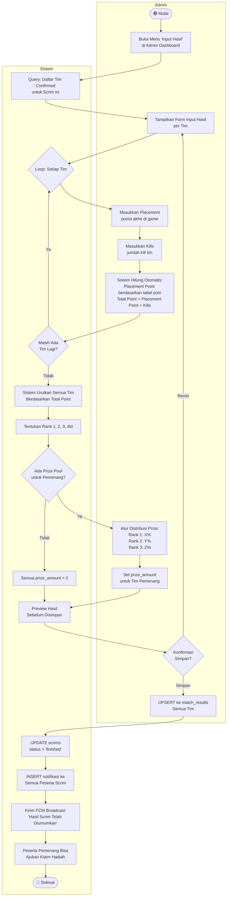
```mermaid
flowchart TD
    subgraph Admin
        direction TB
        A([🟢 Mulai]) --> B[Buka Menu 'Input Hasil'<br/>di Admin Dashboard]
        F[Masukkan Placement<br/>posisi akhir di game] --> G[Masukkan Kills<br/>jumlah kill tim]
        G --> H
        M[Atur Distribusi Prize:<br/>Rank 1: X%<br/>Rank 2: Y%<br/>Rank 3: Z%] --> N
        Q{Konfirmasi<br/>Simpan?} -->|Revisi| D
        Q -->|Simpan| R
    end

    subgraph Sistem
        direction TB
        B --> C[Query: Daftar Tim Confirmed<br/>untuk Scrim ini]
        C --> D[Tampilkan Form Input Hasil<br/>per Tim]
        D --> E{Loop: Setiap Tim}
        E --> F
        H[Sistem Hitung Otomatis:<br/>Placement Point berdasarkan tabel poin<br/>Total Point = Placement Point + Kills] --> I{Masih Ada<br/>Tim Lagi?}
        I -->|Ya| E
        I -->|Tidak| J[Sistem Urutkan Semua Tim<br/>Berdasarkan Total Point]
        J --> K[Tentukan Rank 1, 2, 3, dst]
        K --> L{Ada Prize Pool<br/>untuk Pemenang?}
        L -->|Ya| M
        L -->|Tidak| O[Semua prize_amount = 0]
        N[Set prize_amount<br/>untuk Tim Pemenang] --> P
        O --> P[Preview Hasil<br/>Sebelum Disimpan]
        P --> Q
        R[UPSERT ke match_results<br/>Semua Tim] --> S[UPDATE scrims<br/>status = 'finished']
        S --> T[INSERT notifikasi ke<br/>Semua Peserta Scrim]
        T --> U[Kirim FCM Broadcast:<br/>'Hasil Scrim Telah Diumumkan']
        U --> V[Peserta Pemenang Bisa<br/>Ajukan Klaim Hadiah]
        V --> W([🔴 Selesai])
    end
```

---

### UC-18 Verifikasi Klaim Hadiah (Admin)

**Aktor:** Admin  
**Tujuan:** Memverifikasi klaim hadiah yang diajukan pemenang dan memproses transfer  
**Prasyarat:** Ada prize_claims dengan status `pending`  

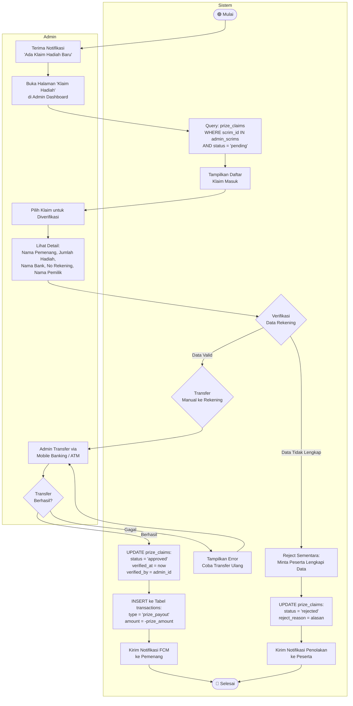
```mermaid
flowchart TD
    subgraph Admin
        direction TB
        B[Terima Notifikasi<br/>'Ada Klaim Hadiah Baru'] --> C[Buka Halaman 'Klaim Hadiah'<br/>di Admin Dashboard]
        F[Pilih Klaim untuk Diverifikasi] --> G
        K[Admin Transfer via<br/>Mobile Banking / ATM] --> L
    end

    subgraph Sistem
        direction TB
        A([🟢 Mulai]) --> B
        C --> D[Query: prize_claims<br/>WHERE scrim_id IN admin_scrims<br/>AND status = 'pending']
        D --> E[Tampilkan Daftar<br/>Klaim Masuk]
        E --> F
        G[Lihat Detail:<br/>Nama Pemenang, Jumlah Hadiah,<br/>Nama Bank, No Rekening, Nama Pemilik] --> H{Verifikasi<br/>Data Rekening}
        H -->|Data Tidak Lengkap| I[Reject Sementara:<br/>Minta Peserta Lengkapi Data]
        H -->|Data Valid| J{Transfer<br/>Manual ke Rekening}
        J --> K
        L{Transfer<br/>Berhasil?} -->|Gagal| M[Tampilkan Error<br/>Coba Transfer Ulang]
        M --> K
        L -->|Berhasil| N[UPDATE prize_claims:<br/>status = 'approved'<br/>verified_at = now<br/>verified_by = admin_id]
        N --> O[INSERT ke Tabel transactions:<br/>type = 'prize_payout'<br/>amount = -prize_amount]
        O --> P[Kirim Notifikasi FCM<br/>ke Pemenang]
        I --> Q[UPDATE prize_claims:<br/>status = 'rejected'<br/>reject_reason = alasan]
        Q --> R[Kirim Notifikasi Penolakan<br/>ke Peserta]
        P & R --> S([🔴 Selesai])
    end
```

---

### UC-19 Berlangganan Premium (Admin)

**Aktor:** Admin  
**Tujuan:** Membeli paket premium untuk mengakses fitur unggulan  
**Prasyarat:** Admin login, belum memiliki paket premium aktif  

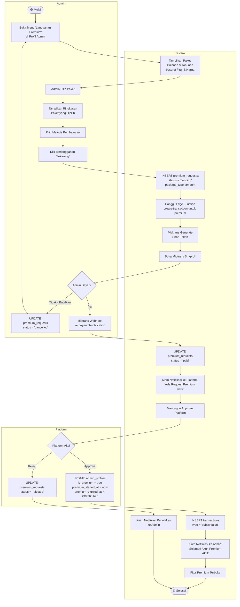
```mermaid
flowchart TD
    subgraph Admin
        direction TB
        A([🟢 Mulai]) --> B[Buka Menu 'Langganan Premium'<br/>di Profil Admin]
        D[Admin Pilih Paket] --> E
        F[Pilih Metode Pembayaran] --> G[Klik 'Berlangganan Sekarang']
        L{Admin Bayar?} -->|Tidak - Batalkan| M[UPDATE premium_requests<br/>status = 'cancelled']
        M --> B
        L -->|Ya| N
    end

    subgraph Platform
        direction TB
        R{Platform Aksi} -->|Approve| S
        R -->|Reject| W
    end

    subgraph Sistem
        direction TB
        B --> C[Tampilkan Paket:<br/>Bulanan & Tahunan<br/>beserta Fitur & Harga]
        C --> D
        E[Tampilkan Ringkasan<br/>Paket yang Dipilih] --> F
        G --> H[INSERT premium_requests:<br/>status = 'pending'<br/>package_type, amount]
        H --> I[Panggil Edge Function<br/>create-transaction untuk premium]
        I --> J[Midtrans Generate<br/>Snap Token]
        J --> K[Buka Midtrans Snap UI]
        K --> L
        N[Midtrans Webhook<br/>ke payment-notification] --> O[UPDATE premium_requests<br/>status = 'paid']
        O --> P[Kirim Notifikasi ke Platform:<br/>'Ada Request Premium Baru']
        P --> Q[Menunggu Approve Platform]
        Q --> R
        S[UPDATE admin_profiles:<br/>is_premium = true<br/>premium_started_at = now<br/>premium_expired_at = +30/365 hari] --> T[INSERT transactions<br/>type = 'subscription']
        T --> U[Kirim Notifikasi ke Admin:<br/>'Selamat! Akun Premium Aktif']
        U --> V[Fitur Premium Terbuka]
        W[UPDATE premium_requests<br/>status = 'rejected'] --> X[Kirim Notifikasi Penolakan<br/>ke Admin]
        V & X --> Y([🔴 Selesai])
    end
```

---

### UC-20 Dashboard Keuangan (Platform)

**Aktor:**   
**Tujuan:** Memantau seluruh arus kas dan kesehatan keuangan platform  
**Prasyarat:** Login sebagai Platform  

```mermaid
flowchart TD
    subgraph Platform
        direction TB
        A([🟢 Mulai]) --> B[Buka Menu 'Keuangan'<br/>di Platform Dashboard]
        E{Pilih Rentang<br/>Waktu} -->|Hari Ini| F[Filter: created_at = today]
        E -->|Minggu Ini| G[Filter: created_at >= 7 hari lalu]
        E -->|Bulan Ini| H[Filter: created_at BETWEEN<br/>awal & akhir bulan]
        E -->|Custom| I[Pilih Tanggal<br/>Mulai & Selesai]
        F & G & H & I --> J
        L --> M{Filter<br/>Jenis Transaksi}
        M -->|Pendapatan| N[Tampilkan registration_fee<br/>& subscription saja]
        M -->|Pengeluaran| O[Tampilkan prize_payout saja]
        M -->|Semua| P[Tampilkan Semua Transaksi]
        N & O & P --> Q{Export<br/>Data?}
    end

    subgraph Sistem
        direction TB
        B --> C[Query VIEW v_platform_finance<br/>Ringkasan Keuangan Platform]
        C --> D[Tampilkan Kartu Ringkasan:<br/>Total Pendapatan<br/>Total Pengeluaran<br/>Saldo Bersih]
        D --> E
        J[Query transactions<br/>dengan Filter Waktu] --> K[Tampilkan Grafik:<br/>Grafik Bar / Line<br/>Pendapatan vs Pengeluaran]
        K --> L[Tampilkan Tabel Transaksi:<br/>Tanggal, Jenis, Keterangan, Nominal]
        Q -->|Ya| R[Export ke CSV / Excel]
        Q -->|Tidak| S[Selesai Melihat]
        R & S --> T([🔴 Selesai])
    end
```

---

### UC-21 Kelola & Suspend Pengguna (Platform)

**Aktor:**   
**Tujuan:** Mengelola akun pengguna dan melakukan tindakan suspend jika diperlukan  
**Prasyarat:** Login sebagai Platform  

```mermaid
flowchart TD
    subgraph Platform
        direction TB
        A([🟢 Mulai]) --> B[Buka Menu 'Kelola Pengguna'<br/>di Platform Dashboard]
        E{Filter<br/>Pengguna} -->|Role| F[Filter by: participant / admin / platform]
        E -->|Status| G[Filter by: aktif / tersuspend]
        E -->|Pencarian| H[Search by: nama / email]
        F & G & H --> I
        J[Platform Pilih Pengguna] --> K
        L{Aksi Platform} -->|Suspend Pengguna| M
        L -->|Unsuspend Pengguna| T
        L -->|Lihat Riwayat Aktivitas| Y
        O[Tampilkan Form Suspend:<br/>Alasan Suspend] --> P
    end

    subgraph Sistem
        direction TB
        B --> C[Query: SELECT * FROM users<br/>ORDER BY created_at DESC]
        C --> D[Tampilkan Daftar Pengguna:<br/>Nama, Email, Role, Status]
        D --> E
        I[Refresh Daftar] --> J
        K[Lihat Detail Profil:<br/>Info Lengkap, Riwayat Aktivitas] --> L
        M{Pengguna<br/>Sudah Tersuspend?} -->|Ya| N[Tampilkan Info<br/>'Sudah Tersuspend']
        M -->|Tidak| O
        P[UPDATE users:<br/>is_suspended = true<br/>suspension_reason = alasan<br/>suspended_at = now<br/>suspended_by = platform_id] --> Q[Paksa Logout Pengguna<br/>dari Sesi Aktif]
        Q --> R[INSERT audit_logs:<br/>action = 'suspend']
        R --> S[Kirim Notifikasi ke Pengguna:<br/>'Akun Anda Telah Disuspend']
        T{Pengguna<br/>Tersuspend?} -->|Tidak| U[Tampilkan 'Pengguna Aktif']
        T -->|Ya| V[UPDATE users:<br/>is_suspended = false<br/>suspension_reason = null]
        V --> W[INSERT audit_logs:<br/>action = 'unsuspend']
        W --> X[Kirim Notifikasi:<br/>'Akun Anda Telah Diaktifkan']
        Y[Tampilkan Audit Log<br/>untuk Pengguna Ini] --> Z([🔴 Selesai])
        N & S & U & X --> Z
    end
```

---

### UC-22 Approve/Reject Premium Request (Platform)

**Aktor:**   
**Tujuan:** Meninjau dan menyetujui atau menolak permintaan premium dari admin  
**Prasyarat:** Ada premium_requests dengan status `paid`  

```mermaid
flowchart TD
    subgraph Platform
        direction TB
        A([🟢 Mulai]) --> B{Cara Mengetahui<br/>Ada Request}
        B -->|Via Notifikasi| C[Terima Push Notification<br/>'Ada Request Premium Baru']
        B -->|Via Dashboard| D[Buka 'Kelola Premium'<br/>di Platform Dashboard]
        C --> E[Klik Notifikasi]
        D --> F[Query: premium_requests<br/>WHERE status = 'paid'<br/>ORDER BY created_at ASC]
        E & F --> G
        H[Pilih Request untuk Ditinjau] --> I
        J{Verifikasi<br/>Pembayaran} --> K
        L{Pembayaran<br/>Terkonfirmasi?} -->|Tidak| M
        L -->|Ya| N{Platform<br/>Memutuskan}
        N -->|Approve| O
        N -->|Reject| M
    end

    subgraph Sistem
        direction TB
        G[Tampilkan Daftar<br/>Request Premium Menunggu] --> H
        I[Lihat Detail:<br/>Nama Admin, Paket, Nominal,<br/>Tanggal Request, Bukti Bayar Midtrans] --> J
        K[Cek Status di<br/>Midtrans Dashboard] --> L
        M[Reject Request<br/>dengan Alasan] --> S[UPDATE premium_requests:<br/>status = 'rejected'<br/>reject_reason = alasan]
        O[UPDATE premium_requests:<br/>status = 'approved'<br/>approved_by = platform_id<br/>approved_at = now] --> P[UPDATE admin_profiles:<br/>is_premium = true<br/>premium_started_at = now<br/>premium_expired_at = sesuai paket]
        P --> Q[INSERT transactions:<br/>type = 'subscription'<br/>amount = +nominal]
        Q --> R[Kirim Notifikasi Approval<br/>ke Admin]
        S --> T[Kirim Notifikasi Penolakan<br/>ke Admin]
        R & T --> U[INSERT audit_logs:<br/>action approve/reject premium]
        U --> V([🔴 Selesai])
    end
```

---

## 5. Sequence Diagram per Use Case

---

### SD-01 Registrasi Akun

```mermaid
sequenceDiagram
    actor Pengguna
    participant App as Flutter App
    participant SupaAuth as Supabase Auth
    participant DB as Supabase DB

    Pengguna->>App: Buka halaman Registrasi
    App-->>Pengguna: Tampilkan form registrasi

    Pengguna->>App: Input nama, email, password
    App->>App: Validasi lokal (format email, min password)

    alt Validasi Gagal
        App-->>Pengguna: Tampilkan pesan error validasi
    else Validasi Berhasil
        App->>SupaAuth: signUp(email, password)
        SupaAuth-->>App: User baru / Error email duplikat

        alt Email sudah terdaftar
            App-->>Pengguna: "Email sudah digunakan"
        else Registrasi Berhasil
            SupaAuth->>DB: Trigger: INSERT users (uuid, role=participant)
            DB-->>SupaAuth: Record berhasil dibuat
            SupaAuth->>Pengguna: Kirim email verifikasi
            App-->>Pengguna: "Cek email Anda untuk verifikasi"
        end
    end

    Pengguna->>SupaAuth: Klik link verifikasi di email
    SupaAuth-->>App: Email terverifikasi
    App-->>Pengguna: Redirect ke halaman Login
```

---

### SD-02 Login

```mermaid
sequenceDiagram
    actor Pengguna
    participant App as Flutter App
    participant SupaAuth as Supabase Auth
    participant DB as Supabase DB

    Pengguna->>App: Buka halaman Login
    App-->>Pengguna: Tampilkan form login

    Pengguna->>App: Input email & password
    App->>SupaAuth: signInWithPassword(email, password)

    alt Kredensial Salah
        SupaAuth-->>App: Error: invalid credentials
        App-->>Pengguna: "Email atau password salah"
    else Login Berhasil
        SupaAuth-->>App: Session (access_token, user.id)
        App->>DB: SELECT * FROM users WHERE uuid = auth.uid()
        DB-->>App: Data user (role, is_suspended)

        alt Akun Tersuspend
            App->>SupaAuth: signOut()
            App-->>Pengguna: "Akun disuspend: [alasan]"
        else role = participant
            App-->>Pengguna: Redirect → Home Screen
        else role = admin
            App-->>Pengguna: Redirect → Admin Dashboard
        else role = platform
            App-->>Pengguna: Redirect → Platform Dashboard
        end

        App->>DB: UPDATE users SET last_login_at = now()
    end
```

---

### SD-03 Browse & Cari Scrim

```mermaid
sequenceDiagram
    actor Peserta
    participant App as Flutter App
    participant DB as Supabase DB

    Peserta->>App: Buka halaman Home / Browse
    App->>DB: SELECT * FROM v_scrim_list\nWHERE status='open'\nORDER BY scheduled_at ASC
    DB-->>App: Daftar scrim tersedia
    App-->>Peserta: Tampilkan daftar scrim

    opt Pengguna Filter
        Peserta->>App: Pilih filter (mode/server/fee)
        App->>DB: SELECT * FROM v_scrim_list\nWHERE mode=? AND server=? AND fee<=?
        DB-->>App: Hasil terfilter
        App-->>Peserta: Tampilkan scrim yang sesuai filter
    end

    opt Pengguna Mencari
        Peserta->>App: Ketik kata kunci di search bar
        App->>DB: SELECT * FROM scrims\nWHERE title ILIKE '%keyword%'
        DB-->>App: Hasil pencarian
        App-->>Peserta: Tampilkan hasil pencarian
    end

    Peserta->>App: Klik salah satu scrim
    App-->>Peserta: Navigasi ke halaman Detail Scrim
```

---

### SD-04 Daftar Scrim

```mermaid
sequenceDiagram
    actor Peserta
    participant App as Flutter App
    participant DB as Supabase DB
    participant EdgeFn as Edge Function

    Peserta->>App: Klik "Daftar Sekarang"
    App-->>Peserta: Tampilkan form pendaftaran

    Peserta->>App: Isi nama tim, FF ID kapten,\nnomor HP, anggota tim
    Peserta->>App: Pilih metode pembayaran

    App->>DB: CHECK: slot_filled < slot_total\nDAN registration_closes_at > now()
    DB-->>App: Slot valid / sudah penuh

    alt Slot Penuh / Registrasi Ditutup
        App-->>Peserta: "Slot penuh atau pendaftaran ditutup"
    else Slot Tersedia
        App->>DB: INSERT registrations\n(status='pending', payment_method)
        DB-->>App: registration_id

        App->>DB: INSERT team_members\n(ff_id per anggota)
        DB-->>App: Anggota tersimpan

        App->>EdgeFn: POST /create-transaction\n{registration_id, payment_type}
        Note over App,EdgeFn: Lanjut ke SD-05
    end
```

---

### SD-05 Pembayaran via Midtrans

```mermaid
sequenceDiagram
    actor Peserta
    participant App as Flutter App
    participant EdgeFn as Edge Function
    participant MT as Midtrans API
    participant DB as Supabase DB
    participant WebhookFn as Edge Fn: payment-notification
    participant FCM as Firebase FCM

    Note over App,FCM: Lanjutan dari SD-04

    App->>EdgeFn: POST /create-transaction\n{registration_id, payment_type[]}
    EdgeFn->>DB: GET registrations JOIN scrims\nWHERE id = registration_id
    DB-->>EdgeFn: Data lengkap (amount, user info)

    EdgeFn->>MT: POST /snap/v1/transactions\n{order_id: "reg-{uuid}",\namount: fee,\nenabled_payments: [...]}
    MT-->>EdgeFn: {token, redirect_url}

    EdgeFn->>DB: UPDATE registrations\nSET midtrans_snap_token = token
    EdgeFn-->>App: {snap_token, redirect_url}

    App->>Peserta: Buka Midtrans Snap UI

    alt Peserta Membatalkan
        Peserta->>App: Tutup UI Midtrans
        App->>DB: UPDATE registrations SET status='cancelled'
        App-->>Peserta: Kembali ke Browse
    else Peserta Membayar
        Peserta->>MT: Selesaikan pembayaran
        MT-->>Peserta: Konfirmasi pembayaran

        MT->>WebhookFn: POST /payment-notification\n{order_id, transaction_status, signature_key}
        WebhookFn->>WebhookFn: Verifikasi HMAC-SHA512

        alt Signature Valid & Status settlement
            WebhookFn->>DB: UPDATE registrations\nSET status='confirmed',\nmidtrans_status='settlement',\npayment_type=actual_type
            WebhookFn->>DB: UPDATE scrims\nSET slot_filled = slot_filled + 1
            WebhookFn->>DB: INSERT transactions\n(type='registration_fee', amount=+fee)
            WebhookFn->>FCM: Send notification\nke FCM token peserta
            FCM-->>Peserta: 🔔 "Pembayaran Berhasil!"
        else Signature Tidak Valid
            WebhookFn-->>MT: HTTP 401 Unauthorized
        end

        App->>DB: Realtime subscription (registrations)
        DB-->>App: Status update: 'confirmed'
        App-->>Peserta: "Pendaftaran Berhasil!"
    end
```

---

### SD-06 Terima Room ID & Password

```mermaid
sequenceDiagram
    actor Admin
    actor Peserta
    participant AdminApp as Flutter App (Admin)
    participant DB as Supabase DB
    participant FCM as Firebase FCM
    participant PesertaApp as Flutter App (Peserta)

    Admin->>AdminApp: Buka halaman Kirim Room ID
    AdminApp-->>Admin: Form Room ID & Password

    Admin->>AdminApp: Isi Room ID dan Room Password
    Admin->>AdminApp: Klik "Kirim ke Peserta"

    AdminApp->>DB: UPDATE scrims SET\nroom_id=?,\nroom_password=?,\nroom_sent_at=now()
    DB-->>AdminApp: Update berhasil

    AdminApp->>DB: SELECT user_id FROM registrations\nWHERE scrim_id=? AND status='confirmed'
    DB-->>AdminApp: List user_id peserta

    loop Setiap Peserta
        AdminApp->>DB: INSERT notifications\n(user_id, type='room_info',\ntitle='Room ID Telah Dikirim')
        DB-->>AdminApp: Notifikasi tersimpan
    end

    AdminApp->>FCM: Send multicast notification\nke semua FCM token peserta
    FCM-->>PesertaApp: 🔔 Push notification masuk

    Peserta->>PesertaApp: Buka notifikasi / halaman Status
    PesertaApp->>DB: SELECT room_id, room_password\nFROM scrims WHERE id=?
    DB-->>PesertaApp: Room ID & Password
    PesertaApp-->>Peserta: Tampilkan Room ID & Password
```

---

### SD-07 Lihat Hasil & Klaim Hadiah

```mermaid
sequenceDiagram
    actor Admin
    actor Peserta
    participant AdminApp as Flutter App (Admin)
    participant PesertaApp as Flutter App (Peserta)
    participant DB as Supabase DB
    participant FCM as Firebase FCM

    Note over Admin,DB: FASE 1 — Input Hasil
    Admin->>AdminApp: Buka "Input Hasil Pertandingan"
    AdminApp->>DB: GET registrations\nWHERE scrim_id=? AND status='confirmed'
    DB-->>AdminApp: Daftar tim peserta

    loop Setiap Tim
        Admin->>AdminApp: Input placement, kills
        AdminApp->>AdminApp: Hitung total_point\n= placement_point + kills
    end

    Admin->>AdminApp: Klik Simpan Hasil
    AdminApp->>DB: UPSERT match_results\n(placement, kills, total_point, rank, prize_amount)
    DB-->>AdminApp: Data tersimpan

    AdminApp->>DB: UPDATE scrims SET status='finished'
    AdminApp->>FCM: Broadcast ke semua peserta\n"Hasil Scrim Tersedia"
    FCM-->>PesertaApp: 🔔 "Hasil Diumumkan!"

    Note over Peserta,DB: FASE 2 — Lihat Hasil
    Peserta->>PesertaApp: Buka Hasil Pertandingan
    PesertaApp->>DB: SELECT * FROM match_results\nWHERE scrim_id=? ORDER BY rank ASC
    DB-->>PesertaApp: Data ranking & prize
    PesertaApp-->>Peserta: Tampilkan leaderboard scrim

    Note over Peserta,DB: FASE 3 — Klaim Hadiah (jika menang)
    Peserta->>PesertaApp: Klik "Klaim Hadiah"
    PesertaApp->>DB: GET bank_accounts\nWHERE user_id = current_user
    DB-->>PesertaApp: Daftar rekening bank

    Peserta->>PesertaApp: Pilih rekening & submit klaim
    PesertaApp->>DB: INSERT prize_claims\n(status='pending', amount, bank_info)
    DB-->>PesertaApp: claim_id

    PesertaApp->>FCM: Notifikasi ke Admin:\n"Ada Klaim Hadiah Baru"
    FCM-->>AdminApp: 🔔 Notifikasi masuk

    Note over Admin,DB: FASE 4 — Verifikasi & Transfer
    Admin->>AdminApp: Buka daftar klaim hadiah
    AdminApp->>DB: GET prize_claims WHERE status='pending'
    DB-->>AdminApp: Daftar klaim

    Admin->>AdminApp: Verifikasi & approve klaim
    AdminApp->>DB: UPDATE prize_claims SET status='approved'
    AdminApp->>DB: INSERT transactions\n(type='prize_payout', amount=-prize)
    AdminApp->>FCM: Notifikasi ke Peserta:\n"Hadiah Telah Dikirim!"
    FCM-->>PesertaApp: 🔔 "Hadiah sedang dikirim!"
```

---

### SD-08 Lihat Leaderboard

```mermaid
sequenceDiagram
    actor Peserta
    participant App as Flutter App
    participant DB as Supabase DB

    Peserta->>App: Buka menu Leaderboard
    App-->>Peserta: Tampilkan halaman Leaderboard

    opt Leaderboard Global
        App->>DB: SELECT * FROM v_leaderboard\nORDER BY total_point DESC\nLIMIT 50
        DB-->>App: Data peringkat global
        App-->>Peserta: Tampilkan Top 50 pemain
    end

    opt Leaderboard Per Scrim
        Peserta->>App: Pilih scrim tertentu
        App->>DB: SELECT * FROM match_results\nWHERE scrim_id=?\nORDER BY rank ASC
        DB-->>App: Hasil scrim
        App-->>Peserta: Tampilkan ranking scrim tersebut
    end

    Peserta->>App: Klik nama tim / pengguna
    App->>DB: SELECT * FROM registrations JOIN match_results\nWHERE user_id=?
    DB-->>App: Histori pertandingan
    App-->>Peserta: Tampilkan profil & histori tim
```

---

### SD-09 Kelola Profil & Rekening Bank

```mermaid
sequenceDiagram
    actor Pengguna
    participant App as Flutter App
    participant DB as Supabase DB
    participant Storage as Supabase Storage
    participant SupaAuth as Supabase Auth

    Pengguna->>App: Buka halaman Profil
    App->>DB: SELECT * FROM users WHERE id = current_user
    DB-->>App: Data profil
    App-->>Pengguna: Tampilkan profil lengkap

    opt Edit Profil
        Pengguna->>App: Edit nama, FF ID, username, dll
        App->>DB: UPDATE users SET\nname=?, ff_id=?, username=?, team_name=?
        DB-->>App: Update berhasil
        App-->>Pengguna: "Profil diperbarui"
    end

    opt Ganti Foto Profil
        Pengguna->>App: Pilih foto baru
        App->>Storage: PUT /avatars/{userId}/{filename}
        Storage-->>App: avatar_url baru
        App->>DB: UPDATE users SET avatar_url=?
        App-->>Pengguna: Foto profil diperbarui
    end

    opt Tambah Rekening Bank
        Pengguna->>App: Klik "Tambah Rekening"
        App-->>Pengguna: Form tambah rekening
        Pengguna->>App: Isi bank_name, account_number, account_name
        App->>DB: INSERT bank_accounts\n(user_id, bank_name, account_number, account_name)
        DB-->>App: Rekening tersimpan
        App-->>Pengguna: "Rekening berhasil ditambahkan"
    end

    opt Ganti Password
        Pengguna->>App: Isi password lama & baru
        App->>SupaAuth: updateUser(password: newPassword)
        SupaAuth-->>App: Berhasil
        App-->>Pengguna: "Password berhasil diganti"
    end
```

---

### SD-10 Buat & Kelola Scrim (Admin)

```mermaid
sequenceDiagram
    actor Admin
    participant App as Flutter App (Admin)
    participant DB as Supabase DB

    Admin->>App: Buka "Buat Scrim Baru"
    App-->>Admin: Tampilkan form buat scrim

    Admin->>App: Isi semua data scrim\n(judul, mode, server, jadwal, slot, fee, prize)
    App->>App: Validasi lokal\n(jadwal > sekarang, slot > 0, fee >= 0)

    alt Validasi Gagal
        App-->>Admin: Tampilkan error validasi
    else Validasi Berhasil
        App->>DB: INSERT scrims\n(admin_id, title, mode, server,\nscheduled_at, slot_total, fee, prize_pool,\nstatus='open', slot_filled=0)
        DB-->>App: scrim_id baru
        App-->>Admin: "Scrim berhasil dibuat!"
    end

    Note over Admin,DB: Edit Scrim
    Admin->>App: Buka scrim & klik Edit
    App->>DB: SELECT * FROM scrims WHERE id=? AND admin_id=current
    DB-->>App: Data scrim
    App-->>Admin: Form edit dengan data saat ini

    Admin->>App: Ubah field yang diinginkan
    App->>DB: UPDATE scrims SET ?\nWHERE id=? AND status='open'
    DB-->>App: Update berhasil
    App-->>Admin: "Scrim diperbarui"

    Note over Admin,DB: Batalkan Scrim
    Admin->>App: Klik "Batalkan Scrim"
    App-->>Admin: Konfirmasi & form alasan
    Admin->>App: Isi alasan pembatalan
    App->>DB: UPDATE scrims SET\nstatus='cancelled',\ncancel_reason=?,\ncancelled_at=now()
    DB-->>App: Berhasil
    App-->>Admin: "Scrim dibatalkan"
```

---

### SD-11 Kirim Room ID ke Peserta (Admin)

```mermaid
sequenceDiagram
    actor Admin
    participant AdminApp as Flutter App (Admin)
    participant DB as Supabase DB
    participant FCM as Firebase FCM
    participant PesertaApp as Flutter App (Peserta)
    actor Peserta

    Admin->>AdminApp: Buka halaman Scrim
    Admin->>AdminApp: Klik "Kirim Room ID"
    AdminApp-->>Admin: Form Room ID & Password

    Admin->>AdminApp: Input Room ID & Room Password
    Admin->>AdminApp: Klik Kirim

    AdminApp->>DB: UPDATE scrims SET\nroom_id=?, room_password=?,\nroom_sent_at=now()\nWHERE id=? AND admin_id=current
    DB-->>AdminApp: Update sukses

    AdminApp->>DB: SELECT users.fcm_token, registrations.user_id\nFROM registrations JOIN users\nWHERE scrim_id=? AND status='confirmed'
    DB-->>AdminApp: List peserta & FCM token

    loop Batch Insert Notifikasi
        AdminApp->>DB: INSERT notifications\n(user_id, type='room_info', scrim_id=?)
    end

    AdminApp->>FCM: sendMulticast(\n  tokens: [...],\n  title: "Room ID Telah Dikirim",\n  body: "Buka aplikasi untuk lihat Room ID"\n)
    FCM-->>PesertaApp: Push notification diterima

    Peserta->>PesertaApp: Buka notifikasi
    PesertaApp->>DB: SELECT room_id, room_password\nFROM scrims WHERE id=?
    DB-->>PesertaApp: Room ID & Password
    PesertaApp-->>Peserta: Tampilkan Room ID & Password
```

---

### SD-12 Input Hasil Pertandingan (Admin)

```mermaid
sequenceDiagram
    actor Admin
    participant App as Flutter App (Admin)
    participant DB as Supabase DB
    participant FCM as Firebase FCM

    Admin->>App: Buka "Input Hasil" untuk scrim tertentu
    App->>DB: SELECT registrations\nWHERE scrim_id=? AND status='confirmed'
    DB-->>App: Daftar tim peserta
    App-->>Admin: Form input hasil per tim

    loop Setiap Tim
        Admin->>App: Input placement & kills
        App->>App: Hitung placement_point\nberdasarkan tabel poin Free Fire
        App->>App: Hitung total_point\n= placement_point + kills
    end

    App->>App: Sort semua tim\nberdasarkan total_point DESC
    App->>App: Assign rank 1, 2, 3, ...
    App->>App: Hitung prize_amount\nuntuk rank yang menang

    Admin->>App: Klik "Simpan Hasil"

    App->>DB: UPSERT match_results\nFOR EACH tim:\n(scrim_id, registration_id, team_name,\nplacement, kills, placement_point,\ntotal_point, rank, prize_amount,\ninputted_by=admin_id)
    DB-->>App: Semua hasil tersimpan

    App->>DB: UPDATE scrims\nSET status='finished'
    DB-->>App: Status updated

    App->>DB: SELECT user_id FROM registrations\nWHERE scrim_id=? AND status='confirmed'
    DB-->>App: List peserta

    App->>FCM: Broadcast ke semua peserta:\n"Hasil Scrim [nama] Telah Diumumkan!"
    FCM-->>App: Delivered

    App-->>Admin: "Hasil berhasil disimpan!"
```

---

### SD-13 Verifikasi Klaim Hadiah (Admin)

```mermaid
sequenceDiagram
    actor Admin
    actor Peserta
    participant AdminApp as Flutter App (Admin)
    participant PesertaApp as Flutter App (Peserta)
    participant DB as Supabase DB
    participant FCM as Firebase FCM

    Note over Peserta,DB: Peserta mengajukan klaim
    Peserta->>PesertaApp: Klik "Klaim Hadiah"
    PesertaApp->>DB: INSERT prize_claims\n(user_id, scrim_id, match_result_id,\namount, bank_info, status='pending')
    DB-->>PesertaApp: claim_id
    PesertaApp->>FCM: Notifikasi ke admin:\n"Ada klaim hadiah baru"
    FCM-->>AdminApp: 🔔 Notifikasi

    Note over Admin,DB: Admin verifikasi
    Admin->>AdminApp: Buka daftar klaim
    AdminApp->>DB: SELECT prize_claims JOIN users JOIN match_results\nWHERE status='pending'\nAND scrim_id IN (admin_scrims)
    DB-->>AdminApp: Daftar klaim pending

    Admin->>AdminApp: Pilih klaim untuk diverifikasi
    AdminApp-->>Admin: Detail: nama, jumlah, rekening bank

    alt Admin Approve
        Admin->>AdminApp: Transfer manual via bank
        Admin->>AdminApp: Klik "Approve Klaim"
        AdminApp->>DB: UPDATE prize_claims SET\nstatus='approved',\nverified_at=now(),\nverified_by=admin_id
        AdminApp->>DB: INSERT transactions\n(type='prize_payout',\namount=-prize_amount,\nscrim_id=?, user_id=?)
        AdminApp->>FCM: Notif ke peserta:\n"Hadiah Telah Dikirim!"
        FCM-->>PesertaApp: 🔔 "Hadiah kamu sudah dikirim!"
    else Admin Reject
        Admin->>AdminApp: Isi alasan penolakan
        Admin->>AdminApp: Klik "Reject"
        AdminApp->>DB: UPDATE prize_claims SET\nstatus='rejected',\nreject_reason=?
        AdminApp->>FCM: Notif ke peserta:\n"Klaim Ditolak: [alasan]"
        FCM-->>PesertaApp: 🔔 Notifikasi penolakan
    end
```

---

### SD-14 Berlangganan Premium (Admin)

```mermaid
sequenceDiagram
    actor Admin
    participant App as Flutter App (Admin)
    participant DB as Supabase DB
    participant EdgeFn as Edge Function
    participant MT as Midtrans
    participant WebhookFn as Edge Fn: payment-notification
    participant PlatformApp as Flutter App (Platform)
    actor Platform

    Admin->>App: Buka menu Langganan Premium
    App->>DB: GET paket premium & harga
    DB-->>App: Daftar paket
    App-->>Admin: Tampilkan pilihan paket

    Admin->>App: Pilih paket & metode bayar
    Admin->>App: Klik "Berlangganan"

    App->>DB: INSERT premium_requests\n(admin_user_id, package_type,\namount, status='pending')
    DB-->>App: request_id

    App->>EdgeFn: POST /create-transaction\n{type:'premium', id: request_id}
    EdgeFn->>MT: POST /snap/v1/transactions\n{order_id: "sub-{uuid}", amount}
    MT-->>EdgeFn: snap_token
    EdgeFn->>DB: UPDATE premium_requests\nSET midtrans_snap_token=?
    EdgeFn-->>App: snap_token

    App-->>Admin: Buka Midtrans Snap UI
    Admin->>MT: Selesaikan pembayaran

    MT->>WebhookFn: POST /payment-notification\n{order_id, status:'settlement'}
    WebhookFn->>DB: UPDATE premium_requests SET status='paid'
    WebhookFn->>DB: SELECT platform user_id
    WebhookFn->>PlatformApp: FCM: "Ada Request Premium Baru"

    Platform->>PlatformApp: Buka & review request
    PlatformApp->>DB: GET premium_requests WHERE status='paid'
    DB-->>PlatformApp: Data request

    alt Platform Approve
        Platform->>PlatformApp: Klik Approve
        PlatformApp->>DB: UPDATE premium_requests SET status='approved'
        PlatformApp->>DB: UPDATE admin_profiles SET\nis_premium=true,\npremium_started_at=now(),\npremium_expired_at=+30/365 hari
        PlatformApp->>DB: INSERT transactions\n(type='subscription', amount=+nominal)
        PlatformApp->>App: FCM: "Akun Premium Aktif!"
        App-->>Admin: 🔔 "Selamat! Fitur premium terbuka"
    else Platform Reject
        Platform->>PlatformApp: Isi alasan & klik Reject
        PlatformApp->>DB: UPDATE premium_requests SET\nstatus='rejected', reject_reason=?
        PlatformApp->>App: FCM: "Request Premium Ditolak"
        App-->>Admin: 🔔 Notifikasi penolakan
    end
```

---

### SD-15 Dashboard Keuangan (Platform)

```mermaid
sequenceDiagram
    actor Platform
    participant App as Flutter App (Platform)
    participant DB as Supabase DB

    Platform->>App: Buka menu Dashboard Keuangan
    App->>DB: SELECT * FROM v_platform_finance
    DB-->>App: Ringkasan: total pendapatan, pengeluaran, saldo

    App-->>Platform: Tampilkan kartu ringkasan keuangan

    App->>DB: SELECT * FROM transactions\nWHERE created_at >= awal_bulan\nORDER BY created_at DESC
    DB-->>App: Daftar transaksi bulan ini
    App-->>Platform: Tampilkan grafik & tabel transaksi

    opt Filter Rentang Waktu
        Platform->>App: Pilih filter tanggal (hari/minggu/bulan/custom)
        App->>DB: SELECT * FROM transactions\nWHERE created_at BETWEEN start AND end
        DB-->>App: Transaksi sesuai filter
        App-->>Platform: Perbarui tampilan grafik & tabel
    end

    opt Filter Jenis Transaksi
        Platform->>App: Filter: Pendapatan / Pengeluaran / Semua
        App->>DB: SELECT * FROM transactions\nWHERE type IN ('registration_fee','subscription')\nOR type = 'prize_payout'
        DB-->>App: Transaksi terfilter
        App-->>Platform: Tampilkan sesuai filter
    end

    opt Export Data
        Platform->>App: Klik Export CSV
        App->>DB: SELECT semua transaksi\nsesuai filter aktif
        DB-->>App: Data lengkap
        App-->>Platform: Generate & download file CSV
    end
```

---

### SD-16 Kelola & Suspend Pengguna (Platform)

```mermaid
sequenceDiagram
    actor Platform
    participant App as Flutter App (Platform)
    participant DB as Supabase DB
    participant FCM as Firebase FCM
    participant TargetApp as Flutter App (Target User)

    Platform->>App: Buka menu Kelola Pengguna
    App->>DB: SELECT * FROM users\nORDER BY created_at DESC
    DB-->>App: Daftar semua pengguna
    App-->>Platform: Tampilkan daftar pengguna

    opt Filter / Cari
        Platform->>App: Filter by role / status / cari nama/email
        App->>DB: SELECT * FROM users\nWHERE role=? AND is_suspended=?\nAND name ILIKE '%keyword%'
        DB-->>App: Hasil filter
        App-->>Platform: Tampilkan hasil
    end

    Platform->>App: Pilih pengguna yang akan dikelola
    App->>DB: SELECT users.*, admin_profiles.*\nWHERE users.id=?
    DB-->>App: Detail pengguna
    App-->>Platform: Tampilkan detail profil

    alt Suspend Pengguna
        Platform->>App: Klik "Suspend"
        App-->>Platform: Form alasan suspend
        Platform->>App: Isi alasan & konfirmasi
        App->>DB: UPDATE users SET\nis_suspended=true,\nsuspension_reason=?,\nsuspended_at=now(),\nsuspended_by=platform_id
        DB-->>App: Update berhasil
        App->>DB: INSERT audit_logs\n(action='suspend', entity_type='users',\nentity_id=user_id)
        App->>FCM: Kirim notifikasi ke target user
        FCM-->>TargetApp: 🔔 "Akun Anda telah disuspend"
        App-->>Platform: "Pengguna berhasil disuspend"
    else Unsuspend Pengguna
        Platform->>App: Klik "Unsuspend"
        App->>DB: UPDATE users SET\nis_suspended=false,\nsuspension_reason=null
        App->>DB: INSERT audit_logs\n(action='unsuspend')
        App->>FCM: Notifikasi ke target user
        FCM-->>TargetApp: 🔔 "Akun Anda telah diaktifkan kembali"
        App-->>Platform: "Pengguna berhasil diaktifkan"
    end
```

---

### SD-17 Approve/Reject Premium Request (Platform)

```mermaid
sequenceDiagram
    actor Platform
    participant PlatformApp as Flutter App (Platform)
    participant DB as Supabase DB
    participant MT as Midtrans Dashboard
    participant FCM as Firebase FCM
    participant AdminApp as Flutter App (Admin)

    Note over Platform,AdminApp: Platform menerima notifikasi request baru
    PlatformApp->>Platform: 🔔 "Ada Request Premium Baru"
    Platform->>PlatformApp: Buka menu Kelola Premium

    PlatformApp->>DB: SELECT premium_requests\nJOIN users ON admin_user_id\nWHERE status='paid'\nORDER BY created_at ASC
    DB-->>PlatformApp: Daftar request menunggu

    Platform->>PlatformApp: Pilih request untuk ditinjau
    PlatformApp-->>Platform: Detail: nama admin, paket,\nnominal, tanggal request

    Platform->>MT: Verifikasi pembayaran\ndi Midtrans Dashboard
    MT-->>Platform: Status pembayaran confirmed

    alt Platform Menyetujui
        Platform->>PlatformApp: Klik "Approve"

        PlatformApp->>DB: UPDATE premium_requests SET\nstatus='approved',\napproved_by=platform_id,\napproved_at=now()
        DB-->>PlatformApp: OK

        PlatformApp->>DB: UPDATE admin_profiles SET\nis_premium=true,\npremium_started_at=now(),\npremium_expired_at=now()+interval

        PlatformApp->>DB: INSERT transactions\n(type='subscription',\namount=+nominal,\nuser_id=admin_user_id)

        PlatformApp->>DB: INSERT audit_logs\n(action='approve_premium')

        PlatformApp->>FCM: Kirim notifikasi ke admin:\n"Selamat! Akun Premium Aktif"
        FCM-->>AdminApp: 🔔 Notifikasi diterima
        AdminApp-->>AdminApp: Refresh status premium\nFitur premium terbuka

        PlatformApp-->>Platform: "Request disetujui"

    else Platform Menolak
        Platform->>PlatformApp: Klik "Reject"
        PlatformApp-->>Platform: Form alasan penolakan
        Platform->>PlatformApp: Isi alasan & konfirmasi

        PlatformApp->>DB: UPDATE premium_requests SET\nstatus='rejected',\nreject_reason=?

        PlatformApp->>DB: INSERT audit_logs\n(action='reject_premium')

        PlatformApp->>FCM: Notifikasi ke admin:\n"Request Premium Ditolak: [alasan]"
        FCM-->>AdminApp: 🔔 Notifikasi penolakan

        PlatformApp-->>Platform: "Request ditolak"
    end
```

---

## 6. Class Diagram

```mermaid
classDiagram
    direction TB

    class User {
        +int id
        +String uuid
        +String name
        +String email
        +String username
        +String role
        +bool is_suspended
        +String? avatar_url
        +String? phone
        +String? ff_id
        +String? team_name
        +DateTime? last_login_at
        +DateTime created_at
        +login()
        +logout()
        +updateProfile()
    }

    class AdminProfile {
        +int id
        +int user_id
        +String display_name
        +String? bio
        +bool is_premium
        +DateTime? premium_started_at
        +DateTime? premium_expired_at
        +int total_scrims_created
        +int total_participants
        +double rating
        +bool is_trusted
        +String? bank_name
        +String? bank_account
        +String? bank_holder
        +createScrim()
        +manageScrim()
        +inputMatchResult()
    }

    class Scrim {
        +int id
        +String uuid
        +int admin_id
        +String title
        +String? description
        +String mode
        +String? rules
        +String server
        +DateTime scheduled_at
        +DateTime registration_closes_at
        +int slot_total
        +int slot_filled
        +int fee
        +int gross_income
        +int fee_platform
        +int fee_admin
        +int prize_pool
        +bool is_premium
        +bool is_featured
        +String status
        +String? room_id
        +String? room_password
        +String? cancel_reason
        +create()
        +update()
        +cancel()
        +sendRoomInfo()
        +finish()
    }

    class Registration {
        +int id
        +String uuid
        +int scrim_id
        +int user_id
        +String team_name
        +String captain_ff_id
        +String phone
        +String status
        +String? payment_method
        +int? payment_amount
        +DateTime? booking_expires_at
        +String? midtrans_snap_token
        +String? midtrans_transaction_id
        +String? midtrans_status
        +String? payment_type
        +register()
        +cancel()
        +confirm()
    }

    class TeamMember {
        +int id
        +int registration_id
        +String ff_id
        +int member_order
        +DateTime created_at
    }

    class MatchResult {
        +int id
        +int scrim_id
        +int registration_id
        +String team_name
        +int placement
        +int kills
        +int placement_point
        +int total_point
        +int? rank
        +int? prize_amount
        +int inputted_by
        +DateTime inputted_at
        +calculatePoints()
        +setRanking()
    }

    class PrizeClaim {
        +int id
        +String uuid
        +int user_id
        +int scrim_id
        +int match_result_id
        +int amount
        +String? bank_type
        +String? bank_name
        +String? account_number
        +String? account_name
        +String status
        +DateTime? claimed_at
        +DateTime? verified_at
        +int? verified_by
        +String? reject_reason
        +claim()
        +approve()
        +reject()
    }

    class Transaction {
        +int id
        +String uuid
        +String type
        +int amount
        +String? reference_type
        +int? reference_id
        +String description
        +int? user_id
        +int? scrim_id
        +int? balance_after
        +DateTime created_at
        +record()
    }

    class PremiumRequest {
        +int id
        +int admin_user_id
        +String package_type
        +int amount
        +String? payment_proof
        +String status
        +int? approved_by
        +DateTime? approved_at
        +String? reject_reason
        +String? midtrans_snap_token
        +String? midtrans_status
        +String? payment_type
        +requestPremium()
        +approve()
        +reject()
    }

    class Notification {
        +int id
        +int user_id
        +String type
        +String title
        +String message
        +Map? data
        +bool is_read
        +DateTime? read_at
        +int? sent_by
        +int? scrim_id
        +DateTime created_at
        +markAsRead()
        +send()
    }

    class BankAccount {
        +int id
        +int user_id
        +String bank_type
        +String bank_name
        +String account_number
        +String account_name
        +bool is_primary
        +bool is_verified
        +add()
        +setPrimary()
        +delete()
    }

    class AuditLog {
        +int id
        +int? actor_id
        +String? actor_role
        +String action
        +String entity_type
        +int? entity_id
        +Map? old_values
        +Map? new_values
        +String? description
        +String? ip_address
        +DateTime created_at
        +record()
    }

    User "1" --> "0..1" AdminProfile : memiliki
    User "1" --> "0..*" Registration : melakukan
    User "1" --> "0..*" PrizeClaim : mengajukan
    User "1" --> "0..*" BankAccount : mendaftarkan
    User "1" --> "0..*" Notification : menerima
    User "1" --> "0..*" Transaction : terlibat dalam
    AdminProfile "1" --> "0..*" Scrim : membuat
    AdminProfile "1" --> "0..*" PremiumRequest : mengajukan
    Scrim "1" --> "0..*" Registration : mempunyai
    Scrim "1" --> "0..*" MatchResult : menghasilkan
    Scrim "1" --> "0..*" Transaction : terkait
    Scrim "1" --> "0..*" Notification : memicu
    Registration "1" --> "1..*" TeamMember : berisi
    Registration "1" --> "0..1" MatchResult : menghasilkan
    MatchResult "1" --> "0..1" PrizeClaim : memunculkan
    PrizeClaim "1" --> "0..1" Transaction : dicatat sebagai
```

---

## 7. Entity Relationship Diagram (ERD)

```mermaid
erDiagram
    USERS {
        bigint id PK
        uuid uuid UK
        varchar name
        varchar email UK
        varchar username
        enum role "participant | admin | platform"
        boolean is_suspended
        varchar avatar_url
        varchar phone
        varchar ff_id
        varchar team_name
        timestamptz last_login_at
        timestamptz created_at
    }

    ADMIN_PROFILES {
        bigint id PK
        bigint user_id FK
        varchar display_name
        boolean is_premium
        timestamptz premium_expired_at
        int total_scrims_created
        numeric rating
        boolean is_trusted
        varchar bank_name
        varchar bank_account
    }

    SCRIMS {
        bigint id PK
        uuid uuid UK
        bigint admin_id FK
        varchar title
        enum mode "squad | duo | solo"
        varchar server
        timestamptz scheduled_at
        timestamptz registration_closes_at
        smallint slot_total
        smallint slot_filled
        int fee
        int fee_platform
        int fee_admin
        int prize_pool
        boolean is_premium
        boolean is_featured
        enum status "open | ongoing | finished | cancelled"
        varchar room_id
        varchar room_password
    }

    REGISTRATIONS {
        bigint id PK
        uuid uuid UK
        bigint scrim_id FK
        bigint user_id FK
        varchar team_name
        varchar captain_ff_id
        varchar phone
        enum status "pending | confirmed | rejected | cancelled"
        varchar payment_method
        int payment_amount
        varchar midtrans_snap_token
        varchar midtrans_status
        varchar payment_type
    }

    TEAM_MEMBERS {
        bigint id PK
        bigint registration_id FK
        varchar ff_id
        smallint member_order
    }

    MATCH_RESULTS {
        bigint id PK
        bigint scrim_id FK
        bigint registration_id FK
        varchar team_name
        smallint placement
        smallint kills
        smallint placement_point
        smallint total_point
        smallint rank
        int prize_amount
        bigint inputted_by FK
    }

    PRIZE_CLAIMS {
        bigint id PK
        uuid uuid UK
        bigint user_id FK
        bigint scrim_id FK
        bigint match_result_id FK
        int amount
        varchar bank_name
        varchar account_number
        varchar account_name
        enum status "pending | approved | rejected | paid"
        bigint verified_by FK
        varchar reject_reason
    }

    TRANSACTIONS {
        bigint id PK
        uuid uuid UK
        enum type "registration_fee | prize_payout | subscription | refund"
        int amount
        varchar reference_type
        bigint reference_id
        varchar description
        bigint user_id FK
        bigint scrim_id FK
        int balance_after
        timestamptz created_at
    }

    PREMIUM_REQUESTS {
        bigint id PK
        bigint admin_user_id FK
        enum package_type "monthly | yearly"
        int amount
        enum status "pending | paid | approved | rejected"
        bigint approved_by FK
        varchar reject_reason
        varchar midtrans_snap_token
        varchar midtrans_status
    }

    NOTIFICATIONS {
        bigint id PK
        bigint user_id FK
        enum type
        varchar title
        text message
        boolean is_read
        bigint sent_by FK
        bigint scrim_id FK
    }

    BANK_ACCOUNTS {
        bigint id PK
        bigint user_id FK
        varchar bank_name
        varchar account_number
        varchar account_name
        boolean is_primary
        boolean is_verified
    }

    AUDIT_LOGS {
        bigint id PK
        bigint actor_id FK
        enum action "create | update | delete | login | suspend"
        varchar entity_type
        bigint entity_id
        jsonb old_values
        jsonb new_values
        inet ip_address
    }

    USERS ||--o| ADMIN_PROFILES : "memiliki profil admin"
    ADMIN_PROFILES ||--o{ SCRIMS : "membuat"
    USERS ||--o{ REGISTRATIONS : "melakukan"
    SCRIMS ||--o{ REGISTRATIONS : "mempunyai"
    REGISTRATIONS ||--|{ TEAM_MEMBERS : "terdiri dari"
    SCRIMS ||--o{ MATCH_RESULTS : "menghasilkan"
    REGISTRATIONS ||--o| MATCH_RESULTS : "dicatat dalam"
    MATCH_RESULTS ||--o| PRIZE_CLAIMS : "memunculkan"
    USERS ||--o{ PRIZE_CLAIMS : "mengajukan"
    SCRIMS ||--o{ PRIZE_CLAIMS : "berkaitan"
    USERS ||--o{ TRANSACTIONS : "terlibat"
    SCRIMS ||--o{ TRANSACTIONS : "mencatat"
    USERS ||--o{ NOTIFICATIONS : "menerima"
    SCRIMS ||--o{ NOTIFICATIONS : "memicu"
    USERS ||--o{ BANK_ACCOUNTS : "mendaftarkan"
    ADMIN_PROFILES ||--o{ PREMIUM_REQUESTS : "mengajukan"
    USERS ||--o{ AUDIT_LOGS : "tercatat dalam"
```

---

## 8. Arsitektur Sistem

```mermaid
graph TB
    subgraph "Mobile App - Flutter"
        UI[UI Layer - Widgets & Screens]
        BL[Business Logic - Services & State]
        DL[Data Layer - Supabase Client SDK]
    end

    subgraph "Supabase Backend"
        AUTH[Supabase Auth - JWT]
        DB[(PostgreSQL DB - RLS)]
        STORAGE[Supabase Storage]
        RT[Realtime Engine]
        EF1[Edge Fn: create-transaction]
        EF2[Edge Fn: payment-notification]
    end

    subgraph "Layanan Eksternal"
        MIDTRANS[Midtrans Payment Gateway]
        FCM[Firebase Cloud Messaging]
    end

    UI --> BL
    BL --> DL
    DL <--> AUTH
    DL <--> DB
    DL <--> STORAGE
    DL <--> RT
    DL --> EF1
    EF1 --> MIDTRANS
    MIDTRANS --> EF2
    EF2 --> DB
    EF2 --> FCM
    FCM --> UI
    RT --> DL
```

| Komponen | Teknologi | Fungsi |
|----------|-----------|--------|
| Mobile App | Flutter 3.x / Dart | UI, state management, real-time updates |
| Database | Supabase (PostgreSQL) | Penyimpanan data utama dengan RLS |
| Auth | Supabase Auth | Manajemen sesi & JWT token |
| Storage | Supabase Storage | Upload avatar & bukti pembayaran |
| Real-time | Supabase Realtime | Subscription status pembayaran live |
| Edge Functions | Deno (TypeScript) | Server-side: generate token & webhook |
| Payment | Midtrans Snap API | Payment gateway multi-metode |
| Push Notif | Firebase Cloud Messaging | Notifikasi push ke device |

---

## 9. Struktur Direktori Proyek

```
booyahhub/
├── lib/
│   ├── main.dart                          # Entry point aplikasi
│   ├── services/
│   │   ├── supabase_service.dart          # Client Supabase & operasi DB
│   │   ├── leaderboard_service.dart       # Logika poin & transaksi
│   │   └── notification_service.dart      # FCM handler
│   └── features/
│       ├── auth/
│       │   ├── login_screen.dart          # UC-02 Login
│       │   ├── register_screen.dart       # UC-01 Registrasi
│       │   └── welcome_screen.dart        # Halaman selamat datang
│       ├── home/                          # UC-03 Browse Scrim
│       ├── booking/
│       │   ├── pembayaran_screen.dart     # UC-06 Pembayaran
│       │   └── detail_scrim_screen.dart   # UC-04 & UC-05
│       ├── admin/
│       │   ├── admin_dashboard_screen.dart
│       │   ├── admin_scrim_screen.dart    # UC-13 & UC-14 Buat/Edit Scrim
│       │   ├── admin_subscription_screen.dart  # UC-19 Langganan Premium
│       │   ├── admin_peserta_screen.dart  # UC-15 Kelola Peserta
│       │   └── admin_hasil_screen.dart    # UC-17 Input Hasil
│       ├── platform/
│       │   ├── dashboard_keuangan_screen.dart  # UC-20 Dashboard Keuangan
│       │   ├── platform_users_screen.dart      # UC-21 Kelola Pengguna
│       │   └── platform_settings_screen.dart   # Pengaturan Platform
│       ├── leaderboard/                   # UC-11 Leaderboard
│       ├── notification/                  # Pusat Notifikasi
│       ├── profile/                       # UC-12 Kelola Profil
│       └── search/                        # UC-03 Pencarian
├── supabase/
│   └── functions/
│       ├── create-transaction/
│       │   └── index.ts                   # Generate Midtrans Snap Token
│       └── payment-notification/
│           └── index.ts                   # Webhook Handler Midtrans
├── assets/
│   ├── images/
│   └── icons/
└── pubspec.yaml                           # Dependencies Flutter
```

---

> 📌 **Catatan:** Render diagram Mermaid di VS Code dengan ekstensi **"Markdown Preview Mermaid Support"** atau buka preview dengan `Ctrl+Shift+V`.

---

*Terakhir diperbarui: Juni 2026 — BooyahHub v2.0*
