# 📱 DOKUMENTASI SISTEM — BOOYAHHUB
### Platform Scrim & Tournament E-Sports (Free Fire)

> **Versi Dokumen:** 2.0 (Edisi SKPL Resmi)  
> **Tanggal:** Juni 2026  
> **Teknologi:** Flutter · Dart · Supabase · Midtrans Sandbox · Firebase FCM  

---

## 📋 Daftar Isi

1. [Gambaran Umum Sistem](#1-gambaran-umum-sistem)
2. [Aktor & Peran](#2-aktor--peran)
3. [Use Case Diagram](#3-use-case-diagram)
4. [Activity Diagram per Use Case](#4-activity-diagram-per-use-case)
   - [UC-01 Registrasi Akun](#uc-01-registrasi-akun)
   - [UC-02 Login](#uc-02-login)
   - [UC-03 Browse & Cari Scrim](#uc-03-browse--cari-scrim)
   - [UC-04 Lihat Detail Scrim](#uc-04-lihat-detail-scrim)
   - [UC-05 Daftar Scrim](#uc-05-daftar-scrim)
   - [UC-06 Pembayaran via Midtrans](#uc-06-pembayaran-via-midtrans)
   - [UC-07 Lihat Status Pendaftaran](#uc-07-lihat-status-pendaftaran)
   - [UC-08 Terima Room ID & Password](#uc-08-terima-room-id--password)
   - [UC-09 Lihat Hasil Pertandingan](#uc-09-lihat-hasil-pertandingan)
   - [UC-10 Klaim Hadiah](#uc-10-klaim-hadiah)
   - [UC-11 Lihat Leaderboard](#uc-11-lihat-leaderboard)
   - [UC-12 Kelola Profil & Rekening Bank](#uc-12-kelola-profil--rekening-bank)
   - [UC-13 Buat Scrim Baru (Admin)](#uc-13-buat-scrim-baru-admin)
   - [UC-14 Simpan Draft (Admin)](#uc-14-simpan-draft-admin)
   - [UC-15 Kelola Pendaftaran Peserta (Admin)](#uc-15-kelola-pendaftaran-peserta-admin)
   - [UC-16 Kirim Room ID ke Peserta (Admin)](#uc-16-kirim-room-id-ke-peserta-admin)
   - [UC-17 Input Hasil Pertandingan (Admin)](#uc-17-input-hasil-pertandingan-admin)
   - [UC-18 Verifikasi Klaim Hadiah (Admin)](#uc-18-verifikasi-klaim-hadiah-admin)
   - [UC-19 Berlangganan Premium (Admin)](#uc-19-berlangganan-premium-admin)
   - [UC-20 Dashboard Keuangan (Platform)](#uc-20-dashboard-keuangan-platform)
   - [UC-21 Kelola & Suspend Pengguna (Platform)](#uc-21-kelola--suspend-pengguna-platform)
   - [UC-22 Approve/Reject Premium Request (Platform)](#uc-22-approvereject-premium-request-platform)
5. [Sequence Diagram per Use Case](#5-sequence-diagram-per-use-case)
   - [SD-01 Registrasi Akun](#sd-01-registrasi-akun)
   - [SD-02 Login](#sd-02-login)
   - [SD-03 Browse & Cari Scrim](#sd-03-browse--cari-scrim)
   - [SD-04 Lihat Detail Scrim](#sd-04-lihat-detail-scrim)
   - [SD-05 Daftar Scrim](#sd-05-daftar-scrim)
   - [SD-06 Pembayaran via Midtrans](#sd-06-pembayaran-via-midtrans)
   - [SD-07 Lihat Status Pendaftaran](#sd-07-lihat-status-pendaftaran)
   - [SD-08 Terima Room ID & Password](#sd-08-terima-room-id--password)
   - [SD-09 Lihat Hasil Pertandingan](#sd-09-lihat-hasil-pertandingan)
   - [SD-10 Klaim Hadiah](#sd-10-klaim-hadiah)
   - [SD-11 Lihat Leaderboard](#sd-11-lihat-leaderboard)
   - [SD-12 Kelola Profil & Rekening Bank](#sd-12-kelola-profil--rekening-bank)
   - [SD-13 Buat Scrim Baru (Admin)](#sd-13-buat-scrim-baru-admin)
   - [SD-14 Simpan Draft (Admin)](#sd-14-simpan-draft-admin)
   - [SD-15 Kelola Pendaftaran Peserta (Admin)](#sd-15-kelola-pendaftaran-peserta-admin)
   - [SD-16 Kirim Room ID ke Peserta (Admin)](#sd-16-kirim-room-id-ke-peserta-admin)
   - [SD-17 Input Hasil Pertandingan (Admin)](#sd-17-input-hasil-pertandingan-admin)
   - [SD-18 Verifikasi Klaim Hadiah (Admin)](#sd-18-verifikasi-klaim-hadiah-admin)
   - [SD-19 Berlangganan Premium (Admin)](#sd-19-berlangganan-premium-admin)
   - [SD-20 Dashboard Keuangan (Platform)](#sd-20-dashboard-keuangan-platform)
   - [SD-21 Kelola & Suspend Pengguna (Platform)](#sd-21-kelola--suspend-pengguna-platform)
   - [SD-22 Approve/Reject Premium Request (Platform)](#sd-22-approvereject-premium-request-platform)
6. [Class Diagram](#6-class-diagram)
7. [Entity Relationship Diagram (ERD)](#7-entity-relationship-diagram-erd)
8. [Arsitektur Sistem](#8-arsitektur-sistem)
9. [Struktur Direktori Proyek](#9-struktur-direktori-proyek)

---

## 1. Gambaran Umum Sistem

**BooyahHub** adalah platform mobile berbasis Flutter yang dirancang khusus untuk komunitas e-sports Free Fire di Indonesia. Platform ini memfasilitasi penyelenggaraan **scrim** (pertandingan latihan) dan **turnamen** dengan sistem pembayaran online terintegrasi melalui Midtrans Sandbox, meminimalisasi verifikasi manual dan mengamankan status transaksi secara otomatis.

### Fitur Utama

| Fitur | Deskripsi |
|-------|-----------|
| 🎮 Browse & Daftar Scrim | Peserta dapat mencari dan mendaftarkan tim mereka pada scrim aktif |
| 💳 Pembayaran Terintegrasi | Pembayaran instan via Midtrans Snap API (GoPay, Virtual Account, dll.) |
| 🏆 Leaderboard Terpadu | Papan peringkat akumulatif berdasarkan poin performa tim |
| 📊 Manajemen Scrim | Admin dapat membuat scrim (draft & open), memodifikasi, dan memantau slot |
| 🏅 Sistem Klaim Hadiah | Pemenang mengajukan klaim prize pool langsung ke rekening terverifikasi |
| 💰 Dashboard Keuangan | Pemantauan arus kas platform secara komprehensif bagi Platform |
| 🔔 Notifikasi Push | Broadcast status pertandingan & Room ID via Firebase Cloud Messaging |
| ⭐ Akun Premium Admin | Hak istimewa untuk menampilkan scrim unggulan (featured) di Beranda |

---

## 2. Aktor & Peran

| Aktor | Role Database | Deskripsi |
|-------|---------------|-----------|
| **Peserta** | `participant` | Pengguna akhir yang mencari event, mendaftar tim, membayar, dan bermain |
| **Admin** | `admin` | Penyelenggara scrim; mengelola event, membagikan Room ID, dan menginput hasil |
| **Platform** | `platform` | Pengelola ekosistem; memantau keuangan, memoderasi user, dan memproses premium |

---

## 3. Use Case Diagram


```mermaid
graph TB
    subgraph PESERTA["👤 PESERTA"]
        UC01([UC-01: Registrasi Akun])
        UC02([UC-02: Login])
        UC03([UC-03: Browse & Cari Scrim])
        UC04([UC-04: Lihat Detail Scrim])
        UC05([UC-05: Daftar Scrim])
        UC06([UC-06: Pembayaran via Midtrans])
        UC07([UC-07: Lihat Status Pendaftaran])
        UC08([UC-08: Terima Room ID & Password])
        UC09([UC-09: Lihat Hasil Pertandingan])
        UC10([UC-10: Klaim Hadiah])
        UC11([UC-11: Lihat Leaderboard])
        UC12([UC-12: Kelola Profil & Rekening Bank])
    end

    subgraph ADMIN["🎮 ADMIN"]
        UC13([UC-13: Buat Scrim Baru])
        UC14([UC-14: Simpan Draft])
        UC15([UC-15: Kelola Pendaftaran Peserta])
        UC16([UC-16: Kirim Room ID ke Peserta])
        UC17([UC-17: Input Hasil Pertandingan])
        UC18([UC-18: Verifikasi Klaim Hadiah])
        UC19([UC-19: Berlangganan Premium])
    end

    subgraph PLATFORM["👑 PLATFORM"]
        UC20([UC-20: Dashboard Keuangan])
        UC21([UC-21: Kelola & Suspend Pengguna])
        UC22([UC-22: Approve/Reject Premium Request])
    end

    subgraph EXT["⚙️ SISTEM EKSTERNAL"]
        UC_MT([Midtrans Sandbox API])
        UC_FCM([Firebase FCM Service])
    end

    A(👤 Peserta) --> UC01 & UC02 & UC03 & UC04 & UC05 & UC07 & UC08 & UC09 & UC10 & UC11 & UC12
    B(🎮 Admin) --> UC13 & UC14 & UC15 & UC16 & UC17 & UC18 & UC19
    C(👑 Platform) --> UC20 & UC21 & UC22

    UC05 -.->|include| UC06
    UC06 -.->|interaksi| UC_MT
    UC19 -.->|interaksi| UC_MT
    UC16 & UC17 & UC18 & UC21 & UC22 -.->|notifikasi| UC_FCM
```

---

## 4. Activity Diagram per Use Case

---

### UC-01 Registrasi Akun

**Aktor:** Peserta Baru / Pengguna  
**Tujuan:** Membuat kredensial akun baru dan profil pengguna di Supabase DB  
**Prasyarat:** Pengguna belum terdaftar di sistem  

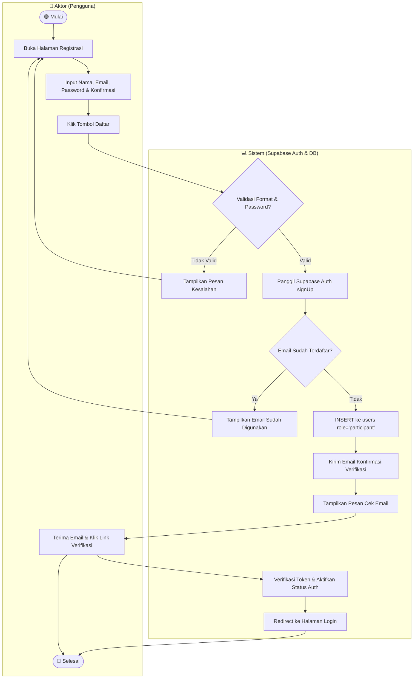
```mermaid
flowchart TD
    subgraph Aktor ["👤 Aktor (Pengguna)"]
        A1([🟢 Mulai]) --> A2[Buka Halaman Registrasi]
        A2 --> A3[Input Nama, Email, Password & Konfirmasi]
        A3 --> A4[Klik Tombol Daftar]
        A5[Terima Email & Klik Link Verifikasi] --> A6([🔴 Selesai])
    end

    subgraph Sistem ["💻 Sistem (Supabase Auth & DB)"]
        A4 --> S1{Validasi Format & Password?}
        S1 -->|Tidak Valid| S2[Tampilkan Pesan Kesalahan] --> A2
        S1 -->|Valid| S3[Panggil Supabase Auth signUp]
        S3 --> S4{Email Sudah Terdaftar?}
        S4 -->|Ya| S5[Tampilkan Email Sudah Digunakan] --> A2
        S4 -->|Tidak| S6[INSERT ke users role='participant']
        S6 --> S7[Kirim Email Konfirmasi Verifikasi]
        S7 --> S8[Tampilkan Pesan Cek Email] --> A5
        A5 --> S9[Verifikasi Token & Aktifkan Status Auth]
        S9 --> S10[Redirect ke Halaman Login] --> A6
    end
```

---

### UC-02 Login

**Aktor:** Peserta, Admin, Platform  
**Tujuan:** Mendapatkan token JWT aktif untuk otorisasi akses menu aplikasi  
**Prasyarat:** Akun telah terdaftar dan email telah diverifikasi  

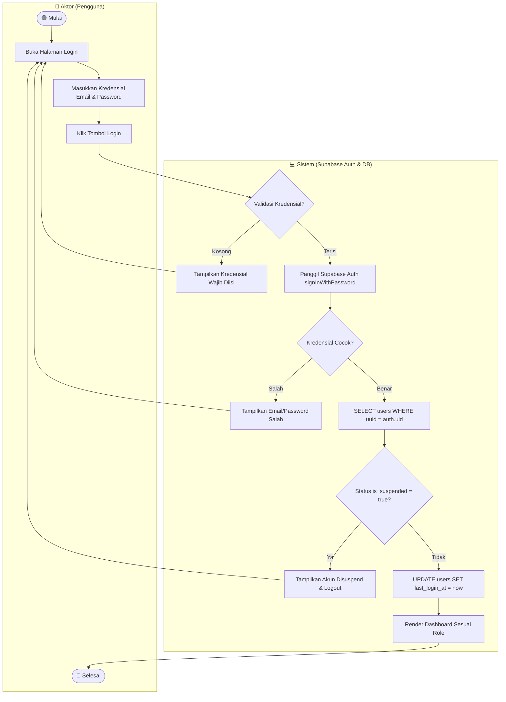
```mermaid
flowchart TD
    subgraph Aktor ["👤 Aktor (Pengguna)"]
        B1([🟢 Mulai]) --> B2[Buka Halaman Login]
        B2 --> B3[Masukkan Kredensial Email & Password]
        B3 --> B4[Klik Tombol Login]
        B5([🔴 Selesai])
    end

    subgraph Sistem ["💻 Sistem (Supabase Auth & DB)"]
        B4 --> S1{Validasi Kredensial?}
        S1 -->|Kosong| S2[Tampilkan Kredensial Wajib Diisi] --> B2
        S1 -->|Terisi| S3[Panggil Supabase Auth signInWithPassword]
        S3 --> S4{Kredensial Cocok?}
        S4 -->|Salah| S5[Tampilkan Email/Password Salah] --> B2
        S4 -->|Benar| S6[SELECT users WHERE uuid = auth.uid]
        S6 --> S7{Status is_suspended = true?}
        S7 -->|Ya| S8[Tampilkan Akun Disuspend & Logout] --> B2
        S7 -->|Tidak| S9[UPDATE users SET last_login_at = now]
        S9 --> S10[Render Dashboard Sesuai Role] --> B5
    end
```

---

### UC-03 Browse & Cari Scrim

**Aktor:** Peserta  
**Tujuan:** Menemukan event scrim aktif berdasarkan filter atau pencarian kata kunci  
**Prasyarat:** Peserta telah login ke aplikasi  

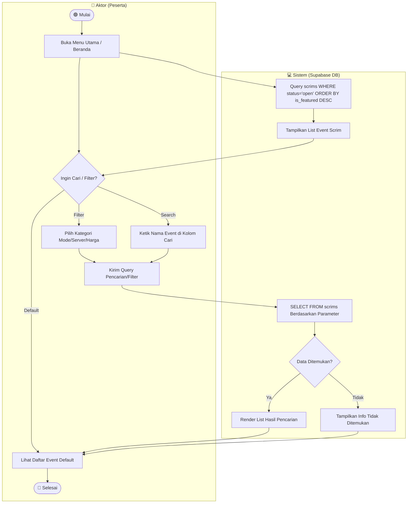
```mermaid
flowchart TD
    subgraph Aktor ["👤 Aktor (Peserta)"]
        C1([🟢 Mulai]) --> C2[Buka Menu Utama / Beranda]
        C2 --> C3{Ingin Cari / Filter?}
        C3 -->|Filter| C4[Pilih Kategori Mode/Server/Harga]
        C3 -->|Search| C5[Ketik Nama Event di Kolom Cari]
        C3 -->|Default| C6[Lihat Daftar Event Default]
        C4 & C5 --> C7[Kirim Query Pencarian/Filter]
        C6 --> C8([🔴 Selesai])
    end

    subgraph Sistem ["💻 Sistem (Supabase DB)"]
        C2 --> S1[Query scrims WHERE status='open' ORDER BY is_featured DESC]
        S1 --> S2[Tampilkan List Event Scrim] --> C3
        C7 --> S3[SELECT FROM scrims Berdasarkan Parameter]
        S3 --> S4{Data Ditemukan?}
        S4 -->|Ya| S5[Render List Hasil Pencarian] --> C6
        S4 -->|Tidak| S6[Tampilkan Info Tidak Ditemukan] --> C6
    end
```

---

### UC-04 Lihat Detail Scrim

**Aktor:** Peserta  
**Tujuan:** Memeriksa prasyarat, jadwal, slot kosong, dan hadiah event scrim sebelum mendaftar  
**Prasyarat:** Peserta memilih salah satu scrim dari menu browse  

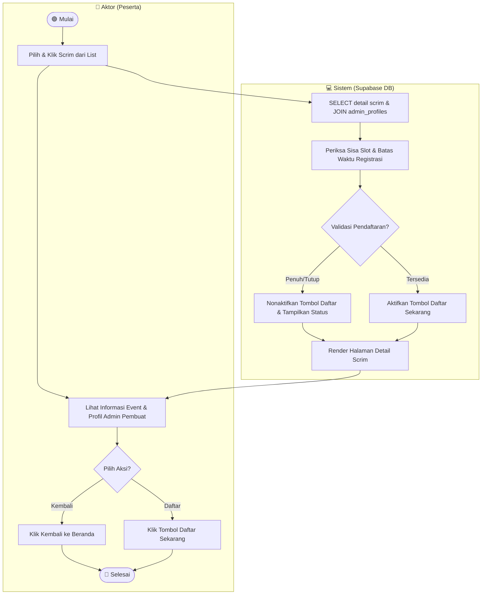
```mermaid
flowchart TD
    subgraph Aktor ["👤 Aktor (Peserta)"]
        D1([🟢 Mulai]) --> D2[Pilih & Klik Scrim dari List]
        D2 --> D3[Lihat Informasi Event & Profil Admin Pembuat]
        D3 --> D4{Pilih Aksi?}
        D4 -->|Kembali| D5[Klik Kembali ke Beranda] --> D6([🔴 Selesai])
        D4 -->|Daftar| D7[Klik Tombol Daftar Sekarang] --> D6
    end

    subgraph Sistem ["💻 Sistem (Supabase DB)"]
        D2 --> S1[SELECT detail scrim & JOIN admin_profiles]
        S1 --> S2[Periksa Sisa Slot & Batas Waktu Registrasi]
        S2 --> S3{Validasi Pendaftaran?}
        S3 -->|Penuh/Tutup| S4[Nonaktifkan Tombol Daftar & Tampilkan Status]
        S3 -->|Tersedia| S5[Aktifkan Tombol Daftar Sekarang]
        S4 & S5 --> S6[Render Halaman Detail Scrim] --> D3
    end
```

---

### UC-05 Daftar Scrim

**Aktor:** Peserta  
**Tujuan:** Mengunci slot pendaftaran tim sementara dengan status pending payment  
**Prasyarat:** Event berstatus open, slot tersedia, dan pendaftaran belum ditutup  

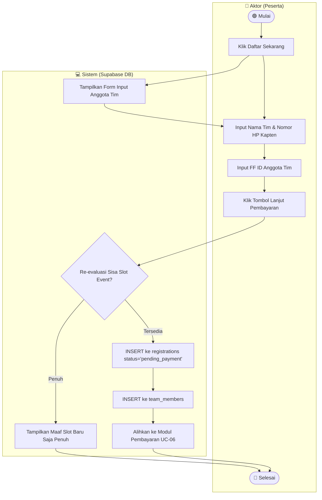
```mermaid
flowchart TD
    subgraph Aktor ["👤 Aktor (Peserta)"]
        E1([🟢 Mulai]) --> E2[Klik Daftar Sekarang]
        E2 --> E3[Input Nama Tim & Nomor HP Kapten]
        E3 --> E4[Input FF ID Anggota Tim]
        E4 --> E5[Klik Tombol Lanjut Pembayaran]
        E6([🔴 Selesai])
    end

    subgraph Sistem ["💻 Sistem (Supabase DB)"]
        E2 --> S1[Tampilkan Form Input Anggota Tim] --> E3
        E5 --> S2{Re-evaluasi Sisa Slot Event?}
        S2 -->|Penuh| S3[Tampilkan Maaf Slot Baru Saja Penuh] --> E6
        S2 -->|Tersedia| S4[INSERT ke registrations status='pending_payment']
        S4 --> S5[INSERT ke team_members]
        S5 --> S6[Alihkan ke Modul Pembayaran UC-06] --> E6
    end
```

---

### UC-06 Pembayaran via Midtrans

**Aktor:** Peserta  
**Tujuan:** Menyelesaikan kewajiban pembayaran secara instan menggunakan Midtrans Sandbox  
**Prasyarat:** Registrasi berhasil dibuat dengan status `pending_payment`  

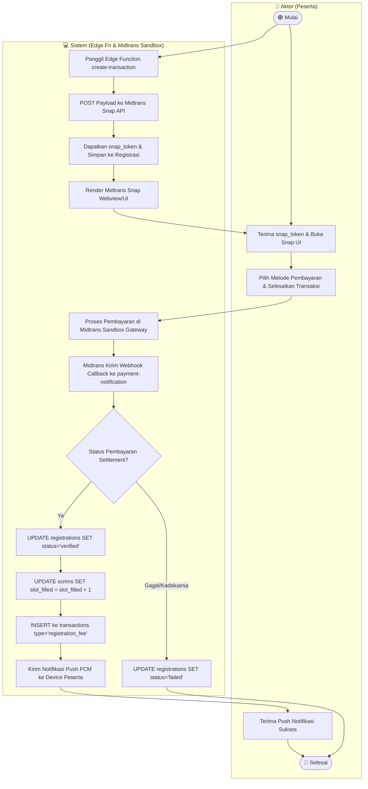
```mermaid
flowchart TD
    subgraph Aktor ["👤 Aktor (Peserta)"]
        F1([🟢 Mulai]) --> F2[Terima snap_token & Buka Snap UI]
        F2 --> F3[Pilih Metode Pembayaran & Selesaikan Transaksi]
        F4[Terima Push Notifikasi Sukses] --> F5([🔴 Selesai])
    end

    subgraph Sistem ["💻 Sistem (Edge Fn & Midtrans Sandbox)"]
        F1 --> S1[Panggil Edge Function create-transaction]
        S1 --> S2[POST Payload ke Midtrans Snap API]
        S2 --> S3[Dapatkan snap_token & Simpan ke Registrasi]
        S3 --> S4[Render Midtrans Snap Webview/UI] --> F2
        F3 --> S5[Proses Pembayaran di Midtrans Sandbox Gateway]
        S5 --> S6[Midtrans Kirim Webhook Callback ke payment-notification]
        S6 --> S7{Status Pembayaran Settlement?}
        S7 -->|Ya| S8[UPDATE registrations SET status='verified']
        S8 --> S9[UPDATE scrims SET slot_filled = slot_filled + 1]
        S9 --> S10[INSERT ke transactions type='registration_fee']
        S10 --> S11[Kirim Notifikasi Push FCM ke Device Peserta] --> F4
        S7 -->|Gagal/Kadaluarsa| S12[UPDATE registrations SET status='failed'] --> F5
    end
```

---

### UC-07 Lihat Status Pendaftaran

**Aktor:** Peserta  
**Tujuan:** Memeriksa berkas registrasi, status pembayaran, serta rincian Room ID jika tersedia  
**Prasyarat:** Peserta telah melakukan proses pendaftaran minimal satu kali  

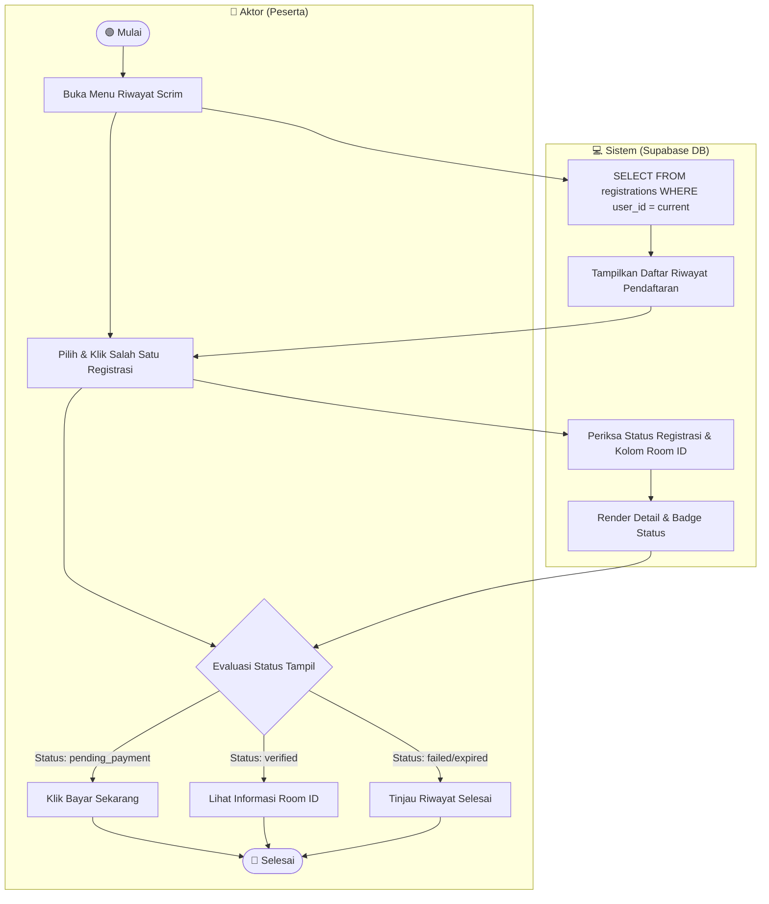
```mermaid
flowchart TD
    subgraph Aktor ["👤 Aktor (Peserta)"]
        G1([🟢 Mulai]) --> G2[Buka Menu Riwayat Scrim]
        G2 --> G3[Pilih & Klik Salah Satu Registrasi]
        G3 --> G4{Evaluasi Status Tampil}
        G4 -->|Status: pending_payment| G5[Klik Bayar Sekarang]
        G4 -->|Status: verified| G6[Lihat Informasi Room ID]
        G4 -->|Status: failed/expired| G7[Tinjau Riwayat Selesai]
        G5 & G6 & G7 --> G8([🔴 Selesai])
    end

    subgraph Sistem ["💻 Sistem (Supabase DB)"]
        G2 --> S1[SELECT FROM registrations WHERE user_id = current]
        S1 --> S2[Tampilkan Daftar Riwayat Pendaftaran] --> G3
        G3 --> S3[Periksa Status Registrasi & Kolom Room ID]
        S3 --> S4[Render Detail & Badge Status] --> G4
    end
```

---

### UC-08 Terima Room ID & Password

**Aktor:** Peserta  
**Tujuan:** Mendapatkan kredensial Room Game Free Fire untuk berpartisipasi dalam pertandingan  
**Prasyarat:** Registrasi berstatus `verified` dan Admin telah mengirimkan detail Room  

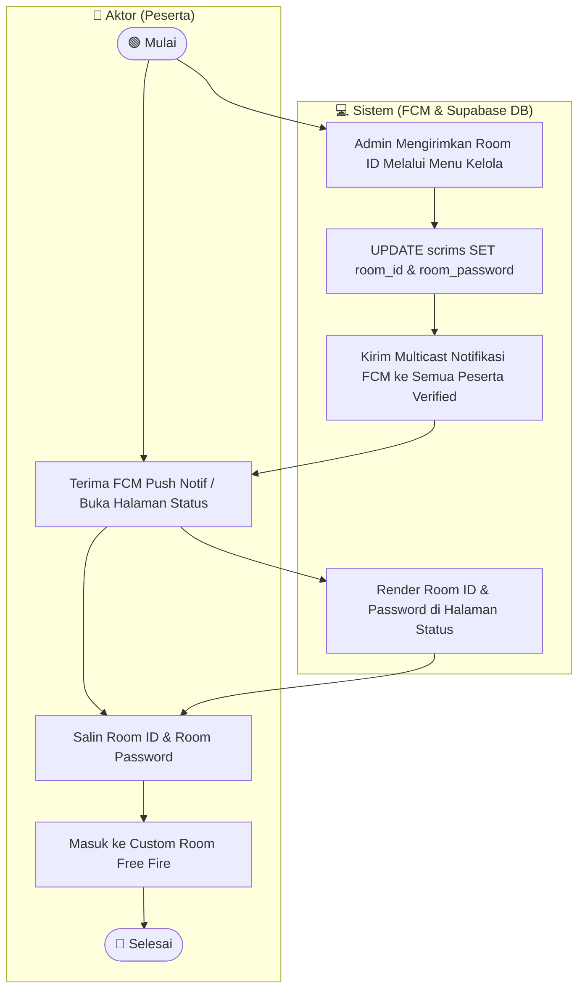
```mermaid
flowchart TD
    subgraph Aktor ["👤 Aktor (Peserta)"]
        H1([🟢 Mulai]) --> H2[Terima FCM Push Notif / Buka Halaman Status]
        H2 --> H3[Salin Room ID & Room Password]
        H3 --> H4[Masuk ke Custom Room Free Fire] --> H5([🔴 Selesai])
    end

    subgraph Sistem ["💻 Sistem (FCM & Supabase DB)"]
        H1 --> S1[Admin Mengirimkan Room ID Melalui Menu Kelola]
        S1 --> S2[UPDATE scrims SET room_id & room_password]
        S2 --> S3[Kirim Multicast Notifikasi FCM ke Semua Peserta Verified] --> H2
        H2 --> S4[Render Room ID & Password di Halaman Status] --> H3
    end
```

---

### UC-09 Lihat Hasil Pertandingan

**Aktor:** Peserta  
**Tujuan:** Memeriksa klasemen akhir, statistik poin, placement, dan jumlah hadiah yang didapatkan  
**Prasyarat:** Scrim telah berstatus `finished` dan Admin telah mengunggah hasil pertandingan  

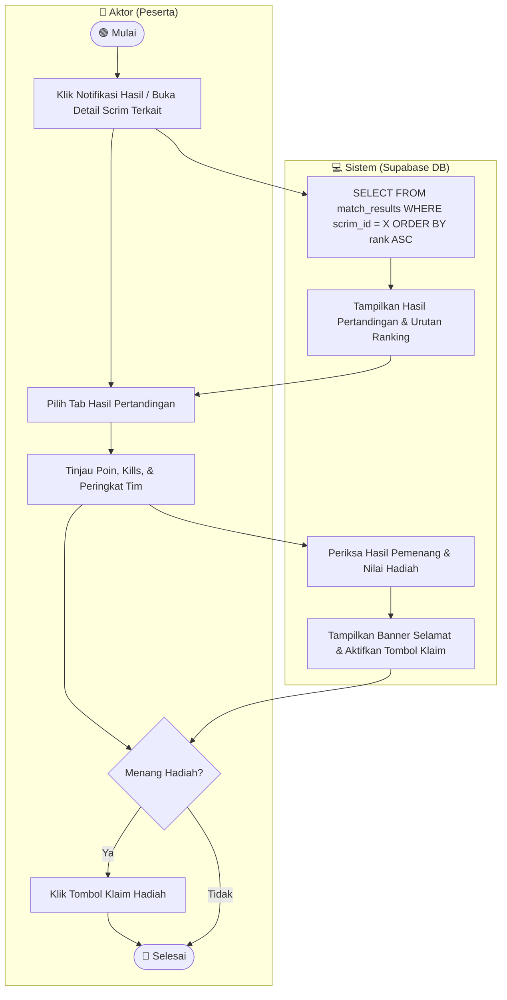
```mermaid
flowchart TD
    subgraph Aktor ["👤 Aktor (Peserta)"]
        I1([🟢 Mulai]) --> I2[Klik Notifikasi Hasil / Buka Detail Scrim Terkait]
        I2 --> I3[Pilih Tab Hasil Pertandingan]
        I3 --> I4[Tinjau Poin, Kills, & Peringkat Tim]
        I4 --> I5{Menang Hadiah?}
        I5 -->|Ya| I6[Klik Tombol Klaim Hadiah] --> I7([🔴 Selesai])
        I5 -->|Tidak| I7
    end

    subgraph Sistem ["💻 Sistem (Supabase DB)"]
        I2 --> S1[SELECT FROM match_results WHERE scrim_id = X ORDER BY rank ASC]
        S1 --> S2[Tampilkan Hasil Pertandingan & Urutan Ranking] --> I3
        I4 --> S3[Periksa Hasil Pemenang & Nilai Hadiah]
        S3 --> S4[Tampilkan Banner Selamat & Aktifkan Tombol Klaim] --> I5
    end
```

---

### UC-10 Klaim Hadiah

**Aktor:** Peserta (Pemenang)  
**Tujuan:** Mengajukan permohonan pencairan dana prize pool dari match_results ke rekening bank  
**Prasyarat:** Tim terdaftar sebagai pemenang dengan prize_amount > 0 pada match_results  

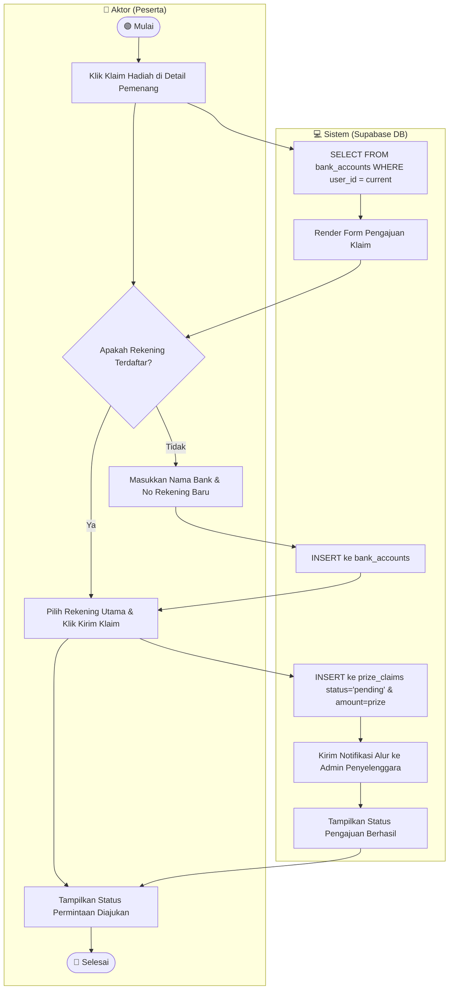
```mermaid
flowchart TD
    subgraph Aktor ["👤 Aktor (Peserta)"]
        J1([🟢 Mulai]) --> J2[Klik Klaim Hadiah di Detail Pemenang]
        J2 --> J3{Apakah Rekening Terdaftar?}
        J3 -->|Tidak| J4[Masukkan Nama Bank & No Rekening Baru]
        J3 -->|Ya| J5[Pilih Rekening Utama & Klik Kirim Klaim]
        J5 --> J6[Tampilkan Status Permintaan Diajukan] --> J7([🔴 Selesai])
    end

    subgraph Sistem ["💻 Sistem (Supabase DB)"]
        J2 --> S1[SELECT FROM bank_accounts WHERE user_id = current]
        S1 --> S2[Render Form Pengajuan Klaim] --> J3
        J4 --> S3[INSERT ke bank_accounts] --> J5
        J5 --> S4[INSERT ke prize_claims status='pending' & amount=prize]
        S4 --> S5[Kirim Notifikasi Alur ke Admin Penyelenggara]
        S5 --> S6[Tampilkan Status Pengajuan Berhasil] --> J6
    end
```

---

### UC-11 Lihat Leaderboard

**Aktor:** Peserta  
**Tujuan:** Memantau akumulasi skor performa tim terbaik secara global maupun regional  
**Prasyarat:** Peserta telah login ke sistem  

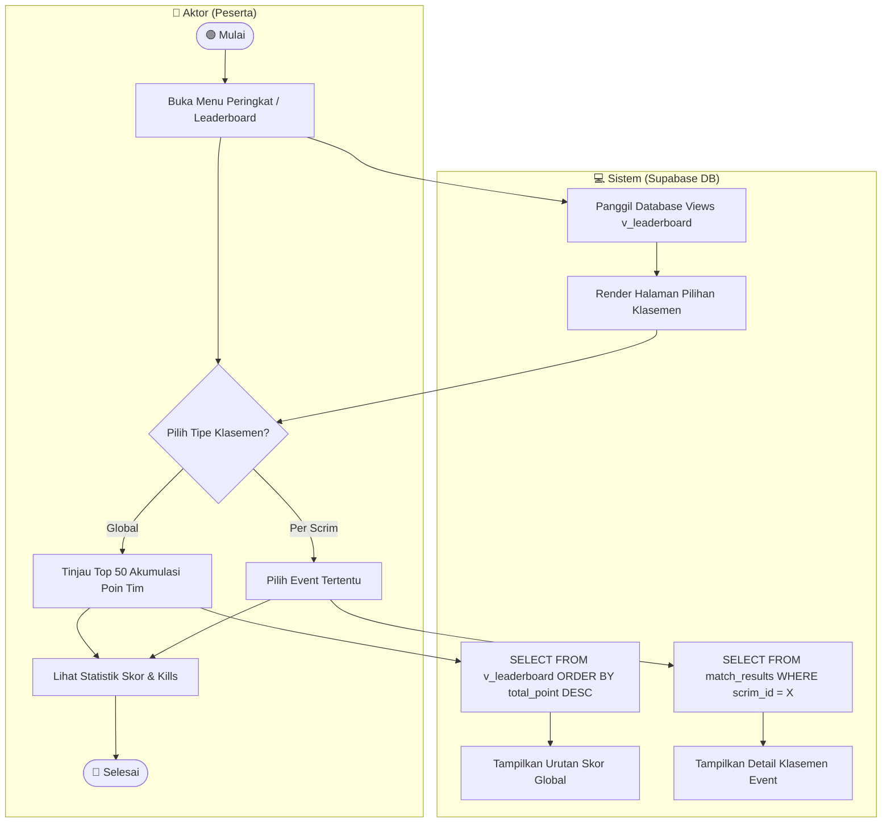
```mermaid
flowchart TD
    subgraph Aktor ["👤 Aktor (Peserta)"]
        K1([🟢 Mulai]) --> K2[Buka Menu Peringkat / Leaderboard]
        K2 --> K3{Pilih Tipe Klasemen?}
        K3 -->|Global| K4[Tinjau Top 50 Akumulasi Poin Tim]
        K3 -->|Per Scrim| K5[Pilih Event Tertentu]
        K4 & K5 --> K6[Lihat Statistik Skor & Kills] --> K7([🔴 Selesai])
    end

    subgraph Sistem ["💻 Sistem (Supabase DB)"]
        K2 --> S1[Panggil Database Views v_leaderboard]
        S1 --> S2[Render Halaman Pilihan Klasemen] --> K3
        K4 --> S3[SELECT FROM v_leaderboard ORDER BY total_point DESC]
        S3 --> S4[Tampilkan Urutan Skor Global]
        K5 --> S5[SELECT FROM match_results WHERE scrim_id = X]
        S5 --> S6[Tampilkan Detail Klasemen Event]
    end
```

---

### UC-12 Kelola Profil & Rekening Bank

**Aktor:** Peserta  
**Tujuan:** Memperbarui data pengguna, mengganti avatar, dan mengelola rekening klaim hadiah  
**Prasyarat:** Pengguna berada di menu pengaturan profil  

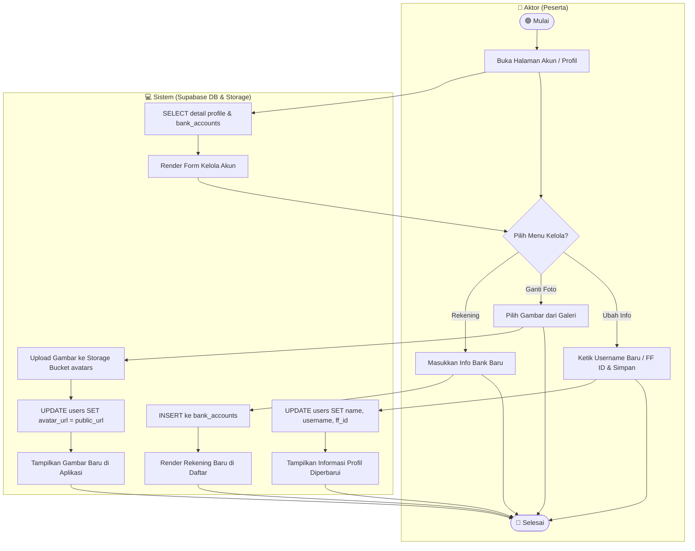
```mermaid
flowchart TD
    subgraph Aktor ["👤 Aktor (Peserta)"]
        L1([🟢 Mulai]) --> L2[Buka Halaman Akun / Profil]
        L2 --> L3{Pilih Menu Kelola?}
        L3 -->|Ubah Info| L4[Ketik Username Baru / FF ID & Simpan]
        L3 -->|Ganti Foto| L5[Pilih Gambar dari Galeri]
        L3 -->|Rekening| L6[Masukkan Info Bank Baru]
        L4 & L5 & L6 --> L7([🔴 Selesai])
    end

    subgraph Sistem ["💻 Sistem (Supabase DB & Storage)"]
        L2 --> S1[SELECT detail profile & bank_accounts]
        S1 --> S2[Render Form Kelola Akun] --> L3
        L4 --> S3[UPDATE users SET name, username, ff_id]
        S3 --> S4[Tampilkan Informasi Profil Diperbarui] --> L7
        L5 --> S5[Upload Gambar ke Storage Bucket avatars]
        S5 --> S6[UPDATE users SET avatar_url = public_url]
        S6 --> S7[Tampilkan Gambar Baru di Aplikasi] --> L7
        L6 --> S8[INSERT ke bank_accounts]
        S8 --> S9[Render Rekening Baru di Daftar] --> L7
    end
```

---

### UC-13 Buat Scrim Baru (Admin)

**Aktor:** Admin  
**Tujuan:** Membuat turnamen/scrim baru yang terikat secara relasi database pada admin bersangkutan  
**Prasyarat:** Pengguna memiliki role `admin` dan berstatus aktif  

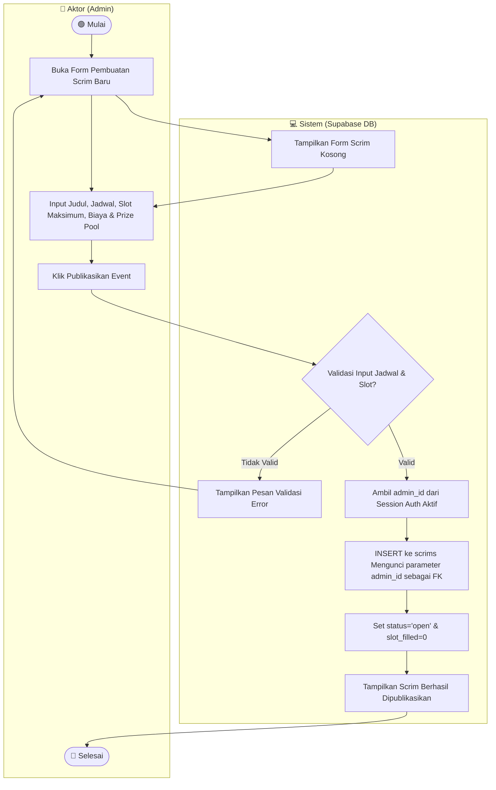
```mermaid
flowchart TD
    subgraph Aktor ["👤 Aktor (Admin)"]
        M1([🟢 Mulai]) --> M2[Buka Form Pembuatan Scrim Baru]
        M2 --> M3[Input Judul, Jadwal, Slot Maksimum, Biaya & Prize Pool]
        M3 --> M4[Klik Publikasikan Event]
        M5([🔴 Selesai])
    end

    subgraph Sistem ["💻 Sistem (Supabase DB)"]
        M2 --> S1[Tampilkan Form Scrim Kosong] --> M3
        M4 --> S2{Validasi Input Jadwal & Slot?}
        S2 -->|Tidak Valid| S3[Tampilkan Pesan Validasi Error] --> M2
        S2 -->|Valid| S4[Ambil admin_id dari Session Auth Aktif]
        S4 --> S5[INSERT ke scrims Mengunci parameter admin_id sebagai FK]
        S5 --> S6[Set status='open' & slot_filled=0]
        S6 --> S7[Tampilkan Scrim Berhasil Dipublikasikan] --> M5
    end
```

---

### UC-14 Simpan Draft (Admin)

**Aktor:** Admin  
**Tujuan:** Menyimpan konfigurasi scrim setengah jalan tanpa langsung membukanya untuk pendaftaran  
**Prasyarat:** Pengguna memiliki role `admin`  

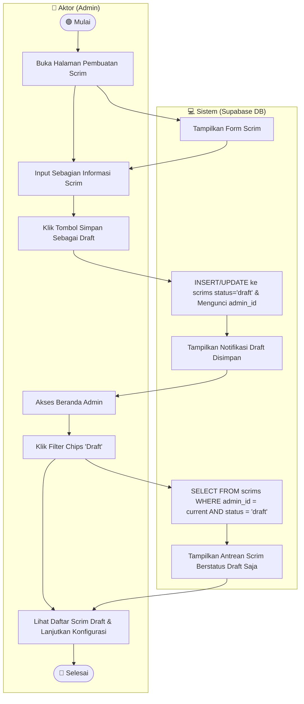
```mermaid
flowchart TD
    subgraph Aktor ["👤 Aktor (Admin)"]
        N1([🟢 Mulai]) --> N2[Buka Halaman Pembuatan Scrim]
        N2 --> N3[Input Sebagian Informasi Scrim]
        N3 --> N4[Klik Tombol Simpan Sebagai Draft]
        N5[Akses Beranda Admin] --> N6[Klik Filter Chips 'Draft']
        N6 --> N7[Lihat Daftar Scrim Draft & Lanjutkan Konfigurasi] --> N8([🔴 Selesai])
    end

    subgraph Sistem ["💻 Sistem (Supabase DB)"]
        N2 --> S1[Tampilkan Form Scrim] --> N3
        N4 --> S2[INSERT/UPDATE ke scrims status='draft' & Mengunci admin_id]
        S2 --> S3[Tampilkan Notifikasi Draft Disimpan] --> N5
        N6 --> S4[SELECT FROM scrims WHERE admin_id = current AND status = 'draft']
        S4 --> S5[Tampilkan Antrean Scrim Berstatus Draft Saja] --> N7
    end
```

---

### UC-15 Kelola Pendaftaran Peserta (Admin)

**Aktor:** Admin  
**Tujuan:** Memantau daftar tim terverifikasi yang mengikuti event scrim miliknya  
**Prasyarat:** Memiliki scrim aktif dengan peserta terdaftar  

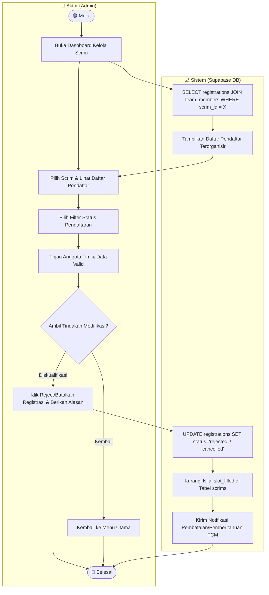
```mermaid
flowchart TD
    subgraph Aktor ["👤 Aktor (Admin)"]
        O1([🟢 Mulai]) --> O2[Buka Dashboard Kelola Scrim]
        O2 --> O3[Pilih Scrim & Lihat Daftar Pendaftar]
        O3 --> O4[Pilih Filter Status Pendaftaran]
        O4 --> O5[Tinjau Anggota Tim & Data Valid]
        O5 --> O6{Ambil Tindakan Modifikasi?}
        O6 -->|Diskualifikasi| O7[Klik Reject/Batalkan Registrasi & Berikan Alasan]
        O6 -->|Kembali| O8[Kembali ke Menu Utama]
        O7 & O8 --> O9([🔴 Selesai])
    end

    subgraph Sistem ["💻 Sistem (Supabase DB)"]
        O2 --> S1[SELECT registrations JOIN team_members WHERE scrim_id = X]
        S1 --> S2[Tampilkan Daftar Pendaftar Terorganisir] --> O3
        O7 --> S3[UPDATE registrations SET status='rejected' / 'cancelled']
        S3 --> S4[Kurangi Nilai slot_filled di Tabel scrims]
        S4 --> S5[Kirim Notifikasi Pembatalan/Pemberitahuan FCM] --> O9
    end
```

---

### UC-16 Kirim Room ID ke Peserta (Admin)

**Aktor:** Admin  
**Tujuan:** Mengirimkan detail akses pertandingan secara massal ke device seluruh peserta terverifikasi  
**Prasyarat:** Scrim telah terisi penuh atau waktu registrasi ditutup, berstatus `open`  

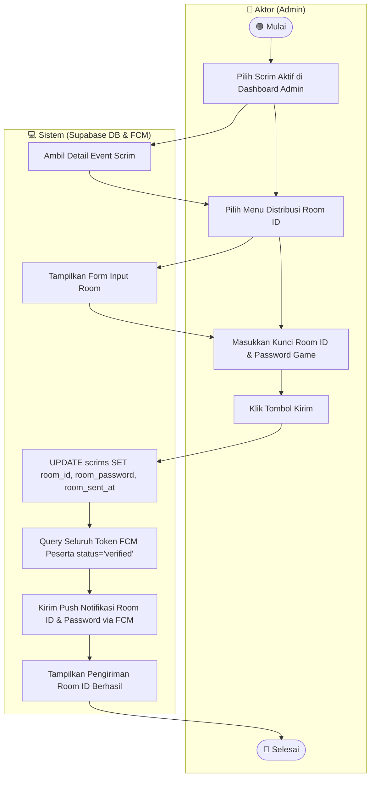
```mermaid
flowchart TD
    subgraph Aktor ["👤 Aktor (Admin)"]
        P1([🟢 Mulai]) --> P2[Pilih Scrim Aktif di Dashboard Admin]
        P2 --> P3[Pilih Menu Distribusi Room ID]
        P3 --> P4[Masukkan Kunci Room ID & Password Game]
        P4 --> P5[Klik Tombol Kirim]
        P6([🔴 Selesai])
    end

    subgraph Sistem ["💻 Sistem (Supabase DB & FCM)"]
        P2 --> S1[Ambil Detail Event Scrim] --> P3
        P3 --> S2[Tampilkan Form Input Room] --> P4
        P5 --> S3[UPDATE scrims SET room_id, room_password, room_sent_at]
        S3 --> S4[Query Seluruh Token FCM Peserta status='verified']
        S4 --> S5[Kirim Push Notifikasi Room ID & Password via FCM]
        S5 --> S6[Tampilkan Pengiriman Room ID Berhasil] --> P6
    end
```

---

### UC-17 Input Hasil Pertandingan (Admin)

**Aktor:** Admin  
**Tujuan:** Menyimpan hasil akhir peringkat tim di game Free Fire untuk kalkulasi leaderboard  
**Prasyarat:** Status scrim adalah ongoing/open, dan pertandingan kustom room telah usai  

```mermaid
flowchart TD
    subgraph Aktor ["👤 Aktor (Admin)"]
        Q1([🟢 Mulai]) --> Q2[Pilih Menu Input Hasil Pertandingan]
        Q2 --> Q3[Input Placement Rank & Jumlah Kills Masing-Masing Tim]
        Q3 --> Q4[Tentukan Distribusi Hadiah Hadir]
        Q4 --> Q5[Klik Tombol Simpan & Selesaikan Event]
        Q6([🔴 Selesai])
    end

    subgraph Sistem ["💻 Sistem (Supabase DB & RPC)"]
        Q2 --> S1[SELECT registrations WHERE status='verified' AND scrim_id = X]
        S1 --> S2[Render Form Input Klasemen Tim] --> Q3
        Q5 --> S3[UPSERT match_results (scrim_id, registration_id, placement, kills)]
        S3 --> S4[Panggil Database RPC sp_finalize_leaderboard]
        S4 --> S5[Auto-calculate Poin & Set Urutan Rank & Hadiah]
        S5 --> S6[UPDATE scrims SET status='finished']
        S6 --> S7[Kirim Notifikasi Hasil via FCM ke Seluruh Peserta]
        S7 --> S8[Tampilkan Status Hasil Scrim Dipublikasikan] --> Q6
    end
```

---

### UC-18 Verifikasi Klaim Hadiah (Admin)

**Aktor:** Admin  
**Tujuan:** Memvalidasi klaim hadiah pemenang dan memperbarui status pencairan dana  
**Prasyarat:** Terdapat prize_claims masuk berstatus `pending` pada event scrim admin terkait  

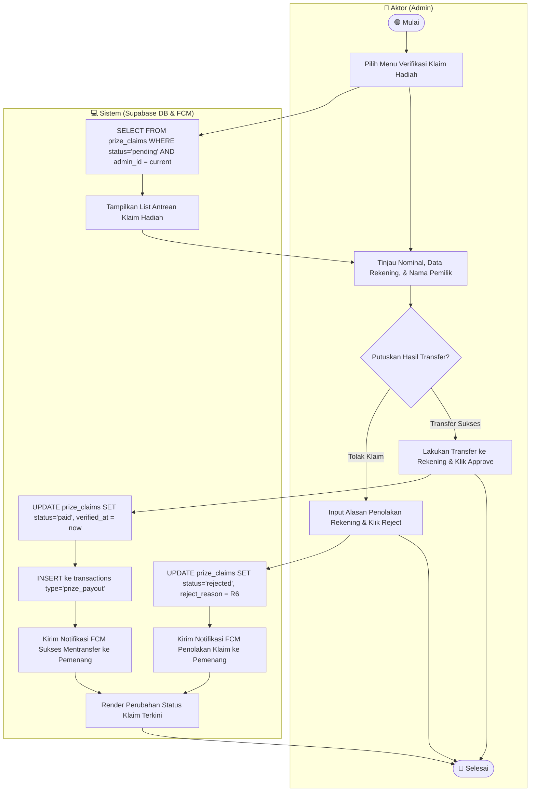
```mermaid
flowchart TD
    subgraph Aktor ["👤 Aktor (Admin)"]
        R1([🟢 Mulai]) --> R2[Pilih Menu Verifikasi Klaim Hadiah]
        R2 --> R3[Tinjau Nominal, Data Rekening, & Nama Pemilik]
        R3 --> R4{Putuskan Hasil Transfer?}
        R4 -->|Transfer Sukses| R5[Lakukan Transfer ke Rekening & Klik Approve]
        R4 -->|Tolak Klaim| R6[Input Alasan Penolakan Rekening & Klik Reject]
        R5 & R6 --> R7([🔴 Selesai])
    end

    subgraph Sistem ["💻 Sistem (Supabase DB & FCM)"]
        R2 --> S1[SELECT FROM prize_claims WHERE status='pending' AND admin_id = current]
        S1 --> S2[Tampilkan List Antrean Klaim Hadiah] --> R3
        R5 --> S3[UPDATE prize_claims SET status='paid', verified_at = now]
        S3 --> S4[INSERT ke transactions type='prize_payout']
        S4 --> S5[Kirim Notifikasi FCM Sukses Mentransfer ke Pemenang]
        R6 --> S6[UPDATE prize_claims SET status='rejected', reject_reason = R6]
        S6 --> S7[Kirim Notifikasi FCM Penolakan Klaim ke Pemenang]
        S5 & S7 --> S8[Render Perubahan Status Klaim Terkini] --> R7
    end
```

---

### UC-19 Berlangganan Premium (Admin)

**Aktor:** Admin  
**Tujuan:** Membayar dan mengaktifkan fitur premium agar dapat menyematkan scrim unggulan (featured)  
**Prasyarat:** Admin login ke aplikasi dan memilih menu berlangganan  

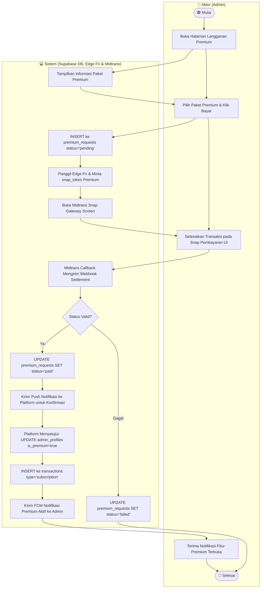
```mermaid
flowchart TD
    subgraph Aktor ["👤 Aktor (Admin)"]
        S1([🟢 Mulai]) --> S2[Buka Halaman Langganan Premium]
        S2 --> S3[Pilih Paket Premium & Klik Bayar]
        S3 --> S4[Selesaikan Transaksi pada Snap Pembayaran UI]
        S5[Terima Notifikasi Fitur Premium Terbuka] --> S6([🔴 Selesai])
    end

    subgraph Sistem ["💻 Sistem (Supabase DB, Edge Fn & Midtrans)"]
        S2 --> SS1[Tampilkan Informasi Paket Premium] --> S3
        S3 --> SS2[INSERT ke premium_requests status='pending']
        SS2 --> SS3[Panggil Edge Fn & Minta snap_token Premium]
        SS3 --> SS4[Buka Midtrans Snap Gateway Screen] --> S4
        S4 --> SS5[Midtrans Callback Mengirim Webhook Settlement]
        SS5 --> SS6{Status Valid?}
        SS6 -->|Ya| SS7[UPDATE premium_requests SET status='paid']
        SS7 --> SS8[Kirim Push Notifikasi ke Platform untuk Konfirmasi]
        SS8 --> SS9[Platform Menyetujui: UPDATE admin_profiles is_premium=true]
        SS9 --> SS10[INSERT ke transactions type='subscription']
        SS10 --> SS11[Kirim FCM Notifikasi Premium Aktif ke Admin] --> S5
        SS6 -->|Gagal| SS12[UPDATE premium_requests SET status='failed'] --> S6
    end
```

---

### UC-20 Dashboard Keuangan (Platform)

**Aktor:** Platform  
**Tujuan:** Mengaudit arus kas masuk (pembayaran scrim, langganan) dan arus kas keluar (pencairan prize pool)  
**Prasyarat:** Pengguna login dengan role `platform`  

```mermaid
flowchart TD
    subgraph Aktor ["👤 Aktor (Platform)"]
        T1([🟢 Mulai]) --> T2[Buka Dashboard Keuangan Platform]
        T2 --> T3{Gunakan Filter?}
        T3 -->|Filter Waktu| T4[Pilih Rentang Tanggal / Bulan]
        T3 -->|Filter Jenis| T5[Pilih Jenis Pendapatan / Pengeluaran]
        T3 -->|Tidak| T6[Lihat Total Pendapatan, Pengeluaran & Saldo Bersih]
        T4 & T5 --> T6
        T6 --> T8([🔴 Selesai])
    end

    subgraph Sistem ["💻 Sistem (Supabase DB)"]
        T2 --> S1[Panggil Database Views v_platform_finance]
        S1 --> S2[Render Grafik & Tabel Ringkasan Keuangan] --> T3
        T4 & T5 --> S3[Query transactions Sesuai Parameter Filter]
        S3 --> S4[Render Ulang Chart & Tabel Arus Kas] --> T6
    end
```

---

### UC-21 Kelola & Suspend Pengguna (Platform)

**Aktor:** Platform  
**Tujuan:** Memoderasi komunitas dengan mensuspend pengguna bermasalah / pelanggar aturan  
**Prasyarat:** Login dengan akun role `platform`  

```mermaid
flowchart TD
    subgraph Aktor ["👤 Aktor (Platform)"]
        U1([🟢 Mulai]) --> U2[Buka Daftar Pengguna di Admin Platform]
        U2 --> U3[Cari Akun Menggunakan Username / Email]
        U3 --> U4[Tinjau Riwayat Scrim & Pelanggaran Akun]
        U4 --> U5{Tentukan Tindakan?}
        U5 -->|Suspend| U6[Klik Suspend Akun & Masukkan Alasan Pelanggaran]
        U5 -->|Unsuspend| U7[Klik Unsuspend Akun Pengguna]
        U6 & U7 --> U8([🔴 Selesai])
    end

    subgraph Sistem ["💻 Sistem (Supabase DB & FCM)"]
        U2 --> S1[SELECT FROM users ORDER BY created_at DESC]
        S1 --> S2[Render Daftar Pengguna Lengkap] --> U3
        U6 --> S3[UPDATE users SET is_suspended=true & suspension_reason = U6]
        S3 --> S4[INSERT ke audit_logs action='suspend']
        S4 --> S5[Paksa Putus Sesi Auth JWT & Kirim Notif FCM Suspend]
        U7 --> S6[UPDATE users SET is_suspended=false, suspension_reason=null]
        S6 --> S7[INSERT ke audit_logs action='unsuspend']
        S7 --> S8[Kirim FCM Notifikasi Akun Aktif Kembali]
        S5 & S8 --> S9[Render Perubahan Informasi di Dashboard] --> U8
    end
```

---

### UC-22 Approve/Reject Premium Request (Platform)

**Aktor:** Platform  
**Tujuan:** Memvalidasi pengajuan berbayar akun premium dari Admin yang telah settlement di Midtrans  
**Prasyarat:** Admin telah melakukan checkout paket premium (premium_requests status `paid`)  

```mermaid
flowchart TD
    subgraph Aktor ["👤 Aktor (Platform)"]
        V1([🟢 Mulai]) --> V2[Terima FCM / Buka Menu Request Premium]
        V2 --> V3[Pilih Antrean Request Premium Admin]
        V3 --> V4{Verifikasi Keabsahan Transfer?}
        V4 -->|Setujui| V5[Klik Setujui & Aktifkan Paket]
        V4 -->|Tolak| V6[Klik Tolak & Masukkan Alasan Penolakan]
        V5 & V6 --> V7([🔴 Selesai])
    end

    subgraph Sistem ["💻 Sistem (Supabase DB & FCM)"]
        V2 --> S1[SELECT FROM premium_requests WHERE status='paid']
        S1 --> S2[Render List Pengajuan Premium Pending] --> V3
        V5 --> S3[UPDATE premium_requests SET status='approved', approved_at=now]
        S3 --> S4[UPDATE admin_profiles SET is_premium=true, premium_expired_at = now + 30]
        S4 --> S5[INSERT ke transactions type='subscription']
        S5 --> S6[Kirim FCM Notifikasi Premium Aktif ke Admin]
        V6 --> S7[UPDATE premium_requests SET status='rejected', reject_reason = V6]
        S7 --> S8[Kirim FCM Notifikasi Permintaan Ditolak ke Admin]
        S6 & S8 --> S9[Perbarui Halaman Dashboard Platform] --> V7
    end

---

## 5. Sequence Diagram per Use Case

---

### SD-01 Registrasi Akun

```mermaid
sequenceDiagram
    actor Pengguna
    participant App as App (Halaman Registrasi)
    participant SupaAuth as Supabase Auth
    participant DB as Supabase DB

    Pengguna->>App: Buka halaman Registrasi
    activate App
    App-->>Pengguna: Tampilkan form registrasi
    deactivate App

    Pengguna->>App: Input nama, email, password
    activate App
    App->>App: Validasi lokal (format email, min password)
    activate App
    deactivate App

    alt Validasi Gagal
        App-->>Pengguna: Tampilkan pesan error validasi
    else Validasi Berhasil
        App->>SupaAuth: signUp(email, password)
        activate SupaAuth
        SupaAuth-->>App: User baru / Error email duplikat
        deactivate SupaAuth

        alt Email sudah terdaftar
            App-->>Pengguna: "Email sudah digunakan"
        else Registrasi Berhasil
            activate SupaAuth
            SupaAuth->>DB: Trigger: INSERT users (uuid, role=participant)
            activate DB
            DB-->>SupaAuth: Record berhasil dibuat
            deactivate DB
            SupaAuth->>Pengguna: Kirim email verifikasi
            deactivate SupaAuth
            App-->>Pengguna: "Cek email Anda untuk verifikasi"
        end
    end
    deactivate App

    Pengguna->>SupaAuth: Klik link verifikasi di email
    activate SupaAuth
    SupaAuth-->>App: Email terverifikasi
    activate App
    App-->>Pengguna: Redirect ke halaman Login
    deactivate App
    deactivate SupaAuth
```

---

### SD-02 Login

```mermaid
sequenceDiagram
    actor Pengguna
    participant App as App (Halaman Login)
    participant SupaAuth as Supabase Auth
    participant DB as Supabase DB

    Pengguna->>App: Buka halaman Login
    activate App
    App-->>Pengguna: Tampilkan form login
    deactivate App

    Pengguna->>App: Input email & password
    activate App
    App->>SupaAuth: signInWithPassword(email, password)
    activate SupaAuth

    alt Kredensial Salah
        SupaAuth-->>App: Error: invalid credentials
        deactivate SupaAuth
        App-->>Pengguna: "Email atau password salah"
    else Login Berhasil
        activate SupaAuth
        SupaAuth-->>App: Session (access_token, user.id)
        deactivate SupaAuth
        App->>DB: SELECT * FROM users WHERE uuid = auth.uid()
        activate DB
        DB-->>App: Data user (role, is_suspended)
        deactivate DB

        alt Akun Tersuspend
            App->>SupaAuth: signOut()
            activate SupaAuth
            SupaAuth-->>App: OK
            deactivate SupaAuth
            App-->>Pengguna: "Akun disuspend: [alasan]"
        else role = participant
            App-->>Pengguna: Redirect → Home Screen (Beranda)
        else role = admin
            App-->>Pengguna: Redirect → Admin Dashboard
        else role = platform
            App-->>Pengguna: Redirect → Platform Dashboard
        end

        App->>DB: UPDATE users SET last_login_at = now()
        activate DB
        DB-->>App: OK
        deactivate DB
    end
    deactivate App
```

---

### SD-03 Browse & Cari Scrim

```mermaid
sequenceDiagram
    actor Peserta
    participant App as App (Halaman Beranda / Browse)
    participant DB as Supabase DB

    Peserta->>App: Buka halaman Home / Browse
    activate App
    App->>DB: SELECT * FROM v_scrim_list WHERE status='open' ORDER BY scheduled_at ASC
    activate DB
    DB-->>App: Daftar scrim tersedia
    deactivate DB
    App-->>Peserta: Tampilkan daftar scrim
    deactivate App

    opt Pengguna Filter
        Peserta->>App: Pilih filter (mode/server/fee)
        activate App
        App->>DB: SELECT * FROM v_scrim_list WHERE mode=? AND server=? AND fee<=?
        activate DB
        DB-->>App: Hasil terfilter
        deactivate DB
        App-->>Peserta: Tampilkan scrim yang sesuai filter
        deactivate App
    end

    opt Pengguna Mencari
        Peserta->>App: Ketik kata kunci di search bar
        activate App
        App->>DB: SELECT * FROM scrims WHERE title ILIKE '%keyword%'
        activate DB
        DB-->>App: Hasil pencarian
        deactivate DB
        App-->>Peserta: Tampilkan hasil pencarian
        deactivate App
    end
```

---

### SD-04 Lihat Detail Scrim

```mermaid
sequenceDiagram
    actor Peserta
    participant App as App (Halaman Detail Scrim)
    participant DB as Supabase DB

    Peserta->>App: Klik salah satu Scrim dari list
    activate App
    App->>DB: SELECT detail scrim & JOIN admin_profiles WHERE id = scrim_id
    activate DB
    DB-->>App: Data detail scrim & admin
    deactivate DB
    App->>App: Periksa sisa slot & batas registrasi
    activate App
    deactivate App
    App-->>Peserta: Render Halaman Detail Scrim & aktifkan/nonaktifkan tombol daftar
    deactivate App
```

---

### SD-05 Daftar Scrim

```mermaid
sequenceDiagram
    actor Peserta
    participant App as App (Halaman Pendaftaran Scrim)
    participant DB as Supabase DB

    Peserta->>App: Klik "Daftar Sekarang"
    activate App
    App-->>Peserta: Tampilkan form pendaftaran
    deactivate App

    Peserta->>App: Isi nama tim, HP kapten, & FF ID anggota
    activate App
    Peserta->>App: Klik tombol Lanjut Pembayaran
    App->>DB: CHECK: slot_filled < slot_total & registration_closes_at > now()
    activate DB
    DB-->>App: Slot valid / penuh
    deactivate DB

    alt Slot Penuh
        App-->>Peserta: "Slot penuh atau pendaftaran ditutup"
    else Slot Tersedia
        App->>DB: INSERT registrations (status='pending_payment')
        activate DB
        DB-->>App: registration_id
        deactivate DB

        App->>DB: INSERT team_members (ff_id anggota)
        activate DB
        DB-->>App: OK
        deactivate DB
        App-->>Peserta: Alihkan ke Modul Pembayaran (SD-06)
    end
    deactivate App
```

---

### SD-06 Pembayaran via Midtrans

```mermaid
sequenceDiagram
    actor Peserta
    participant App as App (Midtrans Snap Webview)
    participant EdgeFn as Edge Function
    participant DB as Supabase DB
    participant MT as Midtrans API
    participant WebhookFn as Edge Fn: payment-notification
    participant FCM as Firebase FCM

    Peserta->>App: Buka Snap UI / Mulai Pembayaran
    activate App
    App->>EdgeFn: POST /create-transaction {registration_id, payment_type}
    activate EdgeFn
    EdgeFn->>DB: GET registrations JOIN scrims WHERE id = registration_id
    activate DB
    DB-->>EdgeFn: Data lengkap (amount, user info)
    deactivate DB

    EdgeFn->>MT: POST /snap/v1/transactions {order_id, amount}
    activate MT
    MT-->>EdgeFn: {token, redirect_url}
    deactivate MT

    EdgeFn->>DB: UPDATE registrations SET midtrans_snap_token = token
    activate DB
    DB-->>EdgeFn: OK
    deactivate DB
    EdgeFn-->>App: {snap_token, redirect_url}
    deactivate EdgeFn

    App->>Peserta: Render Midtrans Snap UI
    deactivate App

    alt Peserta Membatalkan
        Peserta->>App: Tutup UI Midtrans
        activate App
        App->>DB: UPDATE registrations SET status='failed'
        activate DB
        DB-->>App: OK
        deactivate DB
        App-->>Peserta: Kembali ke Browse
        deactivate App
    else Peserta Membayar
        Peserta->>MT: Selesaikan pembayaran
        activate MT
        MT-->>Peserta: Pembayaran Sukses
        deactivate MT

        MT->>WebhookFn: POST /payment-notification {order_id, transaction_status}
        activate WebhookFn
        WebhookFn->>WebhookFn: Verifikasi HMAC-SHA512
        activate WebhookFn
        deactivate WebhookFn

        alt Signature Valid & Status settlement
            WebhookFn->>DB: UPDATE registrations SET status='verified', midtrans_status='settlement'
            activate DB
            DB-->>WebhookFn: OK
            deactivate DB

            WebhookFn->>DB: UPDATE scrims SET slot_filled = slot_filled + 1
            activate DB
            DB-->>WebhookFn: OK
            deactivate DB

            WebhookFn->>DB: INSERT transactions (type='registration_fee')
            activate DB
            DB-->>WebhookFn: OK
            deactivate DB

            WebhookFn->>FCM: Send notification ke token peserta
            activate FCM
            FCM-->>Peserta: 🔔 "Pembayaran Berhasil!"
            deactivate FCM
        else Signature Tidak Valid
            WebhookFn-->>MT: HTTP 401 Unauthorized
        end
        deactivate WebhookFn

        App->>DB: Realtime subscription (registrations)
        activate App
        activate DB
        DB-->>App: Status update: 'verified'
        deactivate DB
        App-->>Peserta: "Pendaftaran Berhasil!"
        deactivate App
    end
```

---

### SD-07 Lihat Status Pendaftaran

```mermaid
sequenceDiagram
    actor Peserta
    participant App as App (Halaman Status Pendaftaran)
    participant DB as Supabase DB

    Peserta->>App: Buka menu Riwayat Scrim / Status
    activate App
    App->>DB: SELECT FROM registrations JOIN scrims WHERE user_id = current_user
    activate DB
    DB-->>App: Daftar riwayat pendaftaran
    deactivate DB
    App-->>Peserta: Render list riwayat & status (pending_payment, verified, dll)
    deactivate App

    opt Klik Detail & Status = pending_payment
        Peserta->>App: Klik "Bayar Sekarang"
        activate App
        App-->>Peserta: Alihkan ke Snap UI (SD-06)
        deactivate App
    end
```

---

### SD-08 Terima Room ID & Password

```mermaid
sequenceDiagram
    actor Peserta
    participant App as App (Halaman Status Scrim / Dialog Notifikasi)
    participant DB as Supabase DB
    participant FCM as Firebase FCM

    FCM-->>Peserta: 🔔 Push notification "Room ID Telah Dikirim"
    Peserta->>App: Buka Notifikasi / Klik Detail Status Scrim
    activate App
    App->>DB: SELECT room_id, room_password FROM scrims WHERE id = scrim_id
    activate DB
    DB-->>App: Data Room ID & Password
    deactivate DB
    App-->>Peserta: Tampilkan Room ID & Password (dan dialog pop-up dengan tombol Copy terpisah)
    deactivate App
```

---

### SD-09 Lihat Hasil Pertandingan

```mermaid
sequenceDiagram
    actor Peserta
    participant App as App (Halaman Hasil Pertandingan)
    participant DB as Supabase DB

    Peserta->>App: Buka Detail Scrim / Tab Hasil Pertandingan
    activate App
    App->>DB: SELECT * FROM match_results WHERE scrim_id = X ORDER BY rank ASC
    activate DB
    DB-->>App: Hasil klasemen per tim
    deactivate DB
    App->>App: Periksa jika user menang (prize_amount > 0)
    activate App
    deactivate App
    App-->>Peserta: Tampilkan Leaderboard Scrim & aktifkan tombol "Klaim Hadiah" (jika menang)
    deactivate App
```

---

### SD-10 Klaim Hadiah

```mermaid
sequenceDiagram
    actor Peserta
    participant App as App (Form Klaim Hadiah)
    participant DB as Supabase DB
    participant FCM as Firebase FCM

    Peserta->>App: Klik "Klaim Hadiah" di Hasil Scrim
    activate App
    App->>DB: SELECT * FROM bank_accounts WHERE user_id = current_user
    activate DB
    DB-->>App: Daftar rekening bank
    deactivate DB
    App-->>Peserta: Render Form Pengajuan Klaim Hadiah
    deactivate App

    alt Rekening Belum Terdaftar
        Peserta->>App: Input bank, no rekening, nama pemilik
        activate App
        App->>DB: INSERT INTO bank_accounts
        activate DB
        DB-->>App: OK
        deactivate DB
        App-->>Peserta: Rekening ditambahkan ke pilihan
        deactivate App
    end

    Peserta->>App: Pilih Rekening & Klik Kirim Klaim
    activate App
    App->>DB: INSERT INTO prize_claims (scrim_id, amount, bank_info, status='pending')
    activate DB
    DB-->>App: claim_id
    deactivate DB
    App->>FCM: Kirim FCM notifikasi ke Admin
    activate FCM
    FCM-->>App: OK
    deactivate FCM
    App-->>Peserta: "Pengajuan klaim berhasil dikirim!"
    deactivate App
```

---

### SD-11 Lihat Leaderboard

```mermaid
sequenceDiagram
    actor Peserta
    participant App as App (Halaman Leaderboard)
    participant DB as Supabase DB

    Peserta->>App: Buka Menu Leaderboard
    activate App
    App-->>Peserta: Tampilkan opsi klasemen
    deactivate App

    alt Klasemen Global
        Peserta->>App: Pilih Papan Peringkat Global
        activate App
        App->>DB: SELECT * FROM v_leaderboard ORDER BY total_point DESC LIMIT 50
        activate DB
        DB-->>App: Data peringkat global
        deactivate DB
        App-->>Peserta: Tampilkan Top 50 tim secara global
        deactivate App
    else Klasemen Per Scrim
        Peserta->>App: Pilih salah satu Scrim
        activate App
        App->>DB: SELECT * FROM match_results WHERE scrim_id = X ORDER BY rank ASC
        activate DB
        DB-->>App: Data klasemen scrim tersebut
        deactivate DB
        App-->>Peserta: Tampilkan klasemen tim per scrim
        deactivate App
    end
```

---

### SD-12 Kelola Profil & Rekening Bank

```mermaid
sequenceDiagram
    actor Pengguna
    participant App as App (Halaman Pengaturan Profil)
    participant DB as Supabase DB
    participant Storage as Supabase Storage
    participant SupaAuth as Supabase Auth

    Pengguna->>App: Buka menu Akun / Profil
    activate App
    App->>DB: SELECT * FROM users WHERE uuid = auth.uid()
    activate DB
    DB-->>App: Data profil lengkap
    deactivate DB
    App-->>Pengguna: Render halaman profil
    deactivate App

    opt Edit Info Profil
        Pengguna->>App: Edit nama, username, atau FF ID
        activate App
        App->>DB: UPDATE users SET name=?, username=?, ff_id=?
        activate DB
        DB-->>App: OK
        deactivate DB
        App-->>Pengguna: "Profil berhasil diperbarui"
        deactivate App
    end

    opt Ganti Foto Profil
        Pengguna->>App: Pilih foto dari galeri
        activate App
        App->>Storage: upload avatar file ke bucket 'avatars'
        activate Storage
        Storage-->>App: avatar public url
        deactivate Storage
        App->>DB: UPDATE users SET avatar_url = url
        activate DB
        DB-->>App: OK
        deactivate DB
        App-->>Pengguna: Foto profil diperbarui
        deactivate App
    end

    opt Kelola Rekening Bank
        Pengguna->>App: Masukkan bank, no_rek, nama & Klik Tambah
        activate App
        App->>DB: INSERT INTO bank_accounts
        activate DB
        DB-->>App: OK
        deactivate DB
        App-->>Pengguna: "Rekening berhasil ditambahkan"
        deactivate App
    end

    opt Ganti Password
        Pengguna->>App: Input password lama & baru
        activate App
        App->>SupaAuth: updateUser(password: newPassword)
        activate SupaAuth
        SupaAuth-->>App: Berhasil
        deactivate SupaAuth
        App-->>Pengguna: "Password berhasil diubah"
        deactivate App
    end
```

---

### SD-13 Buat Scrim Baru (Admin)

```mermaid
sequenceDiagram
    actor Admin
    participant App as AdminApp (Halaman Buat Scrim)
    participant DB as Supabase DB

    Admin->>App: Buka halaman "Buat Scrim Baru"
    activate App
    App-->>Admin: Tampilkan form scrim kosong
    deactivate App

    Admin->>App: Isi data scrim (judul, mode, server, jadwal, slot, fee, prize) & klik "Publikasikan"
    activate App
    App->>App: Validasi input (jadwal > sekarang, slot > 0, fee >= 0)
    activate App
    deactivate App

    alt Validasi Gagal
        App-->>Admin: Tampilkan error validasi
    else Validasi Sukses
        App->>DB: INSERT INTO scrims (admin_id, title, mode, server, scheduled_at, slot_total, fee, status='open')
        activate DB
        DB-->>App: scrim_id baru
        deactivate DB
        App-->>Admin: "Scrim berhasil dipublikasikan!"
    end
    deactivate App
```

---

### SD-14 Simpan Draft (Admin)

```mermaid
sequenceDiagram
    actor Admin
    participant App as AdminApp (Halaman Buat Scrim / Beranda Admin)
    participant DB as Supabase DB

    Admin->>App: Buka form Scrim & Isi sebagian data
    activate App
    Admin->>App: Klik "Simpan Sebagai Draft"
    App->>DB: INSERT/UPDATE scrims SET status='draft', admin_id=current_user
    activate DB
    DB-->>App: OK
    deactivate DB
    App-->>Admin: "Draft berhasil disimpan"
    deactivate App

    Admin->>App: Klik filter Chips 'Draft' di Beranda Admin
    activate App
    App->>DB: SELECT * FROM scrims WHERE admin_id = current_user AND status = 'draft'
    activate DB
    DB-->>App: List scrim draft
    deactivate DB
    App-->>Admin: Tampilkan daftar draft
    deactivate App
```

---

### SD-15 Kelola Pendaftaran Peserta (Admin)

```mermaid
sequenceDiagram
    actor Admin
    participant App as AdminApp (Halaman Kelola Pendaftaran)
    participant DB as Supabase DB
    participant FCM as Firebase FCM
    participant PesertaApp as Flutter App (Peserta)

    Admin->>App: Buka detail scrim & lihat daftar pendaftar
    activate App
    App->>DB: SELECT * FROM registrations JOIN team_members WHERE scrim_id = X
    activate DB
    DB-->>App: List pendaftaran peserta
    deactivate DB
    App-->>Admin: Tampilkan daftar peserta terfilter status
    deactivate App

    opt Diskualifikasi / Reject Pendaftaran
        Admin->>App: Klik reject pendaftaran & isi alasan
        activate App
        App->>DB: UPDATE registrations SET status='rejected' WHERE id = reg_id
        activate DB
        DB-->>App: OK
        deactivate DB

        App->>DB: UPDATE scrims SET slot_filled = slot_filled - 1 WHERE id = scrim_id
        activate DB
        DB-->>App: OK
        deactivate DB

        App->>FCM: Kirim push notif pembatalan pendaftaran
        activate FCM
        FCM-->>PesertaApp: 🔔 "Pendaftaran Anda dibatalkan"
        deactivate FCM
        App-->>Admin: "Pendaftaran berhasil direject"
        deactivate App
    end
```

---

### SD-16 Kirim Room ID ke Peserta (Admin)

```mermaid
sequenceDiagram
    actor Admin
    participant AdminApp as AdminApp (Halaman Kirim Room ID)
    participant DB as Supabase DB
    participant FCM as Firebase FCM
    participant PesertaApp as PesertaApp (Halaman Status Scrim)
    actor Peserta

    Admin->>AdminApp: Buka menu "Kirim Room ID" di scrim aktif
    activate AdminApp
    AdminApp-->>Admin: Tampilkan Form Room ID & Password
    deactivate AdminApp

    Admin->>AdminApp: Input Room ID & Password & klik "Kirim"
    activate AdminApp
    AdminApp->>DB: UPDATE scrims SET room_id, room_password, room_sent_at=now() WHERE id=scrim_id
    activate DB
    DB-->>AdminApp: OK
    deactivate DB

    AdminApp->>DB: SELECT users.fcm_token, registrations.user_id FROM registrations JOIN users WHERE scrim_id=? AND status='verified'
    activate DB
    DB-->>AdminApp: List token FCM peserta
    deactivate DB

    loop Batch Insert Notifikasi
        AdminApp->>DB: INSERT INTO notifications (user_id, type='room_info')
        activate DB
        DB-->>AdminApp: OK
        deactivate DB
    end

    AdminApp->>FCM: sendMulticast(tokens, title="Room ID Telah Dikirim", body)
    activate FCM
    FCM-->>PesertaApp: Push notification diterima
    deactivate FCM
    AdminApp-->>Admin: "Room ID berhasil dikirim!"
    deactivate AdminApp

    Peserta->>PesertaApp: Klik notifikasi / buka status
    activate PesertaApp
    PesertaApp->>DB: SELECT room_id, room_password FROM scrims WHERE id=scrim_id
    activate DB
    DB-->>PesertaApp: Room ID & Password
    deactivate DB
    PesertaApp-->>Peserta: Tampilkan Room ID & Password (dialog pop-up dengan tombol Copy terpisah)
    deactivate PesertaApp
```

---

### SD-17 Input Hasil Pertandingan (Admin)

```mermaid
sequenceDiagram
    actor Admin
    participant App as AdminApp (Halaman Input Hasil)
    participant DB as Supabase DB
    participant FCM as Firebase FCM
    participant PesertaApp as PesertaApp (Halaman Hasil Pertandingan)

    Admin->>App: Buka menu "Input Hasil" scrim
    activate App
    App->>DB: SELECT FROM registrations WHERE scrim_id=X AND status='verified'
    activate DB
    DB-->>App: Daftar tim peserta
    deactivate DB
    App-->>Admin: Render Form Input per Tim
    deactivate App

    loop Setiap Tim
        Admin->>App: Input placement & kills
        activate App
        App->>App: Hitung total_point = placement_point + kills
        deactivate App
    end

    Admin->>App: Klik "Simpan Hasil"
    activate App
    App->>App: Sort tim by total_point DESC & tentukan rank & prize_amount
    activate App
    deactivate App

    App->>DB: UPSERT INTO match_results (scrim_id, placement, kills, total_point, rank, prize_amount)
    activate DB
    DB-->>App: OK
    deactivate DB

    App->>DB: UPDATE scrims SET status='finished' WHERE id=scrim_id
    activate DB
    DB-->>App: OK
    deactivate DB

    App->>DB: SELECT user_id FROM registrations WHERE scrim_id=scrim_id AND status='verified'
    activate DB
    DB-->>App: List user_id peserta
    deactivate DB

    App->>FCM: sendMulticast ke semua peserta "Hasil Scrim Telah Diumumkan"
    activate FCM
    FCM-->>PesertaApp: 🔔 "Hasil Scrim Diumumkan!"
    deactivate FCM
    App-->>Admin: "Hasil berhasil disimpan!"
    deactivate App
```

---

### SD-18 Verifikasi Klaim Hadiah (Admin)

```mermaid
sequenceDiagram
    actor Admin
    participant AdminApp as AdminApp (Halaman Verifikasi Klaim)
    participant DB as Supabase DB
    participant FCM as Firebase FCM
    participant PesertaApp as PesertaApp (Halaman Status / Hasil)

    Admin->>AdminApp: Buka menu daftar klaim pending
    activate AdminApp
    AdminApp->>DB: SELECT FROM prize_claims WHERE status='pending' AND scrim_id IN (admin_scrims)
    activate DB
    DB-->>AdminApp: Daftar klaim pending
    deactivate DB
    AdminApp-->>Admin: Tampilkan daftar antrean klaim
    deactivate AdminApp

    Admin->>AdminApp: Pilih salah satu klaim untuk diverifikasi
    activate AdminApp
    AdminApp-->>Admin: Tampilkan detail rekening bank & jumlah transfer
    deactivate AdminApp

    alt Admin Menyetujui (Approve)
        Admin->>AdminApp: Transfer manual via bank
        Admin->>AdminApp: Klik "Approve"
        activate AdminApp
        AdminApp->>DB: UPDATE prize_claims SET status='paid', verified_at=now()
        activate DB
        DB-->>AdminApp: OK
        deactivate DB

        AdminApp->>DB: INSERT INTO transactions (type='prize_payout', amount=-prize)
        activate DB
        DB-->>AdminApp: OK
        deactivate DB

        AdminApp->>FCM: Kirim push notif ke peserta
        activate FCM
        FCM-->>PesertaApp: 🔔 "Hadiah kamu sudah dikirim!"
        deactivate FCM
        AdminApp-->>Admin: "Klaim disetujui & tercatat"
        deactivate AdminApp
    else Admin Menolak (Reject)
        Admin->>AdminApp: Input alasan reject & Klik "Reject"
        activate AdminApp
        AdminApp->>DB: UPDATE prize_claims SET status='rejected', reject_reason=alasan
        activate DB
        DB-->>AdminApp: OK
        deactivate DB

        AdminApp->>FCM: Kirim push notif penolakan
        activate FCM
        FCM-->>PesertaApp: 🔔 "Klaim hadiah ditolak: [alasan]"
        deactivate FCM
        AdminApp-->>Admin: "Klaim berhasil ditolak"
        deactivate AdminApp
    end
```

---

### SD-19 Berlangganan Premium (Admin)

```mermaid
sequenceDiagram
    actor Admin
    participant App as AdminApp (Halaman Premium Admin)
    participant EdgeFn as Edge Function
    participant DB as Supabase DB
    participant MT as Midtrans
    participant WebhookFn as Edge Fn: payment-notification
    participant PlatformApp as Flutter App (Platform)

    Admin->>App: Buka menu Langganan Premium
    activate App
    App->>DB: GET paket premium & harga
    activate DB
    DB-->>App: Daftar paket
    deactivate DB
    App-->>Admin: Tampilkan pilihan paket
    deactivate App

    Admin->>App: Pilih paket & Klik "Berlangganan"
    activate App
    App->>DB: INSERT INTO premium_requests (amount, status='pending')
    activate DB
    DB-->>App: request_id
    deactivate DB

    App->>EdgeFn: POST /create-transaction {type:'premium', request_id}
    activate EdgeFn
    EdgeFn->>MT: POST /snap/v1/transactions {order_id: "sub-..."}
    activate MT
    MT-->>EdgeFn: snap_token
    deactivate MT

    EdgeFn->>DB: UPDATE premium_requests SET midtrans_snap_token=token
    activate DB
    DB-->>EdgeFn: OK
    deactivate DB
    EdgeFn-->>App: snap_token
    deactivate EdgeFn

    App-->>Admin: Buka Midtrans Snap UI
    deactivate App

    Admin->>MT: Lakukan pembayaran
    activate MT
    MT-->>Admin: Pembayaran Berhasil
    deactivate MT

    MT->>WebhookFn: POST /payment-notification {order_id, transaction_status='settlement'}
    activate WebhookFn
    WebhookFn->>DB: UPDATE premium_requests SET status='paid'
    activate DB
    DB-->>WebhookFn: OK
    deactivate DB
    WebhookFn->>DB: SELECT platform user token
    activate DB
    DB-->>WebhookFn: platform token
    deactivate DB
    WebhookFn-->>PlatformApp: 🔔 FCM: "Ada Request Premium Baru"
    deactivate WebhookFn
```

---

### SD-20 Dashboard Keuangan (Platform)

```mermaid
sequenceDiagram
    actor Platform
    participant App as PlatformApp (Halaman Dashboard Keuangan)
    participant DB as Supabase DB

    Platform->>App: Buka menu Dashboard Keuangan
    activate App
    App->>DB: SELECT * FROM v_platform_finance
    activate DB
    DB-->>App: Summary: total income, payout, & net balance
    deactivate DB
    App->>DB: SELECT * FROM transactions ORDER BY created_at DESC
    activate DB
    DB-->>App: Riwayat transaksi lengkap
    deactivate DB
    App-->>Platform: Render chart grafik & tabel arus kas
    deactivate App

    opt Filter Waktu / Tipe
        Platform->>App: Terapkan filter tanggal atau jenis transaksi
        activate App
        App->>DB: SELECT * FROM transactions WHERE ?
        activate DB
        DB-->>App: Transaksi terfilter
        deactivate DB
        App-->>Platform: Perbarui visualisasi chart & tabel
        deactivate App
    end
```

---

### SD-21 Kelola & Suspend Pengguna (Platform)

```mermaid
sequenceDiagram
    actor Platform
    participant App as PlatformApp (Halaman Kelola Pengguna)
    participant DB as Supabase DB
    participant FCM as Firebase FCM
    participant TargetApp as TargetApp (Flutter App)

    Platform->>App: Buka menu Kelola Pengguna
    activate App
    App->>DB: SELECT * FROM users ORDER BY created_at DESC
    activate DB
    DB-->>App: Daftar pengguna
    deactivate DB
    App-->>Platform: Render daftar pengguna
    deactivate App

    opt Cari / Filter
        Platform->>App: Cari nama/email atau filter role
        activate App
        App->>DB: SELECT * FROM users WHERE ...
        activate DB
        DB-->>App: Hasil pencarian/filter
        deactivate DB
        App-->>Platform: Tampilkan hasil pencarian
        deactivate App
    end

    Platform->>App: Pilih salah satu pengguna
    activate App
    App->>DB: SELECT users.*, admin_profiles.* WHERE id=user_id
    activate DB
    DB-->>App: Detail profile & metadata
    deactivate DB
    App-->>Platform: Tampilkan detail profil pengguna
    deactivate App

    alt Suspend Pengguna
        Platform->>App: Klik "Suspend" & Isi Alasan
        activate App
        App->>DB: UPDATE users SET is_suspended=true, suspension_reason=alasan WHERE id=user_id
        activate DB
        DB-->>App: OK
        deactivate DB

        App->>DB: INSERT INTO audit_logs (action='suspend')
        activate DB
        DB-->>App: OK
        deactivate DB

        App->>FCM: Kirim push notif suspend ke device user
        activate FCM
        FCM-->>TargetApp: 🔔 "Akun Anda telah disuspend"
        deactivate FCM
        App-->>Platform: "Pengguna berhasil disuspend"
        deactivate App
    else Unsuspend Pengguna
        Platform->>App: Klik "Unsuspend"
        activate App
        App->>DB: UPDATE users SET is_suspended=false, suspension_reason=null WHERE id=user_id
        activate DB
        DB-->>App: OK
        deactivate DB

        App->>DB: INSERT INTO audit_logs (action='unsuspend')
        activate DB
        DB-->>App: OK
        deactivate DB

        App->>FCM: Kirim push notif unsuspend
        activate FCM
        FCM-->>TargetApp: 🔔 "Akun Anda telah diaktifkan kembali"
        deactivate FCM
        App-->>Platform: "Pengguna diaktifkan kembali"
        deactivate App
    end
```

---

### SD-22 Approve/Reject Premium Request (Platform)

```mermaid
sequenceDiagram
    actor Platform
    participant PlatformApp as PlatformApp (Halaman Kelola Premium)
    participant DB as Supabase DB
    participant MT as Midtrans Dashboard
    participant FCM as Firebase FCM
    participant AdminApp as AdminApp (Halaman Dashboard Admin)
    actor Admin

    PlatformApp-->>Platform: 🔔 FCM: "Ada Request Premium Baru"
    Platform->>PlatformApp: Buka menu Kelola Premium
    activate PlatformApp
    PlatformApp->>DB: SELECT * FROM premium_requests WHERE status='paid'
    activate DB
    DB-->>PlatformApp: List request premium pending approval
    deactivate DB
    PlatformApp-->>Platform: Tampilkan antrean request premium
    deactivate PlatformApp

    Platform->>PlatformApp: Pilih salah satu request
    activate PlatformApp
    PlatformApp-->>Platform: Detail: nama admin, nominal, snap token
    deactivate PlatformApp

    Platform->>MT: Verifikasi pembayaran di Dashboard Midtrans
    activate MT
    MT-->>Platform: Status settlement terkonfirmasi
    deactivate MT

    alt Platform Menyetujui (Approve)
        Platform->>PlatformApp: Klik "Approve"
        activate PlatformApp
        PlatformApp->>DB: UPDATE premium_requests SET status='approved' WHERE id=request_id
        activate DB
        DB-->>PlatformApp: OK
        deactivate DB

        PlatformApp->>DB: UPDATE admin_profiles SET is_premium=true, premium_expired_at = now() + 30 days WHERE user_id=admin_user_id
        activate DB
        DB-->>PlatformApp: OK
        deactivate DB

        PlatformApp->>DB: INSERT INTO transactions (type='subscription')
        activate DB
        DB-->>PlatformApp: OK
        deactivate DB

        PlatformApp->>DB: INSERT INTO audit_logs (action='approve_premium')
        activate DB
        DB-->>PlatformApp: OK
        deactivate DB

        PlatformApp->>FCM: Kirim push notif premium aktif
        activate FCM
        FCM-->>AdminApp: 🔔 "Selamat! Akun Premium Aktif"
        deactivate FCM
        AdminApp-->>AdminApp: Refresh & buka fitur premium
        PlatformApp-->>Platform: "Request Premium disetujui"
        deactivate PlatformApp
    else Platform Menolak (Reject)
        Platform->>PlatformApp: Klik "Reject" & Isi Alasan
        activate PlatformApp
        PlatformApp->>DB: UPDATE premium_requests SET status='rejected', reject_reason=alasan WHERE id=request_id
        activate DB
        DB-->>PlatformApp: OK
        deactivate DB

        PlatformApp->>DB: INSERT INTO audit_logs (action='reject_premium')
        activate DB
        DB-->>PlatformApp: OK
        deactivate DB

        PlatformApp->>FCM: Kirim push notif premium ditolak
        activate FCM
        FCM-->>AdminApp: 🔔 "Request Premium Ditolak"
        deactivate FCM
        PlatformApp-->>Platform: "Request Premium ditolak"
        deactivate PlatformApp
    end
```

---

## 6. Class Diagram

```mermaid
classDiagram
    direction TB

    class User {
        +int id
        +String uuid
        +String name
        +String email
        +String username
        +String role
        +bool is_suspended
        +String? avatar_url
        +String? phone
        +String? ff_id
        +String? team_name
        +DateTime? last_login_at
        +DateTime created_at
        +login()
        +logout()
        +updateProfile()
    }

    class AdminProfile {
        +int id
        +int user_id
        +String display_name
        +String? bio
        +bool is_premium
        +DateTime? premium_started_at
        +DateTime? premium_expired_at
        +int total_scrims_created
        +int total_participants
        +double rating
        +bool is_trusted
        +String? bank_name
        +String? bank_account
        +String? bank_holder
        +createScrim()
        +manageScrim()
        +inputMatchResult()
    }

    class Scrim {
        +int id
        +String uuid
        +int admin_id
        +String title
        +String? description
        +String mode
        +String? rules
        +String server
        +DateTime scheduled_at
        +DateTime registration_closes_at
        +int slot_total
        +int slot_filled
        +int fee
        +int gross_income
        +int fee_platform
        +int fee_admin
        +int prize_pool
        +bool is_premium
        +bool is_featured
        +String status
        +String? room_id
        +String? room_password
        +String? cancel_reason
        +create()
        +update()
        +cancel()
        +sendRoomInfo()
        +finish()
    }

    class Registration {
        +int id
        +String uuid
        +int scrim_id
        +int user_id
        +String team_name
        +String captain_ff_id
        +String phone
        +String status
        +String? payment_method
        +int? payment_amount
        +DateTime? booking_expires_at
        +String? midtrans_snap_token
        +String? midtrans_transaction_id
        +String? midtrans_status
        +String? payment_type
        +register()
        +cancel()
        +confirm()
    }

    class TeamMember {
        +int id
        +int registration_id
        +String ff_id
        +int member_order
        +DateTime created_at
    }

    class MatchResult {
        +int id
        +int scrim_id
        +int registration_id
        +String team_name
        +int placement
        +int kills
        +int placement_point
        +int total_point
        +int? rank
        +int? prize_amount
        +int inputted_by
        +DateTime inputted_at
        +calculatePoints()
        +setRanking()
    }

    class PrizeClaim {
        +int id
        +String uuid
        +int user_id
        +int scrim_id
        +int match_result_id
        +int amount
        +String? bank_type
        +String? bank_name
        +String? accountNumber
        +String? accountName
        +String status
        +DateTime? claimed_at
        +DateTime? verified_at
        +int? verified_by
        +String? reject_reason
        +claim()
        +approve()
        +reject()
    }

    class Transaction {
        +int id
        +String uuid
        +String type
        +int amount
        +String? reference_type
        +int? reference_id
        +String description
        +int? user_id
        +int? scrim_id
        +int? balance_after
        +DateTime created_at
        +record()
    }

    class PremiumRequest {
        +int id
        +int admin_user_id
        +String package_type
        +int amount
        +String? payment_proof
        +String status
        +int? approved_by
        +DateTime? approved_at
        +String? reject_reason
        +String? midtrans_snap_token
        +String? midtrans_status
        +String? payment_type
        +requestPremium()
        +approve()
        +reject()
    }

    class Notification {
        +int id
        +int user_id
        +String type
        +String title
        +String message
        +Map? data
        +bool is_read
        +DateTime? read_at
        +int? sent_by
        +int? scrim_id
        +DateTime created_at
        +markAsRead()
        +send()
    }

    class BankAccount {
        +int id
        +int user_id
        +String bank_type
        +String bank_name
        +String account_number
        +String account_name
        +bool is_primary
        +bool is_verified
        +add()
        +setPrimary()
        +delete()
    }

    class AuditLog {
        +int id
        +int? actor_id
        +String? actor_role
        +String action
        +String entity_type
        +int? entity_id
        +Map? old_values
        +Map? new_values
        +String? description
        +String? ip_address
        +DateTime created_at
        +record()
    }

    User "1" --> "0..1" AdminProfile : memiliki
    User "1" --> "0..*" Registration : melakukan
    User "1" --> "0..*" PrizeClaim : mengajukan
    User "1" --> "0..*" BankAccount : mendaftarkan
    User "1" --> "0..*" Notification : menerima
    User "1" --> "0..*" Transaction : terlibat dalam
    AdminProfile "1" --> "0..*" Scrim : membuat
    AdminProfile "1" --> "0..*" PremiumRequest : mengajukan
    Scrim "1" --> "0..*" Registration : mempunyai
    Scrim "1" --> "0..*" MatchResult : menghasilkan
    Scrim "1" --> "0..*" Transaction : terkait
    Scrim "1" --> "0..*" Notification : memicu
    Registration "1" --> "1..*" TeamMember : berisi
    Registration "1" --> "0..1" MatchResult : menghasilkan
    MatchResult "1" --> "0..1" PrizeClaim : memunculkan
    PrizeClaim "1" --> "0..1" Transaction : dicatat sebagai
```

---

## 7. Entity Relationship Diagram (ERD)

```mermaid
erDiagram
    USERS {
        bigint id PK
        uuid uuid UK
        varchar name
        varchar email UK
        varchar username
        enum role "participant | admin | platform"
        boolean is_suspended
        varchar avatar_url
        varchar phone
        varchar ff_id
        varchar team_name
        timestamptz last_login_at
        timestamptz created_at
    }

    ADMIN_PROFILES {
        bigint id PK
        bigint user_id FK
        varchar display_name
        boolean is_premium
        timestamptz premium_expired_at
        int total_scrims_created
        numeric rating
        boolean is_trusted
        varchar bank_name
        varchar bank_account
    }

    SCRIMS {
        bigint id PK
        uuid uuid UK
        bigint admin_id FK
        varchar title
        enum mode "squad | duo | solo"
        varchar server
        timestamptz scheduled_at
        timestamptz registration_closes_at
        smallint slot_total
        smallint slot_filled
        int fee
        int fee_platform
        int fee_admin
        int prize_pool
        boolean is_premium
        boolean is_featured
        enum status "draft | open | ongoing | finished | cancelled"
        varchar room_id
        varchar room_password
    }

    REGISTRATIONS {
        bigint id PK
        uuid uuid UK
        bigint scrim_id FK
        bigint user_id FK
        varchar team_name
        varchar captain_ff_id
        varchar phone
        enum status "pending_payment | verified | rejected | cancelled"
        varchar payment_method
        int payment_amount
        varchar midtrans_snap_token
        varchar midtrans_status
        varchar payment_type
    }

    TEAM_MEMBERS {
        bigint id PK
        bigint registration_id FK
        varchar ff_id
        smallint member_order
    }

    MATCH_RESULTS {
        bigint id PK
        bigint scrim_id FK
        bigint registration_id FK
        varchar team_name
        smallint placement
        smallint kills
        smallint placement_point
        smallint total_point
        smallint rank
        int prize_amount
        bigint inputted_by FK
    }

    PRIZE_CLAIMS {
        bigint id PK
        uuid uuid UK
        bigint user_id FK
        bigint scrim_id FK
        bigint match_result_id FK
        int amount
        varchar bank_name
        varchar account_number
        varchar account_name
        enum status "pending | approved | rejected | paid"
        bigint verified_by FK
        varchar reject_reason
    }

    TRANSACTIONS {
        bigint id PK
        uuid uuid UK
        enum type "registration_fee | prize_payout | subscription | refund"
        int amount
        varchar reference_type
        bigint reference_id
        varchar description
        bigint user_id FK
        bigint scrim_id FK
        int balance_after
        timestamptz created_at
    }

    PREMIUM_REQUESTS {
        bigint id PK
        bigint admin_user_id FK
        enum package_type "monthly | yearly"
        int amount
        enum status "pending | paid | approved | rejected"
        bigint approved_by FK
        varchar reject_reason
        varchar midtrans_snap_token
        varchar midtrans_status
    }

    NOTIFICATIONS {
        bigint id PK
        bigint user_id FK
        enum type
        varchar title
        text message
        boolean is_read
        bigint sent_by FK
        bigint scrim_id FK
    }

    BANK_ACCOUNTS {
        bigint id PK
        bigint user_id FK
        varchar bank_name
        varchar account_number
        varchar account_name
        boolean is_primary
        boolean is_verified
    }

    AUDIT_LOGS {
        bigint id PK
        bigint actor_id FK
        enum action "create | update | delete | login | suspend | unsuspend"
        varchar entity_type
        bigint entity_id
        jsonb old_values
        jsonb new_values
        inet ip_address
    }

    USERS ||--o| ADMIN_PROFILES : "memiliki profil admin"
    ADMIN_PROFILES ||--o{ SCRIMS : "membuat"
    USERS ||--o{ REGISTRATIONS : "melakukan"
    SCRIMS ||--o{ REGISTRATIONS : "mempunyai"
    REGISTRATIONS ||--|{ TEAM_MEMBERS : "terdiri dari"
    SCRIMS ||--o{ MATCH_RESULTS : "menghasilkan"
    REGISTRATIONS ||--o| MATCH_RESULTS : "dicatat dalam"
    MATCH_RESULTS ||--o| PRIZE_CLAIMS : "memunculkan"
    USERS ||--o{ PRIZE_CLAIMS : "mengajukan"
    SCRIMS ||--o{ PRIZE_CLAIMS : "berkaitan"
    USERS ||--o{ TRANSACTIONS : "terlibat"
    SCRIMS ||--o{ TRANSACTIONS : "mencatat"
    USERS ||--o{ NOTIFICATIONS : "menerima"
    SCRIMS ||--o{ NOTIFICATIONS : "memicu"
    USERS ||--o{ BANK_ACCOUNTS : "mendaftarkan"
    ADMIN_PROFILES ||--o{ PREMIUM_REQUESTS : "mengajukan"
    USERS ||--o{ AUDIT_LOGS : "tercatat dalam"
```

---

## 8. Arsitektur Sistem

```mermaid
graph TB
    subgraph "Mobile App - Flutter"
        UI[UI Layer - Widgets & Screens]
        BL[Business Logic - Services & State]
        DL[Data Layer - Supabase Client SDK]
    end

    subgraph "Supabase Backend"
        AUTH[Supabase Auth - JWT]
        DB[(PostgreSQL DB - RLS)]
        STORAGE[Supabase Storage]
        RT[Realtime Engine]
        EF1[Edge Fn: create-transaction]
        EF2[Edge Fn: payment-notification]
    end

    subgraph "Layanan Eksternal"
        MIDTRANS[Midtrans Sandbox Payment Gateway]
        FCM[Firebase Cloud Messaging]
    end

    UI --> BL
    BL --> DL
    DL <--> AUTH
    DL <--> DB
    DL <--> STORAGE
    DL <--> RT
    DL --> EF1
    EF1 --> MIDTRANS
    MIDTRANS --> EF2
    EF2 --> DB
    EF2 --> FCM
    FCM --> UI
    RT --> DL
```

| Komponen | Teknologi | Fungsi |
|----------|-----------|--------|
| Mobile App | Flutter 3.x / Dart | UI, state management, real-time updates |
| Database | Supabase (PostgreSQL) | Penyimpanan data utama dengan RLS |
| Auth | Supabase Auth | Manajemen sesi & JWT token |
| Storage | Supabase Storage | Upload avatar & berkas platform |
| Real-time | Supabase Realtime | Subscription status pendaftaran live |
| Edge Functions | Deno (TypeScript) | Server-side: generate token & webhook |
| Payment Gateway | Midtrans Sandbox API | Simulasi pembayaran multi-metode |
| Push Notif | Firebase Cloud Messaging | Notifikasi push ke device |

---

## 9. Struktur Direktori Proyek

```
booyahhub/
├── lib/
│   ├── main.dart                          # Entry point aplikasi
│   ├── services/
│   │   ├── supabase_service.dart          # Client Supabase & operasi DB
│   │   ├── leaderboard_service.dart       # Logika poin & transaksi
│   │   └── notification_service.dart      # FCM handler
│   └── features/
│       ├── auth/
│       │   ├── login_screen.dart          # UC-02 Login
│       │   ├── register_screen.dart       # UC-01 Registrasi
│       │   └── welcome_screen.dart        # Halaman selamat datang
│       ├── home/                          # UC-03 Browse Scrim
│       ├── booking/
│       │   ├── pembayaran_screen.dart     # UC-06 Pembayaran
│       │   └── detail_scrim_screen.dart   # UC-04 & UC-05
│       ├── admin/
│       │   ├── admin_dashboard_screen.dart
│       │   ├── admin_scrim_screen.dart    # UC-13 & UC-14 Buat/Edit Scrim
│       │   ├── admin_subscription_screen.dart  # UC-19 Langganan Premium
│       │   ├── admin_peserta_screen.dart  # UC-15 Kelola Peserta
│       │   └── admin_hasil_screen.dart    # UC-17 Input Hasil
│       ├── platform/
│       │   ├── dashboard_keuangan_screen.dart  # UC-20 Dashboard Keuangan
│       │   ├── platform_users_screen.dart      # UC-21 Kelola Pengguna
│       │   └── platform_settings_screen.dart   # Pengaturan Platform
│       ├── leaderboard/                   # UC-11 Leaderboard
│       ├── notification/                  # Pusat Notifikasi
│       ├── profile/                       # UC-12 Profil & Rekening Bank
│       └── search/                        # UC-03 Pencarian
├── supabase/
│   └── functions/
│       ├── create-transaction/
│       │   └── index.ts                   # Generate Midtrans Snap Token
│       └── payment-notification/
│       │   └── index.ts                   # Webhook Handler Midtrans
├── assets/
│   ├── images/
│   └── icons/
└── pubspec.yaml                           # Dependencies Flutter
```

---

> 📌 **Catatan:** Render diagram Mermaid di VS Code dengan ekstensi **"Markdown Preview Mermaid Support"** atau buka preview dengan `Ctrl+Shift+V`.

---

*Terakhir diperbarui: Juni 2026 — BooyahHub v2.0 (Edisi Laporan Resmi SKPL)*
